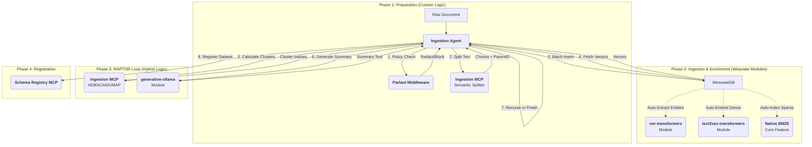

# Detailed Indexing Workflow Design (ETL)
**Architecture:** Ingestion Agent + Ingestion MCP + Self-Hosted Weaviate
**Pattern:** Hybrid (Agent Orchestration + DB-side Compute)

## 1. Design Philosophy
Instead of the "Ingestion Agent" doing everything, it acts as a **Controller**. It prepares data and orchestrates a recursive loop, while **Weaviate Modules** (running as sidecar containers) handle the GPU-intensive tasks of Vectorization, NER, and Summarization.

### The Stack
*   **Orchestrator:** `IngestionAgent` (Python/MAF)
*   **Heavy Lifting (Custom):** `IngestionMCP` (Semantic Splitting, Clustering Algorithms)
*   **Heavy Lifting (Native):** `Weaviate` (Embeddings, NER, Generative Summary, Hybrid Search)

---

## 2. Visual Workflow



---

## 3. Component Breakdown

### A. Self-Hosted Weaviate Modules (The "Free" Compute)
These run as Docker containers alongside the database. They replace custom Python code.

| Module | Purpose | Replaces Custom Code | Configuration |
| :--- | :--- | :--- | :--- |
| **`text2vec-transformers`** | **Dense Embedding.** Automatically vectorizes text on insert. | Replaces `torch` / `sentence-transformers` code. | Model: `sentence-transformers/all-MiniLM-L6-v2` or custom `C-AliBERT`. |
| **`ner-transformers`** | **Enrichment.** Extracts People, Orgs, Locations automatically. | Replaces `spacy` / `gliner` pipelines. | Model: `dbmdz/bert-large-cased-finetuned-conll03-english`. |
| **`generative-ollama`** | **Summarization.** Generates summaries for RAPTOR clusters using a local LLM. | Replaces `OpenAI` API calls. | Model: `llama3` or `mistral` running in Ollama container. |
| **`ref2vec-centroid`** | **User Personalization.** (Optional) Calculates user centroids based on interaction. | Replaces manual average-vector logic. | Standard configuration. |

### B. Necessary Customized Components (The "Agent" Logic)
Weaviate cannot do these tasks natively. They require custom Python implementation in the **Ingestion MCP** or **Ingestion Agent**.

#### 1. Semantic Splitter (Ingestion MCP)
Weaviate expects prepared text chunks. It cannot intelligently split a PDF based on topic shifts.
*   **Logic:** Uses libraries like `unstructured` or `langchain` text splitters to detect discourse boundaries.
*   **Output:** List of `Chunk` objects with `text`, `source`, and `parent_doc_id`.

#### 2. Clustering Algorithm (Ingestion MCP)
RAPTOR requires clustering vectors to find "themes." Weaviate stores vectors but does not natively expose a "Cluster these N objects using GMM" endpoint.
*   **Logic:**
    1.  Agent queries Weaviate for vectors of the current tree layer.
    2.  Ingestion MCP runs **UMAP** (dimensionality reduction) and **Gaussian Mixture Models (GMM)** or **HDBSCAN**.
    3.  Returns list of `[ClusterID, [ChunkIDs]]`.

#### 3. RAPTOR State Manager (Ingestion Agent)
The Agent must track the recursion depth.
*   **Logic:**
    *   `if num_clusters > threshold`: Generate summaries $\rightarrow$ Re-embed summaries $\rightarrow$ Repeat.
    *   `else`: Stop recursion.

#### 4. Policy Enforcer (Parlant Middleware)
Data must be cleaned *before* it hits the database.
*   **Logic:** Python decorator checks Parlant for PII redaction rules or "Do not ingest" flags based on document classification.

---

## 4. Implementation Specification

### 4.1. Docker Compose (Infrastructure)
This setup ensures all "AI" runs in sidecars, keeping the Python Agent lightweight.

```yaml
services:
  weaviate:
    image: semitechnologies/weaviate:1.24.1
    environment:
      ENABLE_MODULES: 'text2vec-transformers,ner-transformers,generative-ollama'
      DEFAULT_VECTORIZER_MODULE: 'text2vec-transformers'
      TRANSFORMERS_INFERENCE_API: 'http://t2v-transformers:8080'
      NER_INFERENCE_API: 'http://ner-transformers:8080'
      GENERATIVE_OLLAMA_API: 'http://ollama:11434'

  # Module 1: Embeddings
  t2v-transformers:
    image: semitechnologies/transformers-inference:sentence-transformers-all-MiniLM-L6-v2
    environment:
      ENABLE_CUDA: '1' # If GPU available

  # Module 2: NER
  ner-transformers:
    image: semitechnologies/ner-transformers:dbmdz-bert-large-cased-finetuned-conll03-english
    environment:
      ENABLE_CUDA: '1'

  # Module 3: Generative (Ollama)
  ollama:
    image: ollama/ollama:latest
    volumes:
      - ./ollama_data:/root/.ollama
```

### 4.2. Ingestion Agent Logic (Python)

```python
class IngestionAgent(RoutedAgent):
    
    @parlant_guard(policy_domain="ingestion", action="ingest")
    async def ingest_document(self, file_path: str):
        # 1. CUSTOM: Semantic Splitting (MCP)
        chunks = await self.ingestion_mcp.split_document(file_path)
        
        # 2. NATIVE: Ingest Leaf Nodes
        # Weaviate automatically runs text2vec and NER upon insertion
        leaf_ids = await self.weaviate_client.batch.configure(
            batch_size=100
        ).with_generate_vectors(True).do(chunks)

        # 3. RAPTOR Recursion
        await self._run_raptor_loop(leaf_ids)
        
        # 4. CUSTOM: Register Schema
        await self.schema_registry.register(source=file_path)

    async def _run_raptor_loop(self, node_ids):
        # A. Fetch Vectors (Weaviate)
        vectors = await self.weaviate_client.data.get_by_ids(node_ids, include_vector=True)
        
        # B. CUSTOM: Calculate Clusters (MCP)
        # Weaviate doesn't do this logic natively
        clusters = await self.ingestion_mcp.cluster_vectors(vectors)
        
        if len(clusters) <= 1:
            return # Root reached
            
        # C. NATIVE: Generate Summaries via Module
        summary_docs = []
        for cluster_id, chunk_indices in clusters.items():
            # Use 'generative-ollama' module to summarize the group
            prompt = f"Summarize these chunks: {chunk_indices}"
            summary = await self.weaviate_client.generate.single_prompt(prompt)
            
            summary_docs.append({
                "content": summary,
                "is_raptor_node": True,
                "tree_level": current_level + 1
            })
            
        # D. NATIVE: Ingest Summaries (Auto-embeds)
        new_ids = await self.weaviate_client.batch.do(summary_docs)
        
        # Recurse
        await self._run_raptor_loop(new_ids)
```

## 5. Summary of Optimization

| Task | Previous (Custom Code) | New (Weaviate Module) | Benefit |
| :--- | :--- | :--- | :--- |
| **Embeddings** | `torch` load model | `text2vec-transformers` | Zero python memory usage; optimized batching. |
| **Keywords** | `rank_bm25` lib | Native `bm25` | Faster; part of the DB index. |
| **NER** | `spacy` pipeline | `ner-transformers` | Auto-enriches metadata on insert. |
| **Summarize** | OpenAI API call | `generative-ollama` | Free, private, runs locally. |
| **Clustering** | Custom Logic | **Remains Custom** | Logic required for RAPTOR specific grouping. |
| **Splitting** | Custom Logic | **Remains Custom** | Logic required for discourse analysis. |