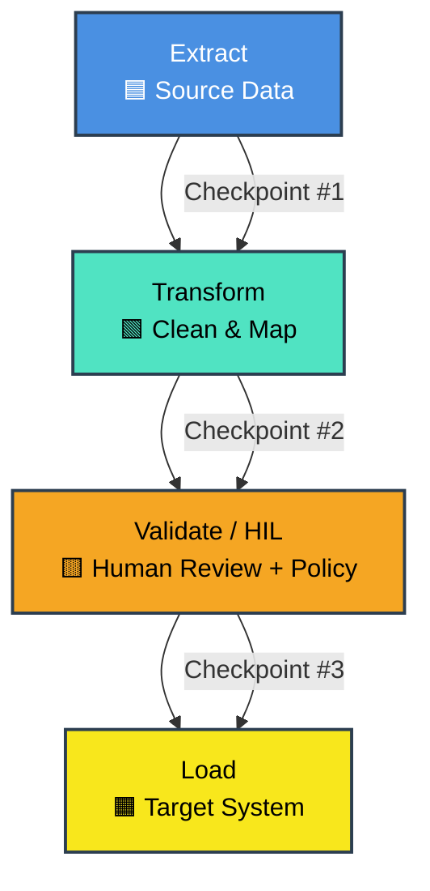

How Workflow Executor Manages Long-Running ETL Jobs
1. Graph-Based Orchestration
    • The ETL pipeline is expressed as a workflow graph: 
        ○ Extract node(s): Agents or functions pulling data from APIs, databases, or files.
        ○ Transform node(s): Agents applying cleaning, enrichment, or mapping logic.
        ○ Load node(s): Agents writing results into target systems (warehouse, lake, analytics store).
    • The executor ensures each stage runs in the correct sequence, with explicit control over dependencies.
2. Checkpointing & Recovery
    • ETL jobs often run for hours (large datasets, batch windows).
    • Workflow Executor supports checkpointing: 
        ○ Saves intermediate state after each stage (e.g., after extraction, after partial transformation).
        ○ If the job fails mid‑run, it can resume from the last checkpoint instead of restarting the entire pipeline.
3. Parallel & Conditional Execution
    • Extract and transform steps can be parallelized (e.g., multiple source tables processed concurrently).
    • Conditional routing allows branching logic: 
        ○ Example: If a dataset fails validation, route to a “quarantine” workflow instead of loading.
4. Human-in-the-Loop (HIL) Validation
    • For compliance-heavy ETL (financial analytics, audit trails), Workflow Executor can pause before the “Load” stage.
    • A human reviewer validates transformations or schema mappings before committing data downstream.
    • This ensures correctness and traceability in long‑running jobs.
5. External Integration
    • Workflow Executor integrates with external APIs and systems via MCP clients.
    • For ETL, this means smooth connections to databases, cloud storage, or analytics engines.
    • Failures (timeouts, API errors) are caught, logged, and retried without breaking the whole workflow.
6. Stateful Execution & Observability
    • The runner maintains threaded state across the ETL job.
    • Middleware provides telemetry, logging, and policy enforcement (e.g., Parlant rules for data handling).
    • This makes long‑running ETL jobs auditable and observable end‑to‑end.

✅ Why Workflow Executor Fits ETL
    • Durability: Checkpointing prevents wasted compute on retries.
    • Scalability: Graph orchestration supports parallel batch jobs.
    • Auditability: Middleware + HIL validation ensures compliance.
    • Flexibility: Conditional routing adapts to data quality issues.
    • Integration: MCP clients connect seamlessly to external data systems.
