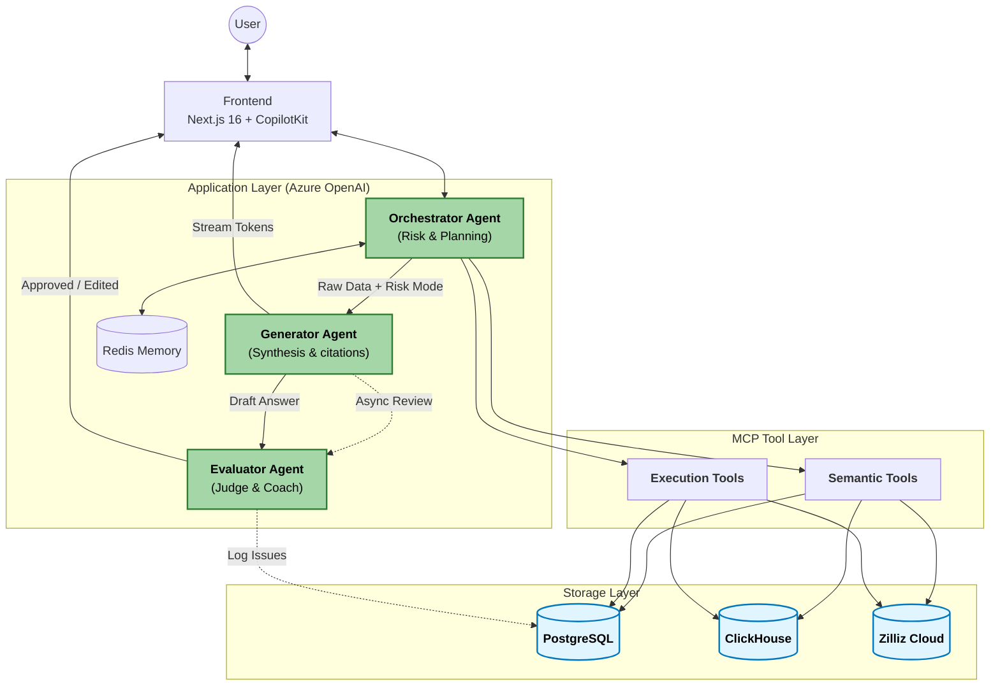
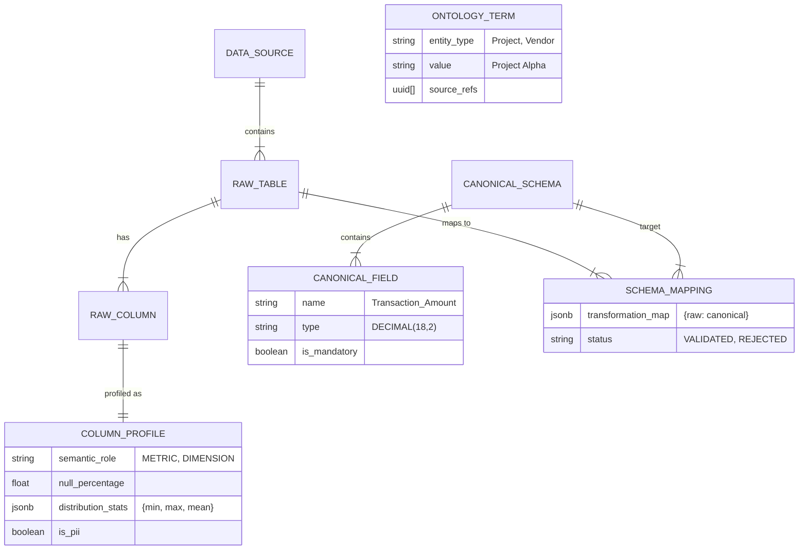
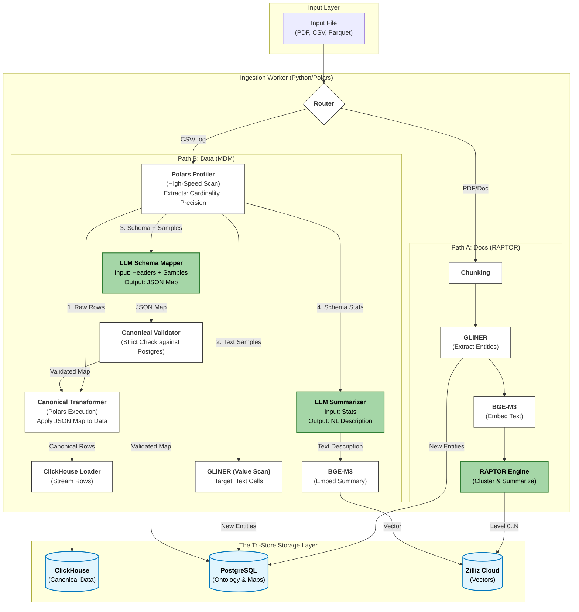

This is a critical architectural distinction. You are correct that the diagram needs to be explicit about the Generator's connectivity.

### Decision: The Generator Must Remain an Agent
It cannot be just a Tool/MCP. Here is why:
1.  **Cognitive Synthesis:** Tools are deterministic (Code/SQL). The Generator converts raw, heterogeneous data (SQL rows + Vector chunks) into a coherent human narrative. This requires **LLM Reasoning**, not just string formatting.
2.  **Citation Logic:** It performs active reasoning to link specific claims in the text to specific rows in the source data (Provenance), which is an AI task.
3.  **Streaming Management:** It controls the user experience (UX) state—deciding when to stream tokens vs. when to hold for verification.

### Fixes in Version 11.1
1.  **Topology Repair:** I have fixed the Mermaid diagram to ensure the `Generator Agent` is the central hub for response creation, connecting the `Orchestrator` to the `Evaluator` and `User`.
2.  **Flow Unification:** Removed the confusing alias nodes (`Gen_Gate`, `Gen_Stream`) in the diagram and replaced them with decision logic paths flowing out of the main **Generator Agent** node.

Here is the corrected **Design Document (Version 11.1)**.

---

# Design Document: Context-Aware Agentic RAG System

**Version:** 11.1 (Topology Fix & Agent Role Clarification)
**Date:** November 25, 2025
**Pattern:** Stateful Orchestration + Tri-Store Data Architecture
**Framework:** Microsoft Agent Framework + MCP + Parlant
**Components:** Orchestrator Engine + Intelligent Ingestion + Zilliz Cloud

## 1. Executive Summary

The System is an enterprise-grade RAG platform designed to eliminate the "Bureaucracy of Agents" while maintaining strict data governance.

**Key Architectural Decisions:**
1.  **Orchestration:** A **Context-Aware Orchestrator** utilizes a "Refinement Loop" to clarify intent.
2.  **Dual-Mode Evaluation:** The system dynamically routes responses based on risk:
    *   **Gatekeeper Mode (High Risk):** Generator waits for Evaluator approval.
    *   **Observer Mode (Low Risk):** Generator streams immediately; Evaluator runs in background.
3.  **Data Architecture (Tri-Store):** PostgreSQL (Control), ClickHouse (Data), Zilliz Cloud (Vector).
4.  **Hybrid AI Strategy:** GPT-4o for Reasoning Agents; Llama-3.1 for Ingestion ETL.

---

## 2. Architecture Topology

**Correction:** The `Generator Agent` is now explicitly connected as the bridge between the Orchestrator (Data Gathering) and the User/Evaluator (Delivery).



---

## 3. Storage Layer: The Tri-Store Specification

This section details the metadata required to support **Downstream Analytics** and **Mapping Validation**.

### 3.1. PostgreSQL (The Control Plane)

**Role:** Stores the "Knowledge Graph" of the enterprise—what data exists, what it means, and how it maps.

**Entity Relationship Diagram (ERD):**



### 3.2. ClickHouse (The Data Plane)
*   **Database:** `canonical_zone`
*   **Table Engine:** `MergeTree` (Optimized for analytical queries).
*   **Schema:** Mirrors the `CANONICAL_SCHEMA` definitions from Postgres.

### 3.3. Zilliz Cloud (The Vector Plane)
*   **Collection 1:** `docs_raptor` (Unstructured chunks + summaries).
*   **Collection 2:** `data_catalog` (Embeddings of table descriptions for semantic discovery).

---

## 4. Agent Specifications

### 4.1. Orchestrator Agent (The Risk Controller)

**Role:** The single authority on Triage, Clarification, Execution, and **Risk Assessment**.
**Logic:** It determines *how* the answer is delivered based on the data source sensitivity.

**Interface:**
```python
class OrchestratorAgent:
    def __init__(self, tools, memory):
        self.tools = tools
        self.memory = memory

    async def run_loop(self, user_input: str, session_id: str) -> str:
        """
        1. LOAD History.
        2. TRIAGE: Determine Risk Level.
           - IF Context implies Financials/PII -> MODE = GATEKEEPER.
           - IF Context implies General Info -> MODE = OBSERVER.
        3. EXECUTE TOOLS (Concurrent).
        4. DELEGATE to Generator with MODE.
        """
        risk_level = self.assess_risk(user_input) # "HIGH" or "LOW"
        tool_calls = await self.plan_tools(user_input)
        
        # Concurrent Execution
        tool_outputs = await self.execute_concurrent(tool_calls)
        
        return await generator_agent.synthesize(
            query=user_input,
            outputs=tool_outputs,
            evaluation_mode=risk_level
        )
```

### 4.2. Generator Agent (The Synthesizer)
**Role:** Composes answers and manages the output stream.
**Why an Agent?** Needs to perform CoT reasoning to merge heterogeneous data (SQL + Text) and manage citation logic.

```python
class GeneratorAgent:
    async def synthesize(self, query: str, outputs: List, evaluation_mode: str):
        # 1. Chain-of-Thought Synthesis
        draft_answer = await self.llm.generate(
            system_prompt="Synthesize these facts into a coherent answer with citations.",
            user_input=query,
            context=outputs
        )
        
        # 2. Risk Branching
        if evaluation_mode == "HIGH (GATEKEEPER)":
            # Blocking Call: Wait for Judge
            final_answer = await evaluator_agent.judge(query, draft_answer, blocking=True)
            return final_answer
            
        else: # "LOW (OBSERVER)"
            # Parallel Call: Stream to User, Fire-and-Forget to Judge
            asyncio.create_task(evaluator_agent.judge(query, draft_answer, blocking=False))
            return draft_answer
```

### 4.3. Evaluator Agent (Dual-Mode Judge)

**Role:** Acts as either a **Gatekeeper** (Blocking) or a **Coach** (Non-Blocking Observer).
**Model:** Uses **GPT-4o-Mini** (Cost-Effective).

**Logic:**
1.  **Gatekeeper Mode:** If score < Threshold, rewrite the answer *before* the user sees it.
2.  **Observer Mode:** If score < Threshold, log the failure to Postgres for future fine-tuning or trigger a "Correction" notification.

**Workflow:**
```python
class EvaluatorAgent:
    async def judge(self, query: str, answer: str, blocking: bool) -> Union[str, None]:
        # 1. Evaluate (LLM-as-a-Judge) using RAGAS metrics
        metrics = await self.calculate_metrics(query, answer)
        
        # 2. Decision Logic
        if blocking:
            if metrics['faithfulness'] < 0.9:
                return await self.rewrite_answer(answer, metrics['reasoning'])
            return answer
        
        else:
            # Observer Mode: Log and Learn
            await self.log_feedback(
                query=query,
                answer=answer,
                score=metrics['overall'],
                issues=metrics['reasoning']
            )
            return None # Return nothing, user already has the answer
```

---

## 5. MCP Tool Definitions

### 5.1. Semantic Tools (Metadata & Context)
*Target: Low Latency (<200ms).*

**Tool 1: `get_domain_context(domain: str)`**
*   **Source:** Postgres (`ontology_term`) AND Zilliz (`data_catalog`).
*   **Function:** Returns valid entity names and high-level KPIs.
*   **Usage:** "How are we doing?" -> Returns "MTD Cost: $120k".

**Tool 2: `get_schema_info(table_names: List[str])`**
*   **Source:** Postgres (`schema_mappings`, `column_profiles`).
*   **Function:** Returns *Canonical* DDL, column descriptions, and **Data Quality Stats**.
*   **Why:** Ensures the Agent generates SQL only for high-quality, existing columns.

### 5.2. Execution Tools (Data Retrieval)
*Target: High Fidelity (>500ms).*

**Tool 3: `search_vectors(query: str, scope: str)`**
*   **Source:** Zilliz Cloud.
*   **Scopes:** `docs` (RAPTOR), `catalog` (Discovery).
*   **Logic:** Hybrid Search (Dense Vector + BM25).

**Tool 4: `execute_clickhouse(sql: str)`**
*   **Source:** ClickHouse.
*   **Function:** Executes read-only SQL against **Canonical** tables.
*   **Safety:** Validated by Parlant middleware (No DROP/DELETE).

---

## 6. Intelligent Ingestion Pipeline (v11.0)

**Core Philosophy:** "Bifurcated Processing, Unified Discovery."



### 6.1. Path A: Unstructured Logic (RAPTOR + GLiNER)
1.  **Chunking:** `unstructured` library.
2.  **Enrichment (GLiNER):** Extracts `Project`, `Client`, `Vendor`.
    *   *Action:* Upsert to Postgres `ontology_term`.
3.  **RAPTOR Processing:**
    *   **Level 0:** Embed Chunks (BGE-M3) -> Store in Zilliz.
    *   **Cluster:** GMM Clustering on Embeddings.
    *   **Summarize:** Llama-3.1 summarizes clusters.
    *   **Level 1+:** Store Summaries in Zilliz (Parent Nodes).

### 6.2. Path B: Structured Logic (MDM -> ClickHouse)

#### Step 1: Smart Profiling (Polars)
Extracts semantic roles and precision stats to populate Postgres.

```python
def profile_columns(df: pl.DataFrame) -> List[ColumnProfile]:
    """
    High-speed scan for Cardinality, Precision, and Semantic Role.
    Distinguishes DIMENSION vs METRIC vs TIME_INDEX.
    """
    # Logic to detect Decimal Precision (Critical for FinOps)
    # Logic to detect Semantic Role based on cardinality
    pass
```

#### Step 2: Canonical Mapping (Llama-3.1)
Maps cryptic source columns to the **Canonical Ontology**.
*   **Input:** `{"name": "v_amt", "samples": ["100.50"]}`
*   **Prompt:** "Map this to Standard Finance Ontology (Transaction.Amount, Customer.ID)."
*   **Output (JSON):** `{"v_amt": "Amount", "cust_id": "Customer"}`

#### Step 3: Strict Validation Gate
*   **Logic:**
    1.  Parse LLM JSON Output.
    2.  Check if every target field exists in Postgres `canonical_fields`.
    3.  Check data type compatibility.
*   **Result:**
    *   *Pass:* Insert into `schema_mappings` with status `VALIDATED`.
    *   *Fail:* Mark as `REJECTED`, abort load.

#### Step 4: Transform & Load (Polars -> ClickHouse)
*   **Action:** Apply the *Validated* Map using Polars Expressions.
*   **Write:** Stream to **ClickHouse** Canonical Table.

---

## 7. Middleware & Policy (Parlant)

Parlant intercepts every tool call to enforce safety constraints.

```python
@parlant_guard(policy_domain="data_access")
async def execute_tool_wrapper(tool_name, args):
    """
    Checks:
    1. Is the user allowed to query this Domain?
    2. Does the SQL contain banned keywords (DROP, ALTER)?
    3. Is PII requested? (If so, inject masking instructions).
    """
    evaluation = await parlant.evaluate(
        domain="data_access",
        action=tool_name,
        context=args
    )
    if evaluation.status == "BLOCK":
        raise PolicyViolationError(evaluation.reason)
    return await execute_tool(tool_name, args)
```

---

## 8. Data Contracts (Pydantic Models)

```python
class CanonicalEntity(BaseModel):
    """Grounded entity in Postgres Ontology"""
    id: str
    name: str
    type: str  # "Customer", "Vendor"
    source_refs: List[UUID]

class IngestionResult(BaseModel):
    """Result of the Pipeline"""
    source_id: UUID
    pipeline_type: Literal["unstructured", "structured"]
    status: Literal["success", "failed", "rejected"]
    validation_errors: Optional[List[str]]
    canonical_table: Optional[str]

class RetrievalResult(BaseModel):
    """Output from Execution Tools"""
    tool_source: Literal["clickhouse", "zilliz"]
    data: List[Dict[str, Any]]
    provenance: Dict[str, Any]  # {table: "std_sales", confidence: 0.9}

class EvaluationResult(BaseModel):
    """Output from Evaluator Agent"""
    score: float = Field(ge=0.0, le=1.0)
    passed: bool
    reasoning: str
    metrics: Dict[str, float] # Faithfulness, Relevance, etc.
```

---

## 9. Infrastructure Stack (Docker & Cloud)

```yaml
version: '3.8'
services:
  # --- Application Layer ---
  backend:
    build: ./backend
    environment:
      - AZURE_OPENAI_KEY=${KEY}       # For Orchestrator
      - ZILLIZ_CLOUD_URI=${URI}       # For Vector Search
      - CLICKHOUSE_URI=${CH_URI}      # For SQL Exec
      - PG_URI=${PG_URI}              # For Metadata
      - PARLANT_URL=http://parlant:8000
    depends_on:
      - redis
      - parlant

  # --- Ingestion Layer (Worker) ---
  ingestion-worker:
    image: python:3.11-slim
    environment:
      - OLLAMA_HOST=http://ollama:11434  # Local "Green Node"
      - ZILLIZ_CLOUD_URI=${URI}
      - CLICKHOUSE_URI=${CH_URI}
      - PG_URI=${PG_URI}
    deploy:
      resources:
        reservations:
          devices:
            - driver: nvidia
              count: 1
              capabilities: [gpu]

  # --- Storage Layer (Tri-Store) ---
  clickhouse:
    image: clickhouse/clickhouse-server:latest
    ports: ["8123:8123"]
    volumes:
      - clickhouse_data:/var/lib/clickhouse

  postgres:
    image: postgres:15
    environment:
      POSTGRES_DB: metadata
    volumes:
      - postgres_data:/var/lib/postgresql/data

  redis:
    image: redis:7-alpine

  # --- Local Inference ---
  ollama:
    image: ollama/ollama:latest
    volumes:
      - ollama_data:/root/.ollama

  # --- Policy Engine ---
  parlant:
    image: parlant/parlant:latest
    ports: ["8000:8000"]

volumes:
  clickhouse_data:
  postgres_data:
  ollama_data:
```

---

## 10. Testing Strategy

### 10.1. Property-Based Testing (Hypothesis)
We test the Orchestrator's *decision logic* without making real API calls.

```python
@given(query=st.text())
async def test_orchestrator_triage(query):
    """
    Property: If query is vague (no specific entities), Orchestrator MUST 
    call Semantic Tools OR ask clarification, NEVER execute deep search immediately.
    """
    orch = OrchestratorAgent()
    response = await orch.dry_run(query)
    
    if is_vague(query):
        assert response.tool_calls[0].name in ["get_domain_context", "get_schema_info"]
        assert response.tool_calls[0].name not in ["execute_clickhouse"]
```

### 10.2. Integration Testing (End-to-End)
**Scenario:** "The FinOps Flow"
1.  **Ingest:** Upload `expenses_2024.csv` (Columns: `v_amt`, `ven_name`).
2.  **Verify MDM:**
    *   Postgres `column_profiles` has stats for `v_amt`.
    *   Postgres `schema_mappings` shows `v_amt` -> `Amount`.
    *   ClickHouse `canonical_zone.expenses` has data.
3.  **Verify Agent:**
    *   User: "Show expenses."
    *   Agent: Calls `get_domain_context`. Returns "Expenses available."
    *   Agent: "Do you want to see by Vendor or Project?"
    *   User: "Vendor."
    *   Agent: Calls `execute_clickhouse("SELECT Vendor, SUM(Amount)...")`.
    *   Agent: Generator synthesizes response with source citation.

---

*Last Updated: 2025-01-25*
*Version: 11.1*