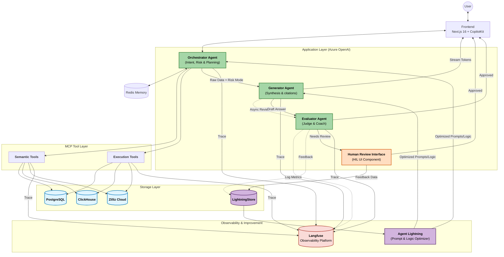

# Design Document: Context-Aware Agentic RAG System

**Version:** 12.1 (Human Review Interface Update)
**Date:** November 25, 2025
**Pattern:** Stateful Orchestration + Tri-Store Data Architecture
**Framework:** Microsoft Agent Framework + MCP + Parlant + Langfuse + RAGAS + Agent Lightning
**Components:** Orchestrator Engine + Intelligent Ingestion + Zilliz Cloud

## 1. Executive Summary

The System is an enterprise-grade RAG platform designed to eliminate the "Bureaucracy of Agents" while maintaining strict data governance. This document outlines the functional design derived from the system requirements.

**Key Architectural Decisions:**
1.  **Orchestration:** A **Context-Aware Orchestrator** utilizes a "Refinement Loop" to clarify intent, including specialized intents like **Data Stories** and **Persona-Aware Visualizations**.
2.  **Dual-Mode Evaluation:** The system dynamically routes responses based on risk, with a robust Human-in-the-Loop (HIL) workflow for quality assurance.
3.  **Data Architecture (Tri-Store):** PostgreSQL (Control), ClickHouse (Data), Zilliz Cloud (Vector).
4.  **Hybrid AI Strategy:** GPT-4o for Reasoning Agents; Llama-3.1 for Ingestion ETL.
5.  **Continuous Improvement:** A full feedback loop powered by **Agent Lightning** and **LightningStore** ensures that prompts and routing logic improve over time.
6.  **Comprehensive Observability:** **Langfuse** provides end-to-end tracing of all agent and tool operations.
7.  **Human Feedback Integration:** A dedicated **Human Review Interface** (not requiring LLM processing) integrates with CopilotKit UI to collect user feedback for system improvement through voting and review mechanisms.

---

## 2. Architecture Topology

**Correction:** The diagram is updated to include the `Human Review Interface`, `Agent Lightning` feedback loop, and `Langfuse` for observability.



**Key Data Flow Changes:**
- The `Human Review Interface` now acts as a UI component to facilitate human feedback collection (voting, approval, correction)
- It does NOT perform any LLM-based processing itself but simply collects and forwards user feedback
- Feedback data is stored in `LightningStore` for analysis by `Agent Lightning` to improve system performance
- The interface integrates with `CopilotKit UI` to provide a seamless user experience for feedback collection

---

## 3. Storage Layer: The Tri-Store Specification
(No changes from v11.1, content omitted for brevity)
### 3.1. PostgreSQL (The Control Plane)
### 3.2. ClickHouse (The Data Plane)
### 3.3. Zilliz Cloud (The Vector Plane)

---

## 4. Agent Specifications

### 4.1. Orchestrator Agent (The Intent and Risk Controller)

**Role:** The single authority on **Intent Parsing**, Triage, Clarification, Execution, and **Risk Assessment**.
**Logic:** It first parses the user's query to determine intent according to the **High-Quality Intent Statement Definition** and then determines *how* the answer is delivered based on data source sensitivity.

**Interface:**
```python
class OrchestratorAgent:
    def __init__(self, tools, memory, prompt_optimizer):
        self.tools = tools
        self.memory = memory
        self.prompt_optimizer = prompt_optimizer # From Agent Lightning

    async def run_loop(self, user_input: str, session_id: str) -> str:
        """
        1. LOAD History.
        2. PARSE INTENT: Use Intent Parser sub-component.
           - IF query is ambiguous -> Request Clarification.
           - IF intent is Data Story -> DELEGATE to Data Story workflow.
           - IF intent is Visualization -> DELEGATE to Visualization workflow.
        3. TRIAGE: Determine Risk Level (GATEKEEPER vs OBSERVER).
        4. EXECUTE TOOLS (Concurrent).
        5. DELEGATE to Generator with MODE and optimized prompts.
        """
        intent = self.parse_intent(user_input) # Adheres to High-Quality Intent Definition
        if intent.is_ambiguous:
            return "Could you please clarify..."

        risk_level = self.assess_risk(user_input)
        tool_calls = await self.plan_tools(intent)
        
        tool_outputs = await self.execute_concurrent(tool_calls)
        
        # Add a reranking step
        reranked_outputs = await rerank_tool.rerank(tool_outputs)

        return await generator_agent.synthesize(
            query=user_input,
            outputs=reranked_outputs,
            evaluation_mode=risk_level,
            intent=intent
        )
```

### 4.2. Generator Agent (The Synthesizer)
**Role:** Composes answers, data stories, or visualizations and manages the output stream.
**Prompt Optimization:** Uses optimized prompts provided by **Agent Lightning**.

```python
class GeneratorAgent:
    async def synthesize(self, query: str, outputs: List, evaluation_mode: str, intent: Intent):
        # 1. Select prompt based on intent and Agent Lightning optimization
        system_prompt = self.prompt_optimizer.get_prompt("synthesis", intent.type)

        # 2. Generate content based on intent
        if intent.type == "DataStory":
            draft_content = await self.generate_data_story(system_prompt, query, outputs)
        elif intent.type == "Visualization":
            draft_content = await self.generate_visualization(system_prompt, query, outputs, intent.persona)
        else:
            draft_content = await self.llm.generate(system_prompt, user_input=query, context=outputs)

        # 3. Risk Branching
        if evaluation_mode == "HIGH (GATEKEEPER)":
            return await evaluator_agent.judge(query, draft_content, blocking=True)
        else: # "LOW (OBSERVER)"
            asyncio.create_task(evaluator_agent.judge(query, draft_content, blocking=False))
            return draft_content
```

### 4.3. Evaluator Agent (Dual-Mode Judge)

**Role:** Acts as either a **Gatekeeper** (Blocking) or a **Coach** (Non-Blocking Observer).
**Metrics:** Assesses responses against seven key RAG characteristics: **faithfulness, relevance, correctness, coverage, consistency, freshness, and traceability.**

**Workflow:**
```python
class EvaluatorAgent:
    async def judge(self, query: str, answer: str, blocking: bool) -> Union[str, None]:
        # 1. Evaluate using RAGAS and other custom checks for the 7 characteristics
        metrics = await self.calculate_metrics(query, answer)
        
        # 2. Decision Logic
        if metrics['overall_score'] < 0.8:
            if blocking:
                # Route to Human Review for correction
                return await human_review_agent.review(query, answer, metrics)
            else:
                # Observer Mode: Log and Learn
                await self.log_feedback_to_lightning_store(...)
                return None
        return answer
```

### 4.4. Human Review Interface (HIL UI Component)
**Role:** Facilitates human validation of low-quality or high-risk answers through UI interactions, collects user feedback for system improvement. This component does NOT use LLM processing but serves as an interface between users and the feedback storage system.

**Workflow:**
```python
class HumanReviewInterface:
    async def present_for_review(self, query: str, answer: str, metrics: dict) -> str:
        # 1. Present content to human reviewer via CopilotKit UI with query, answer, context, and quality scores.

        # 2. Collect human feedback (approval, rejection, voting, or optional correction).
        feedback = await self.wait_for_user_feedback() # Blocks until feedback is complete

        # 3. Store the feedback data (query, original answer, user feedback, metrics) in LightningStore.
        await self.log_to_lightning_store(query, answer, feedback, metrics)

        # 4. Return the approved answer to the user or handle rejection appropriately.
        if feedback['action'] == 'approve':
            return answer
        elif feedback['action'] == 'correct':
            return feedback['corrected_answer']
        else:
            # Handle rejection case - possibly return an explanation to user
            return "Response was not approved due to quality concerns."
```

### 4.5. Human Feedback Data Schema for Agent Lightning
**Purpose:** To provide a structured format for collecting and storing human feedback that can be analyzed by Agent Lightning to improve system performance.

**Data Schema:**
```python
class HumanFeedback(BaseModel):
    """Schema for human feedback collected through the review interface"""
    feedback_id: UUID
    session_id: str
    timestamp: datetime
    query: str
    original_answer: str
    answer_metrics: Dict[str, float]  # Original evaluation metrics from Evaluator Agent
    user_action: Literal['approve', 'reject', 'correct', 'upvote', 'downvote']
    user_comment: Optional[str] = None
    corrected_answer: Optional[str] = None  # Filled when user provides correction
    review_duration: float  # Time taken by user for review (seconds)
    user_profile: Dict[str, Any]  # Anonymous user metadata for context

class FeedbackAggregation(BaseModel):
    """Schema for aggregated feedback data used by Agent Lightning"""
    aggregation_id: UUID
    feedback_type: Literal['quality_issue', 'factual_error', 'relevance_problem', 'other']
    pattern: str  # Common patterns identified in feedback
    frequency: int  # How often this pattern occurs
    impact_score: float  # How much this pattern affects overall performance
    suggested_improvement: str  # Recommendations for system improvement
    affected_components: List[Literal['Evaluator', 'Generator', 'Orchestrator']]  # Which components need adjustment
```

**Message Schema for Agent Lightning Integration:**
```python
class FeedbackMessage(BaseModel):
    """Message format sent to Agent Lightning for processing"""
    message_id: UUID
    message_type: Literal['human_feedback', 'aggregated_insights', 'trend_analysis']
    source_component: Literal['HumanReviewInterface', 'EvaluatorAgent', 'SystemMonitor']
    payload: Union[HumanFeedback, FeedbackAggregation]
    processing_priority: Literal['high', 'medium', 'low']
    created_at: datetime
```

---

## 5. UI Integration & Human Review

### 5.1. CopilotKit UI Integration for Human Review
**Purpose:** Enable seamless integration of human review functionality within the existing Next.js 16 + CopilotKit frontend to collect user feedback through voting and review interfaces.

**UI Components:**
```typescript
interface HumanReviewUIProps {
  query: string;
  answer: string;
  metrics: Record<string, number>;
  onFeedback: (feedback: HumanFeedback) => void;
}

// Simple voting component for quick approval/rejection
const FeedbackVoting: React.FC<HumanReviewUIProps> = ({
  query,
  answer,
  metrics,
  onFeedback
}) => {
  const handleVote = (vote: 'upvote' | 'downvote') => {
    const feedback: HumanFeedback = {
      feedback_id: crypto.randomUUID(),
      session_id: getSessionId(),
      timestamp: new Date(),
      query,
      original_answer: answer,
      answer_metrics: metrics,
      user_action: vote,
      review_duration: calculateReviewTime()
    };
    onFeedback(feedback);
  };

  return (
    <div className="feedback-voting">
      <p>Was this response helpful?</p>
      <button onClick={() => handleVote('upvote')}>👍</button>
      <button onClick={() => handleVote('downvote')}>👎</button>
    </div>
  );
};

// Detailed review component for corrections and comments
const DetailedReview: React.FC<HumanReviewUIProps> = ({
  query,
  answer,
  onFeedback
}) => {
  const [correction, setCorrection] = useState(answer);
  const [comment, setComment] = useState('');

  const handleSubmit = (action: 'approve' | 'reject' | 'correct') => {
    const feedback: HumanFeedback = {
      feedback_id: crypto.randomUUID(),
      session_id: getSessionId(),
      timestamp: new Date(),
      query,
      original_answer: answer,
      answer_metrics: metrics,
      user_action: action,
      user_comment: comment,
      corrected_answer: action === 'correct' ? correction : undefined,
      review_duration: calculateReviewTime()
    };
    onFeedback(feedback);
  };

  return (
    <div className="detailed-review">
      <h3>Review Response</h3>
      <div className="original-content">
        <label>Original Answer:</label>
        <p>{answer}</p>
      </div>
      <div className="correction-input">
        <label>Corrected Answer (optional):</label>
        <textarea
          value={correction}
          onChange={(e) => setCorrection(e.target.value)}
        />
      </div>
      <div className="comment-input">
        <label>Comments:</label>
        <textarea
          value={comment}
          onChange={(e) => setComment(e.target.value)}
        />
      </div>
      <div className="action-buttons">
        <button onClick={() => handleSubmit('approve')}>Approve</button>
        <button onClick={() => handleSubmit('correct')}>Submit Correction</button>
        <button onClick={() => handleSubmit('reject')}>Reject</button>
      </div>
    </div>
  );
};
```

### 5.2. MCP Tool Definitions

#### 5.2.1. Semantic Tools (Metadata & Context)
(No changes from v11.1)

#### 5.2.2. Execution Tools (Data Retrieval)
*Target: High Fidelity (>500ms).*

**Tool 3: `search_vectors(query: str, scope: str)`**
*   **Source:** Zilliz Cloud.
*   **Logic:** Hybrid Search (Dense Vector + BM25).

**Tool 4: `execute_clickhouse(sql: str)`**
*   **Source:** ClickHouse.
*   **Function:** Executes read-only SQL against **Canonical** tables.
*   **Safety:** Validated by Parlant middleware (No DROP/DELETE).

---

## 6. Intelligent Ingestion Pipeline (v11.0)

**Core Philosophy:** "Bifurcated Processing, Unified Discovery."


### 6.1. Path A: Unstructured Logic (RAPTOR + GLiNER)
1.  **Chunking:** `unstructured` library.
2.  **Enrichment (GLiNER):** Extracts `Project`, `Client`, `Vendor`.
    *   *Action:* Upsert to Postgres `ontology_term`.
3.  **RAPTOR Processing:**
    *   **Level 0:** Embed Chunks (BGE-M3) -> Store in Zilliz.
    *   **Cluster:** GMM Clustering on Embeddings.
    *   **Summarize:** Llama-3.1 summarizes clusters.
    *   **Level 1+:** Store Summaries in Zilliz (Parent Nodes).

### 6.2. Path B: Structured Logic (MDM -> ClickHouse)

#### Step 1: Smart Profiling (Polars)
Extracts semantic roles and precision stats to populate Postgres.

```python
def profile_columns(df: pl.DataFrame) -> List[ColumnProfile]:
    """
    High-speed scan for Cardinality, Precision, and Semantic Role.
    Distinguishes DIMENSION vs METRIC vs TIME_INDEX.
    """
    # Logic to detect Decimal Precision (Critical for FinOps)
    # Logic to detect Semantic Role based on cardinality
    pass
```

#### Step 2: Canonical Mapping (Llama-3.1)
Maps cryptic source columns to the **Canonical Ontology**.
*   **Input:** `{"name": "v_amt", "samples": ["100.50"]}`
*   **Prompt:** "Map this to Standard Finance Ontology (Transaction.Amount, Customer.ID)."
*   **Output (JSON):** `{"v_amt": "Amount", "cust_id": "Customer"}`

#### Step 3: Strict Validation Gate
*   **Logic:**
    1.  Parse LLM JSON Output.
    2.  Check if every target field exists in Postgres `canonical_fields`.
    3.  Check data type compatibility.
*   **Result:**
    *   *Pass:* Insert into `schema_mappings` with status `VALIDATED`.
    *   *Fail:* Mark as `REJECTED`, abort load.

#### Step 4: Transform & Load (Polars -> ClickHouse)
*   **Action:** Apply the *Validated* Map using Polars Expressions.
*   **Write:** Stream to **ClickHouse** Canonical Table.

---

## 7. Middleware & Policy (Parlant)

Parlant intercepts every tool call to enforce safety, security, and compliance.

```python
@parlant_guard(policy_domain="data_access")
async def execute_tool_wrapper(tool_name, args):
    """
    Checks:
    1. Is the user allowed to query this Domain? (RBAC)
    2. Does the SQL contain banned keywords (DROP, ALTER)?
    3. Is PII requested? If so, apply masking/redaction policies.
    4. Log every action with provenance for audit trails (SOC2/GDPR).
    """
    # ... Parlant evaluation logic ...
```
---
## 8. Data Contracts (Pydantic Models)

```python
from typing import Union
from uuid import UUID
from datetime import datetime

class CanonicalEntity(BaseModel):
    """Grounded entity in Postgres Ontology"""
    id: str
    name: str
    type: str  # "Customer", "Vendor"
    source_refs: List[UUID]

class IngestionResult(BaseModel):
    """Result of the Pipeline"""
    source_id: UUID
    pipeline_type: Literal["unstructured", "structured"]
    status: Literal["success", "failed", "rejected"]
    validation_errors: Optional[List[str]]
    canonical_table: Optional[str]

class RetrievalResult(BaseModel):
    """Output from Execution Tools"""
    tool_source: Literal["clickhouse", "zilliz"]
    data: List[Dict[str, Any]]
    provenance: Dict[str, Any]  # {table: "std_sales", confidence: 0.9}

class EvaluationResult(BaseModel):
    """Output from Evaluator Agent"""
    score: float = Field(ge=0.0, le=1.0)
    passed: bool
    reasoning: str
    metrics: Dict[str, float] # Faithfulness, Relevance, etc.

class HumanFeedback(BaseModel):
    """Schema for human feedback collected through the review interface"""
    feedback_id: UUID
    session_id: str
    timestamp: datetime
    query: str
    original_answer: str
    answer_metrics: Dict[str, float]  # Original evaluation metrics from Evaluator Agent
    user_action: Literal['approve', 'reject', 'correct', 'upvote', 'downvote']
    user_comment: Optional[str] = None
    corrected_answer: Optional[str] = None  # Filled when user provides correction
    review_duration: float  # Time taken by user for review (seconds)
    user_profile: Dict[str, Any]  # Anonymous user metadata for context

class FeedbackAggregation(BaseModel):
    """Schema for aggregated feedback data used by Agent Lightning"""
    aggregation_id: UUID
    feedback_type: Literal['quality_issue', 'factual_error', 'relevance_problem', 'other']
    pattern: str  # Common patterns identified in feedback
    frequency: int  # How often this pattern occurs
    impact_score: float  # How much this pattern affects overall performance
    suggested_improvement: str  # Recommendations for system improvement
    affected_components: List[Literal['Evaluator', 'Generator', 'Orchestrator']]  # Which components need adjustment

class FeedbackMessage(BaseModel):
    """Message format sent to Agent Lightning for processing"""
    message_id: UUID
    message_type: Literal['human_feedback', 'aggregated_insights', 'trend_analysis']
    source_component: Literal['HumanReviewInterface', 'EvaluatorAgent', 'SystemMonitor']
    payload: Union[HumanFeedback, FeedbackAggregation]
    processing_priority: Literal['high', 'medium', 'low']
    created_at: datetime
```

---

## 9. Infrastructure Stack (Docker & Cloud)

Updated to include Langfuse, Agent Lightning, and LightningStore.

```yaml
# ... (services for backend, ingestion-worker, clickhouse, postgres, redis, ollama, parlant)
  
  # --- Observability ---
  langfuse-server:
    image: langfuse/langfuse-server:latest
    ports: ["3000:3000"]
    depends_on: [postgres]

  # --- Continuous Improvement ---
  agent-lightning:
    build: ./agent-lightning
    environment:
      - LIGHTNING_STORE_URI=...
  
  lightning-store: # e.g., another Postgres or specialized DB
    image: postgres:15
    environment:
      POSTGRES_DB: lightning
```
---
## 10. Testing Strategy

### 10.1. Property-Based Testing (Hypothesis)
We test the Orchestrator's *decision logic* without making real API calls.

```python
@given(query=st.text())
async def test_orchestrator_triage(query):
    """
    Property: If query is vague (no specific entities), Orchestrator MUST 
    call Semantic Tools OR ask clarification, NEVER execute deep search immediately.
    """
    orch = OrchestratorAgent()
    response = await orch.dry_run(query)
    
    if is_vague(query):
        assert response.tool_calls[0].name in ["get_domain_context", "get_schema_info"]
        assert response.tool_calls[0].name not in ["execute_clickhouse"]
```

### 10.2. Integration Testing (End-to-End)
**Scenario:** "The FinOps Flow"
1.  **Ingest:** Upload `expenses_2024.csv` (Columns: `v_amt`, `ven_name`).
2.  **Verify MDM:**
    *   Postgres `column_profiles` has stats for `v_amt`.
    *   Postgres `schema_mappings` shows `v_amt` -> `Amount`.
    *   ClickHouse `canonical_zone.expenses` has data.
3.  **Verify Agent:**
    *   User: "Show expenses."
    *   Agent: Calls `get_domain_context`. Returns "Expenses available."
    *   Agent: "Do you want to see by Vendor or Project?"
    *   User: "Vendor."
    *   Agent: Calls `execute_clickhouse("SELECT Vendor, SUM(Amount)...")`.
    *   Agent: Generator synthesizes response with source citation.

---

*Last Updated: 2025-11-25*
*Version: 12.0*
