# Design Thinking + Agent Patterns Integration

## Objective
Map Double Diamond Design Process and Six Thinking Hats to AI agent patterns (Plan-and-Execute, ReAct, CoT, ToT) at both orchestration and agent levels.

---

## Framework Overview

### Double Diamond Design Process

```
Discover → Define → Develop → Deliver
(Diverge) (Converge) (Diverge) (Converge)
```

**4 Phases:**
1. **Discover (Diverge)**: Explore problem space, gather insights
2. **Define (Converge)**: Synthesize insights, define problem
3. **Develop (Diverge)**: Generate solutions, explore alternatives
4. **Deliver (Converge)**: Test, refine, implement solution

### Six Thinking Hats

**6 Perspectives:**
- 🤍 **White Hat**: Facts, data, information
- ❤️ **Red Hat**: Emotions, feelings, intuition
- ⚫ **Black Hat**: Caution, risks, critical judgment
- 💛 **Yellow Hat**: Benefits, optimism, positive thinking
- 💚 **Green Hat**: Creativity, alternatives, new ideas
- 🔵 **Blue Hat**: Process control, meta-thinking, orchestration

---

## Integration Matrix: Design Thinking × Agent Patterns

| Design Phase | Six Hats Active | Agent Pattern | Orchestration Level | Agent Level | Use Case |
|--------------|-----------------|---------------|---------------------|-------------|----------|
| **Discover** | 💚🤍❤️ | ReAct + ToT | Plan-and-Execute | ReAct agents | Query clarification, requirement elicitation |
| **Define** | ⚫🔵 | Plan-and-Execute | Plan-and-Execute | CoT agents | Intent formalization, validation |
| **Develop** | 💚💛🤍 | ToT + ReAct | Plan-and-Execute | ReAct + ToT | Solution exploration, optimization |
| **Deliver** | 🔵⚫ | Plan-and-Execute | Plan-and-Execute | CoT agents | Execution, validation, delivery |

---

## Phase 1: Discover (Diverge) - Exploration

### Design Thinking Goal
Explore problem space, understand user needs, gather diverse perspectives

### Six Thinking Hats Active
- 💚 **Green Hat**: Generate multiple query interpretations
- 🤍 **White Hat**: Gather facts from knowledge base
- ❤️ **Red Hat**: Understand user intent and emotional context

### Agent Pattern Mapping

#### Orchestration Level: Plan-and-Execute
```python
class DiscoverPhaseOrchestrator(AssistantAgent):
    """Orchestrates discovery phase with divergent thinking"""
    
    async def on_messages(self, messages, cancellation_token):
        query = messages[-1].content
        
        # PLAN: Discover phase strategy
        plan = await self.create_discover_plan(query)
        # Plan includes:
        # 1. Generate query variants (Green Hat)
        # 2. Retrieve factual context (White Hat)
        # 3. Analyze user intent (Red Hat)
        
        # EXECUTE: Run discovery agents
        results = await self.execute_discover_plan(plan)
        
        return results
```

#### Agent Level: ReAct Pattern
```python
class IntentExplorerAgent(RoutedAgent):
    """Uses ReAct to explore multiple interpretations"""
    
    @message_handler
    async def explore_intent(self, message: QueryMessage, ctx: MessageContext):
        """ReAct loop for intent exploration"""
        
        interpretations = []
        
        for iteration in range(self.max_iterations):
            # THOUGHT (Green Hat): What other interpretations exist?
            thought = await self.generate_thought(
                query=message.content,
                existing_interpretations=interpretations
            )
            
            # ACTION (White Hat): Retrieve supporting evidence
            evidence = await self.retrieve_evidence(thought.interpretation)
            
            # OBSERVATION: Assess interpretation quality
            observation = await self.assess_interpretation(
                interpretation=thought.interpretation,
                evidence=evidence
            )
            
            interpretations.append(observation)
            
            # Check if we have sufficient diversity
            if self.has_sufficient_diversity(interpretations):
                break
        
        return interpretations
```

#### Agent Level: ToT Pattern (Advanced)
```python
class QueryInterpretationToT(RoutedAgent):
    """Tree-of-Thoughts for exploring interpretation space"""
    
    @message_handler
    async def explore_interpretations(self, message: QueryMessage, ctx: MessageContext):
        """ToT search for best interpretation"""
        
        # Root: Initial query
        root = ThoughtNode(
            thought="Initial query analysis",
            interpretation=message.content,
            score=0.0
        )
        
        # Build interpretation tree (Green Hat: divergent thinking)
        interpretation_tree = await self.build_tree(root, max_depth=3)
        
        # Evaluate paths (White Hat: fact-based scoring)
        best_paths = await self.evaluate_paths(interpretation_tree)
        
        # Return top-k interpretations for Define phase
        return best_paths[:5]
```

**Use Case Example:**
```
User Query: "How are we doing?"

Discover Phase Output:
1. Interpretation 1: Overall business performance (confidence: 0.85)
2. Interpretation 2: Specific project status (confidence: 0.72)
3. Interpretation 3: Team morale check (confidence: 0.45)
4. Interpretation 4: Financial health inquiry (confidence: 0.68)
5. Interpretation 5: Customer satisfaction query (confidence: 0.55)
```

### Parlant Guidelines for Discover Phase

```python
# Define behavioral guidelines for exploration
await agent.create_guideline(
    condition="User query is ambiguous or has multiple interpretations",
    action="Generate at least 3 diverse interpretations using Green Hat thinking, retrieve supporting evidence for each using White Hat facts, and assess user intent using Red Hat empathy",
    tools=[generate_interpretations, retrieve_evidence, assess_user_intent]
)

await agent.create_guideline(
    condition="Exploring query interpretations",
    action="Ensure interpretations cover different domains (business, technical, emotional) and maintain diversity score above 0.6",
    tools=[calculate_diversity_score]
)

# Domain-specific terminology
await agent.create_glossary_term(
    term="business performance",
    definition="Metrics including revenue, growth, customer satisfaction, and operational efficiency"
)
```

### CopilotKit HIL for Discover Phase

```typescript
// Human-in-the-Loop: Clarification Request
useCopilotAction({
  name: "request_clarification",
  description: "Request user clarification when interpretations have similar confidence scores",
  parameters: [
    {
      name: "interpretations",
      type: "object[]",
      description: "Top interpretations with similar confidence",
      required: true,
    },
  ],
  renderAndWaitForResponse: ({ args, respond }) => {
    return (
      <InterpretationSelector
        interpretations={args.interpretations}
        onSelect={(selected) => respond?.({ 
          selectedInterpretation: selected,
          userConfirmed: true 
        })}
        onProvideMore={() => respond?.({ 
          needsMoreContext: true 
        })}
      />
    );
  },
});

// Agentic Generative UI: Show exploration progress
useCoAgentStateRender({
  name: "discover_agent",
  render: ({ state }) => (
    <ExplorationProgress
      interpretations={state.interpretations}
      currentIteration={state.iteration}
      diversityScore={state.diversity_score}
    />
  ),
});
```

---

## Phase 2: Define (Converge) - Formalization

### Design Thinking Goal
Synthesize insights, define clear problem statement, validate understanding

### Six Thinking Hats Active
- ⚫ **Black Hat**: Validate interpretations, identify risks
- 🔵 **Blue Hat**: Control process, select best interpretation

### Agent Pattern Mapping

#### Orchestration Level: Plan-and-Execute
```python
class DefinePhaseOrchestrator(AssistantAgent):
    """Orchestrates definition phase with convergent thinking"""
    
    async def on_messages(self, messages, cancellation_token):
        interpretations = messages[-1].content  # From Discover phase
        
        # PLAN: Define phase strategy
        plan = await self.create_define_plan(interpretations)
        # Plan includes:
        # 1. Validate each interpretation (Black Hat)
        # 2. Score and rank interpretations (Blue Hat)
        # 3. Select best interpretation
        # 4. Formalize as structured intent
        
        # EXECUTE: Run validation and selection
        validated_intent = await self.execute_define_plan(plan)
        
        return validated_intent
```

#### Agent Level: CoT Pattern
```python
class IntentValidatorAgent(RoutedAgent):
    """Uses CoT for structured validation"""
    
    @message_handler
    async def validate_interpretation(
        self, 
        message: InterpretationMessage, 
        ctx: MessageContext
    ):
        """CoT validation with Black Hat thinking"""
        
        cot_prompt = """
        Validate this interpretation using structured reasoning:
        
        Interpretation: {interpretation}
        Evidence: {evidence}
        
        Step 1: Check Factual Grounding (White Hat)
        - Is this interpretation supported by evidence?
        - What facts support or contradict it?
        
        Step 2: Identify Risks (Black Hat)
        - What could go wrong with this interpretation?
        - What ambiguities remain?
        - What assumptions are we making?
        
        Step 3: Assess Completeness
        - Does this interpretation cover all aspects of the query?
        - What information is missing?
        
        Step 4: Assign Confidence Score
        - Based on evidence, risks, and completeness
        - Score: 0.0 (low confidence) to 1.0 (high confidence)
        
        Final Assessment: [Your structured assessment]
        """
        
        validation = await self.llm.generate(
            cot_prompt.format(
                interpretation=message.interpretation,
                evidence=message.evidence
            )
        )
        
        return validation
```

#### Agent Level: Plan-and-Execute (Selection)
```python
class IntentSelectorAgent(RoutedAgent):
    """Selects best interpretation using Blue Hat thinking"""
    
    @message_handler
    async def select_best_intent(
        self, 
        message: ValidatedInterpretationsMessage, 
        ctx: MessageContext
    ):
        """Plan-and-Execute for intent selection"""
        
        # PLAN: Selection criteria
        criteria = [
            ("confidence", 0.4),      # 40% weight
            ("evidence_quality", 0.3), # 30% weight
            ("completeness", 0.2),     # 20% weight
            ("risk_level", 0.1)        # 10% weight (inverse)
        ]
        
        # EXECUTE: Score each interpretation
        scored_interpretations = []
        for interp in message.interpretations:
            score = await self.calculate_weighted_score(interp, criteria)
            scored_interpretations.append((interp, score))
        
        # Select best
        best_interpretation = max(scored_interpretations, key=lambda x: x[1])
        
        # Formalize as structured intent
        formal_intent = await self.formalize_intent(best_interpretation[0])
        
        return formal_intent
```

**Use Case Example:**
```
Define Phase Input: 5 interpretations from Discover

Define Phase Process:
1. Validate each interpretation (Black Hat)
   - Interpretation 1: High confidence (0.85), well-grounded
   - Interpretation 2: Medium confidence (0.72), some ambiguity
   - Interpretation 3: Low confidence (0.45), insufficient evidence
   - Interpretation 4: Medium confidence (0.68), clear scope
   - Interpretation 5: Medium confidence (0.55), needs clarification

2. Select best interpretation (Blue Hat)
   - Winner: Interpretation 1 (Overall business performance)
   - Weighted score: 0.82

Define Phase Output:
Formal Intent: {
  "intent": "business_performance_inquiry",
  "entities": {"timeframe": "current", "scope": "overall"},
  "confidence": 0.85,
  "query_type": "data_story"
}
```

### Parlant Guidelines for Define Phase

```python
# Validation guidelines with Black Hat thinking
await agent.create_guideline(
    condition="Validating interpretation confidence",
    action="Apply Black Hat critical thinking: check factual grounding, identify risks and ambiguities, assess completeness. Reject interpretations with confidence below 0.6",
    tools=[validate_interpretation, assess_risks]
)

await agent.create_guideline(
    condition="Selecting best interpretation from validated candidates",
    action="Use Blue Hat process control: apply weighted scoring (confidence 40%, evidence quality 30%, completeness 20%, risk level 10%), select highest scoring interpretation",
    tools=[calculate_weighted_score, formalize_intent]
)

# Canned response for low confidence scenarios
await agent.create_canned_response(
    condition="All interpretations have confidence below 0.7",
    response="I found multiple possible interpretations of your query, but I'm not confident enough to proceed. Could you provide more context about: {missing_context_areas}?"
)

# Journey step: Define phase completion
await agent.create_journey_step(
    name="intent_formalization",
    description="Converge on single validated interpretation",
    success_criteria="Formal intent created with confidence >= 0.7"
)
```

### CopilotKit HIL for Define Phase

```typescript
// Human-in-the-Loop: Intent Validation
useCopilotAction({
  name: "validate_intent",
  description: "Request user validation when interpretation confidence is borderline (0.6-0.75)",
  parameters: [
    {
      name: "formal_intent",
      type: "object",
      description: "The formalized intent to validate",
      required: true,
    },
    {
      name: "validation_concerns",
      type: "string[]",
      description: "Specific concerns identified by Black Hat analysis",
      required: true,
    },
  ],
  renderAndWaitForResponse: ({ args, respond }) => {
    return (
      <IntentValidationCard
        intent={args.formal_intent}
        concerns={args.validation_concerns}
        onApprove={() => respond?.({ 
          approved: true,
          confidence_boost: 0.15 
        })}
        onReject={() => respond?.({ 
          approved: false,
          feedback: "User rejected interpretation" 
        })}
        onModify={(modifications) => respond?.({ 
          approved: true,
          modified_intent: modifications 
        })}
      />
    );
  },
});

// Streaming intermediate state: Validation progress
const modifiedConfig = copilotKitCustomizeConfig(config, {
  emitIntermediateState: [
    { 
      stateKey: "validation_results", 
      tool: "set_validation", 
      toolArgument: "validation" 
    },
    {
      stateKey: "selected_intent",
      tool: "set_intent",
      toolArgument: "intent"
    }
  ],
});
```

---

## Phase 3: Develop (Diverge) - Solution Generation

### Design Thinking Goal
Generate multiple solutions, explore alternatives, optimize approaches

### Six Thinking Hats Active
- 💚 **Green Hat**: Generate alternative strategies
- 💛 **Yellow Hat**: Identify benefits of each approach
- 🤍 **White Hat**: Gather data to support solutions

### Agent Pattern Mapping

#### Orchestration Level: Plan-and-Execute
```python
class DevelopPhaseOrchestrator(AssistantAgent):
    """Orchestrates development phase with divergent solution generation"""
    
    async def on_messages(self, messages, cancellation_token):
        formal_intent = messages[-1].content  # From Define phase
        
        # PLAN: Develop phase strategy
        plan = await self.create_develop_plan(formal_intent)
        # Plan includes:
        # 1. Generate retrieval strategies (Green Hat)
        # 2. Evaluate benefits of each (Yellow Hat)
        # 3. Execute strategies in parallel (White Hat)
        # 4. Optimize and refine
        
        # EXECUTE: Run solution generation
        solutions = await self.execute_develop_plan(plan)
        
        return solutions
```

#### Agent Level: ReAct Pattern
```python
class RetrievalStrategyAgent(RoutedAgent):
    """Uses ReAct to explore retrieval strategies"""
    
    @message_handler
    async def explore_strategies(
        self, 
        message: IntentMessage, 
        ctx: MessageContext
    ):
        """ReAct loop for strategy exploration"""
        
        strategies = []
        
        for iteration in range(self.max_iterations):
            # THOUGHT (Green Hat): What retrieval strategy should I try?
            thought = await self.generate_strategy_thought(
                intent=message.intent,
                tried_strategies=strategies
            )
            
            # ACTION (White Hat): Execute retrieval strategy
            results = await self.execute_retrieval(thought.strategy)
            
            # OBSERVATION (Yellow Hat): Assess benefits
            observation = await self.assess_benefits(
                strategy=thought.strategy,
                results=results,
                metrics=["recall", "precision", "latency", "cost"]
            )
            
            strategies.append(observation)
            
            # Check if we have sufficient coverage
            if self.has_sufficient_coverage(strategies):
                break
        
        return strategies
```

#### Agent Level: ToT Pattern (Advanced)
```python
class AnswerGenerationToT(RoutedAgent):
    """Tree-of-Thoughts for exploring answer formulations"""
    
    @message_handler
    async def explore_answers(
        self, 
        message: RetrievalResultsMessage, 
        ctx: MessageContext
    ):
        """ToT search for best answer formulation"""
        
        # Root: Initial answer draft
        root = ThoughtNode(
            thought="Initial answer formulation",
            answer_draft="...",
            score=0.0
        )
        
        # Build answer tree (Green Hat: creative variations)
        answer_tree = await self.build_answer_tree(
            root, 
            context=message.retrieved_docs,
            max_depth=3,
            branching_factor=3
        )
        
        # Evaluate paths (Yellow Hat: benefit scoring)
        best_paths = await self.evaluate_answer_paths(
            answer_tree,
            criteria=["clarity", "completeness", "conciseness", "accuracy"]
        )
        
        # Return top-k answer candidates for Deliver phase
        return best_paths[:3]
```

**Use Case Example:**
```
Develop Phase Input: Formal intent (business_performance_inquiry)

Develop Phase Process:
1. Generate retrieval strategies (Green Hat)
   - Strategy 1: Semantic search across all LOBs
   - Strategy 2: Metadata filter (recent financial data)
   - Strategy 3: Hybrid (semantic + temporal constraints)
   - Strategy 4: Graph traversal (related metrics)

2. Execute strategies in parallel (White Hat)
   - Strategy 1: 45 docs, recall=0.82, latency=120ms
   - Strategy 2: 12 docs, recall=0.65, latency=45ms
   - Strategy 3: 28 docs, recall=0.88, latency=95ms
   - Strategy 4: 35 docs, recall=0.75, latency=180ms

3. Evaluate benefits (Yellow Hat)
   - Strategy 3 (Hybrid): Best balance of recall and latency
   - Strategy 1 (Semantic): High recall but slower
   - Strategy 4 (Graph): Good for relationships but slow

Develop Phase Output:
Selected Strategy: Hybrid (semantic + temporal)
Retrieved Documents: 28 high-quality docs
Answer Candidates: 3 formulations ready for validation
```

### Parlant Guidelines for Develop Phase

```python
# Strategy generation with Green Hat creativity
await agent.create_guideline(
    condition="Generating retrieval strategies for formal intent",
    action="Use Green Hat creative thinking to generate at least 3 alternative retrieval strategies (semantic, metadata-based, hybrid, graph-based). Evaluate benefits of each using Yellow Hat optimism",
    tools=[generate_strategies, evaluate_benefits, execute_retrieval]
)

await agent.create_guideline(
    condition="Evaluating retrieval strategy performance",
    action="Score strategies on recall (40%), precision (30%), latency (20%), cost (10%). Select strategy with highest weighted score",
    tools=[calculate_metrics, score_strategies]
)

await agent.create_guideline(
    condition="Generating answer formulations from retrieved documents",
    action="Create 3 diverse answer formulations emphasizing different aspects: comprehensive (all details), concise (key points), narrative (storytelling). Use Yellow Hat to identify benefits of each",
    tools=[generate_answer_variants, assess_answer_quality]
)

# Context variable for real-time metrics
await agent.create_variable(
    name="retrieval_metrics",
    tool=get_current_retrieval_metrics,
    update_interval="on_strategy_execution"
)

# Domain adaptation for retrieval strategies
await agent.create_glossary_term(
    term="hybrid retrieval",
    definition="Combination of semantic search and metadata filtering to balance recall and precision"
)
```

### CopilotKit HIL for Develop Phase

```typescript
// Human-in-the-Loop: Strategy Selection
useCopilotAction({
  name: "select_retrieval_strategy",
  description: "Let user choose retrieval strategy when multiple strategies have similar performance",
  parameters: [
    {
      name: "strategies",
      type: "object[]",
      description: "Retrieval strategies with performance metrics",
      required: true,
    },
  ],
  renderAndWaitForResponse: ({ args, respond }) => {
    return (
      <StrategyComparisonTable
        strategies={args.strategies}
        metrics={["recall", "precision", "latency", "cost"]}
        onSelect={(strategy) => respond?.({ 
          selected_strategy: strategy,
          user_preference: strategy.name 
        })}
        onAutoSelect={() => respond?.({ 
          auto_select: true,
          use_highest_score: true 
        })}
      />
    );
  },
});

// Generative UI: Show retrieval progress
useCopilotAction({
  name: "show_retrieval_progress",
  parameters: [
    {
      name: "strategy_results",
      type: "object[]",
    },
  ],
  render: ({ args }) => (
    <RetrievalDashboard
      strategies={args.strategy_results}
      showMetrics={true}
      showDocuments={true}
    />
  ),
});

// Agentic state streaming: Answer generation
useCoAgentStateRender({
  name: "develop_agent",
  render: ({ state }) => (
    <AnswerGenerationProgress
      candidates={state.answer_candidates}
      currentDepth={state.tree_depth}
      evaluationScores={state.evaluation_scores}
    />
  ),
});
```

---

## Phase 4: Deliver (Converge) - Execution & Validation

### Design Thinking Goal
Test, refine, validate, and deliver final solution

### Six Thinking Hats Active
- 🔵 **Blue Hat**: Orchestrate execution and validation
- ⚫ **Black Hat**: Final quality checks and risk assessment

### Agent Pattern Mapping

#### Orchestration Level: Plan-and-Execute
```python
class DeliverPhaseOrchestrator(AssistantAgent):
    """Orchestrates delivery phase with convergent validation"""
    
    async def on_messages(self, messages, cancellation_token):
        answer_candidates = messages[-1].content  # From Develop phase
        
        # PLAN: Deliver phase strategy
        plan = await self.create_deliver_plan(answer_candidates)
        # Plan includes:
        # 1. Evaluate each candidate (Black Hat)
        # 2. Select best answer (Blue Hat)
        # 3. Final validation checks
        # 4. Deliver to user
        
        # EXECUTE: Run validation and delivery
        final_answer = await self.execute_deliver_plan(plan)
        
        return final_answer
```

#### Agent Level: CoT Pattern
```python
class AnswerEvaluatorAgent(RoutedAgent):
    """Uses CoT for structured evaluation"""
    
    @message_handler
    async def evaluate_answer(
        self, 
        message: AnswerCandidateMessage, 
        ctx: MessageContext
    ):
        """CoT evaluation with Black Hat thinking"""
        
        cot_prompt = """
        Evaluate this answer using structured reasoning:
        
        Query: {query}
        Answer: {answer}
        Context: {context}
        
        Step 1: Check Faithfulness (Black Hat)
        - Is every claim supported by context?
        - Any hallucinations or unsupported statements?
        - Faithfulness score: 0.0-1.0
        
        Step 2: Check Relevance (Black Hat)
        - Does the answer address the query?
        - Any irrelevant information?
        - Relevance score: 0.0-1.0
        
        Step 3: Check Correctness (Black Hat)
        - Are all facts accurate?
        - Any contradictions?
        - Correctness score: 0.0-1.0
        
        Step 4: Check Completeness
        - Does it cover all query aspects?
        - What's missing?
        - Completeness score: 0.0-1.0
        
        Step 5: Check Consistency
        - Is the answer internally consistent?
        - Any logical contradictions?
        - Consistency score: 0.0-1.0
        
        Step 6: Overall Assessment
        - Average score: [calculate]
        - Threshold: 0.80
        - Decision: [Pass/Fail/Review]
        
        Final Evaluation: [Your structured evaluation]
        """
        
        evaluation = await self.llm.generate(
            cot_prompt.format(
                query=message.query,
                answer=message.answer,
                context=message.context
            )
        )
        
        return evaluation
```

#### Agent Level: Plan-and-Execute (Delivery)
```python
class AnswerDeliveryAgent(RoutedAgent):
    """Delivers answer with Blue Hat orchestration"""
    
    @message_handler
    async def deliver_answer(
        self, 
        message: EvaluatedAnswerMessage, 
        ctx: MessageContext
    ):
        """Plan-and-Execute for answer delivery"""
        
        # PLAN: Delivery strategy based on evaluation
        if message.evaluation.overall_score >= 0.80:
            # High quality: Direct delivery
            plan = ["format_answer", "add_citations", "deliver_to_user"]
        elif message.evaluation.overall_score >= 0.60:
            # Medium quality: Add disclaimer
            plan = ["format_answer", "add_citations", "add_disclaimer", "deliver_to_user"]
        else:
            # Low quality: Human review
            plan = ["format_answer", "route_to_human_review", "await_approval", "deliver_to_user"]
        
        # EXECUTE: Follow delivery plan
        for step in plan:
            await self.execute_step(step, message)
        
        return DeliveryConfirmation(status="delivered", quality=message.evaluation.overall_score)
```

**Use Case Example:**
```
Deliver Phase Input: 3 answer candidates from Develop

Deliver Phase Process:
1. Evaluate each candidate (Black Hat)
   - Candidate 1: Overall score 0.92 (excellent)
   - Candidate 2: Overall score 0.78 (below threshold)
   - Candidate 3: Overall score 0.85 (good)

2. Select best answer (Blue Hat)
   - Winner: Candidate 1 (score 0.92)
   - Meets all quality thresholds

3. Final validation
   - Faithfulness: 0.95 ✓
   - Relevance: 0.90 ✓
   - Correctness: 0.93 ✓
   - Completeness: 0.88 ✓
   - Consistency: 0.94 ✓

Deliver Phase Output:
Final Answer: [Formatted answer with citations]
Quality Score: 0.92
Delivery Status: Direct delivery (no review needed)
```

### Parlant Guidelines for Deliver Phase

```python
# Quality evaluation with Black Hat critical thinking
await agent.create_guideline(
    condition="Evaluating answer candidate quality",
    action="Apply Black Hat critical analysis: check faithfulness (claims supported by context), relevance (addresses query), correctness (facts accurate), completeness (covers all aspects), consistency (no contradictions). Calculate overall score as average",
    tools=[evaluate_faithfulness, evaluate_relevance, evaluate_correctness]
)

await agent.create_guideline(
    condition="Answer quality score is below 0.8",
    action="Route to human review before delivery. Include quality concerns and specific issues identified",
    tools=[route_to_human_review, format_review_request]
)

await agent.create_guideline(
    condition="Answer quality score is between 0.6 and 0.8",
    action="Add disclaimer to answer: 'This answer has medium confidence. Please verify critical details.' Include quality score in metadata",
    tools=[add_disclaimer, format_answer]
)

await agent.create_guideline(
    condition="Answer quality score is 0.8 or above",
    action="Deliver answer directly with citations. Use Blue Hat orchestration to format, add citations, and deliver to user",
    tools=[format_answer, add_citations, deliver_to_user]
)

# Canned response for low quality scenarios
await agent.create_canned_response(
    condition="All answer candidates score below 0.6",
    response="I couldn't generate a high-quality answer with the available information. The main issues are: {quality_issues}. Would you like me to try a different approach or provide more context?"
)

# Journey completion
await agent.create_journey_step(
    name="answer_delivery",
    description="Final validation and delivery of answer",
    success_criteria="Answer delivered with quality score >= 0.8 or routed to human review"
)
```

### CopilotKit HIL for Deliver Phase

```typescript
// Human-in-the-Loop: Answer Approval (Critical for low-medium quality)
useCopilotAction({
  name: "approve_answer",
  description: "Request human approval for answers with quality score 0.6-0.8 or when Black Hat identifies risks",
  parameters: [
    {
      name: "answer",
      type: "string",
      description: "The generated answer",
      required: true,
    },
    {
      name: "quality_metrics",
      type: "object",
      description: "Detailed quality scores",
      required: true,
    },
    {
      name: "concerns",
      type: "string[]",
      description: "Issues identified by Black Hat analysis",
      required: true,
    },
  ],
  renderAndWaitForResponse: ({ args, status, respond }) => {
    return (
      <AnswerApprovalCard
        answer={args.answer}
        qualityMetrics={args.quality_metrics}
        concerns={args.concerns}
        isExecuting={status === "executing"}
        onApprove={() => respond?.({ 
          approved: true,
          delivery_authorized: true,
          metadata: { approvedAt: new Date().toISOString() }
        })}
        onReject={() => respond?.({ 
          approved: false,
          feedback: "Answer quality insufficient"
        })}
        onEdit={(editedAnswer) => respond?.({ 
          approved: true,
          edited_answer: editedAnswer,
          human_edited: true
        })}
      />
    );
  },
});

// Generative UI: Quality Dashboard
useCopilotAction({
  name: "show_quality_metrics",
  parameters: [
    {
      name: "evaluation_results",
      type: "object",
    },
  ],
  render: ({ args }) => (
    <QualityDashboard
      faithfulness={args.evaluation_results.faithfulness}
      relevance={args.evaluation_results.relevance}
      correctness={args.evaluation_results.correctness}
      completeness={args.evaluation_results.completeness}
      consistency={args.evaluation_results.consistency}
      overallScore={args.evaluation_results.overall_score}
      threshold={0.8}
    />
  ),
});

// Streaming final answer with citations
useCoAgentStateRender({
  name: "deliver_agent",
  render: ({ state }) => (
    <FinalAnswerDisplay
      answer={state.final_answer}
      citations={state.citations}
      qualityScore={state.quality_score}
      deliveryStatus={state.delivery_status}
    />
  ),
});

// Share state between app and agent for delivery tracking
const { agentState } = useCoAgent({ 
  name: "deliver_agent", 
  initialState: { 
    answer_candidate: selectedCandidate,
    quality_threshold: 0.8 
  } 
});
```

---

## Complete Integration: RAG Pipeline with Design Thinking

### End-to-End Flow

```mermaid
graph TD
    subgraph "Discover Phase (Diverge)"
        A[User Query] --> B[ReAct: Intent Explorer]
        B --> C[ToT: Interpretation Tree]
        C --> D[Multiple Interpretations]
        
        style B fill:#90EE90
        style C fill:#90EE90
        note1[💚 Green Hat: Creativity<br/>🤍 White Hat: Facts<br/>❤️ Red Hat: Empathy]
    end
    
    subgraph "Define Phase (Converge)"
        D --> E[CoT: Intent Validator]
        E --> F[Plan-and-Execute: Selector]
        F --> G[Formal Intent]
        
        style E fill:#FFB6C1
        style F fill:#ADD8E6
        note2[⚫ Black Hat: Validation<br/>🔵 Blue Hat: Control]
    end
    
    subgraph "Develop Phase (Diverge)"
        G --> H[ReAct: Strategy Explorer]
        H --> I[ToT: Answer Generation]
        I --> J[Answer Candidates]
        
        style H fill:#90EE90
        style I fill:#90EE90
        note3[💚 Green Hat: Alternatives<br/>💛 Yellow Hat: Benefits<br/>🤍 White Hat: Data]
    end
    
    subgraph "Deliver Phase (Converge)"
        J --> K[CoT: Answer Evaluator]
        K --> L[Plan-and-Execute: Delivery]
        L --> M[Final Answer]
        
        style K fill:#FFB6C1
        style L fill:#ADD8E6
        note4[⚫ Black Hat: Quality<br/>🔵 Blue Hat: Orchestration]
    end
```



---

## Pattern Selection Guide by Phase

| Phase | Primary Pattern | Secondary Pattern | Orchestration | Rationale |
|-------|----------------|-------------------|---------------|-----------|
| **Discover** | ReAct | ToT (advanced) | Plan-and-Execute | Need iterative exploration with tool use |
| **Define** | CoT | Plan-and-Execute | Plan-and-Execute | Need structured validation, no tool use |
| **Develop** | ReAct | ToT (advanced) | Plan-and-Execute | Need iterative strategy exploration |
| **Deliver** | CoT | Plan-and-Execute | Plan-and-Execute | Need structured evaluation, no tool use |

---

## Six Thinking Hats × Agent Patterns Matrix

| Hat | Pattern | When to Use | Implementation |
|-----|---------|-------------|----------------|
| 🤍 **White Hat** | ReAct | Fact gathering, data retrieval | Tool-using agents with database/API access |
| ❤️ **Red Hat** | CoT | Intent understanding, empathy | Prompt-based reasoning about user needs |
| ⚫ **Black Hat** | CoT | Validation, risk assessment | Structured evaluation prompts |
| 💛 **Yellow Hat** | CoT | Benefit analysis, optimization | Structured benefit scoring |
| 💚 **Green Hat** | ToT | Creative exploration, alternatives | Tree search for solution space |
| 🔵 **Blue Hat** | Plan-and-Execute | Process control, orchestration | High-level workflow management |

---

## Implementation Priorities

### MVP (Phase 1)
1. ✅ **Discover**: ReAct for intent exploration
2. ✅ **Define**: CoT for validation
3. ✅ **Develop**: ReAct for retrieval strategies
4. ✅ **Deliver**: CoT for evaluation

### Phase 2 (Advanced)
1. ⚠️ **Discover**: Add ToT for complex queries
2. ⚠️ **Develop**: Add ToT for answer generation
3. ⚠️ **All Phases**: Explicit Six Hats prompting

### Phase 3 (Optimization)
1. ⚠️ **Meta-Learning**: Blue Hat agent learns optimal phase transitions
2. ⚠️ **Adaptive Patterns**: System selects patterns based on query complexity
3. ⚠️ **Human-in-Loop**: Red Hat for empathy, Black Hat for validation

---

## Benefits of This Integration

### Design Thinking Benefits
1. **Structured Exploration**: Double Diamond ensures thorough problem exploration
2. **Balanced Thinking**: Six Hats prevent cognitive biases
3. **Iterative Refinement**: Diverge-converge cycles improve quality
4. **Human-Centered**: Red Hat ensures user needs are central

### Agent Pattern Benefits
1. **ReAct**: Enables tool use and iterative exploration (Discover, Develop)
2. **CoT**: Provides structured reasoning (Define, Deliver)
3. **ToT**: Explores solution space comprehensively (advanced cases)
4. **Plan-and-Execute**: Orchestrates entire workflow (all phases)

### Combined Benefits
1. **Comprehensive Coverage**: Every phase has appropriate pattern
2. **Quality Assurance**: Multiple validation points (Black Hat + CoT)
3. **Creativity + Rigor**: Green Hat divergence + Black Hat convergence
4. **Explainability**: CoT reasoning + Six Hats perspectives
5. **Adaptability**: Can adjust patterns based on query complexity

---

## Conclusion

**Integration Summary:**

| Aspect | Approach |
|--------|----------|
| **Orchestration** | Plan-and-Execute (all phases) |
| **Discover** | ReAct + ToT (Green/White/Red Hats) |
| **Define** | CoT + Plan-and-Execute (Black/Blue Hats) |
| **Develop** | ReAct + ToT (Green/Yellow/White Hats) |
| **Deliver** | CoT + Plan-and-Execute (Black/Blue Hats) |

**Result**: A comprehensive RAG system that combines design thinking rigor with AI agent capabilities, ensuring both creative exploration and rigorous validation.

---

## Parlant + CopilotKit HIL Integration Summary

### Parlant's Role: Ensured Compliance & Behavioral Control

Parlant ensures agents follow design thinking principles reliably across all phases:

| Phase | Parlant Guidelines | Behavioral Guarantees |
|-------|-------------------|----------------------|
| **Discover** | Green/White/Red Hat exploration rules | Ensures diverse interpretations, fact-based evidence, empathetic intent analysis |
| **Define** | Black/Blue Hat validation rules | Guarantees critical evaluation, risk assessment, structured selection |
| **Develop** | Green/Yellow Hat generation rules | Ensures creative alternatives, benefit analysis, optimized strategies |
| **Deliver** | Black/Blue Hat quality rules | Guarantees quality thresholds, validation checks, proper routing |

**Key Parlant Features Used:**

1. **Behavioral Guidelines**: Natural language rules that are contextually matched and reliably enforced
   - Condition-action patterns for each Six Thinking Hat
   - Tool attachment for specific actions
   - Explainability for understanding guideline matching

2. **Journeys**: Structured progression through Double Diamond phases
   - Clear success criteria for each phase
   - Transition rules between phases
   - Progress tracking

3. **Canned Responses**: Eliminate hallucinations in critical scenarios
   - Low confidence interpretations
   - Quality threshold failures
   - Error conditions

4. **Domain Adaptation**: 
   - Glossary terms for RAG-specific concepts
   - Context variables for real-time metrics
   - Consistent terminology across phases

5. **Guardrails**: Prevent off-topic responses and ensure compliance
   - Quality score thresholds
   - Confidence level requirements
   - Risk assessment gates

### CopilotKit HIL's Role: Human-in-the-Loop Control Points

CopilotKit provides strategic human intervention points where human judgment adds value:

| Phase | HIL Intervention | When Triggered | User Action |
|-------|-----------------|----------------|-------------|
| **Discover** | Interpretation Selection | Similar confidence scores (< 0.15 difference) | Select preferred interpretation or provide more context |
| **Define** | Intent Validation | Borderline confidence (0.6-0.75) | Approve, reject, or modify formal intent |
| **Develop** | Strategy Selection | Multiple strategies with similar performance | Choose preferred strategy or auto-select |
| **Deliver** | Answer Approval | Quality score 0.6-0.8 or Black Hat concerns | Approve, reject, or edit answer before delivery |

**Key CopilotKit Features Used:**

1. **renderAndWaitForResponse**: Synchronous human approval
   - Critical quality gates (Deliver phase)
   - Ambiguity resolution (Discover/Define phases)
   - Strategy selection (Develop phase)

2. **Generative UI (render)**: Asynchronous information display
   - Exploration progress (Discover)
   - Validation results (Define)
   - Retrieval metrics (Develop)
   - Quality dashboards (Deliver)

3. **Agentic State Streaming**: Real-time agent state visibility
   - Intermediate interpretations
   - Validation progress
   - Answer generation tree
   - Quality evaluation scores

4. **Shared State (useCoAgent)**: Bidirectional app-agent communication
   - User preferences
   - Quality thresholds
   - Domain context
   - Delivery tracking

### Integration Benefits

**Parlant + CopilotKit = Reliable Autonomy + Strategic Human Control**

1. **Reliability**: Parlant ensures agents follow design thinking principles consistently
   - No prompt engineering required
   - Guaranteed compliance with Six Thinking Hats
   - Explainable guideline matching

2. **Control**: CopilotKit provides human oversight at critical decision points
   - Quality gates prevent low-quality outputs
   - Ambiguity resolution improves accuracy
   - User preferences guide agent behavior

3. **Transparency**: Combined explainability and visibility
   - Parlant explains which guidelines were matched
   - CopilotKit shows intermediate agent state
   - Users understand agent reasoning

4. **Efficiency**: Automation with human judgment
   - Agents handle routine exploration/validation
   - Humans intervene only when needed
   - Optimal balance of speed and quality

### Implementation Pattern

```python
# Parlant: Define behavioral rules
async def setup_parlant_guidelines(agent):
    """Configure Parlant guidelines for all phases"""
    
    # Discover phase guidelines
    await agent.create_guideline(
        condition="User query is ambiguous",
        action="Generate diverse interpretations using Green Hat thinking",
        tools=[generate_interpretations]
    )
    
    # Define phase guidelines
    await agent.create_guideline(
        condition="Validating interpretation",
        action="Apply Black Hat critical thinking to assess risks",
        tools=[validate_interpretation]
    )
    
    # Develop phase guidelines
    await agent.create_guideline(
        condition="Generating retrieval strategies",
        action="Create alternatives using Green Hat, evaluate with Yellow Hat",
        tools=[generate_strategies, evaluate_benefits]
    )
    
    # Deliver phase guidelines
    await agent.create_guideline(
        condition="Answer quality score below 0.8",
        action="Route to human review with quality concerns",
        tools=[route_to_human_review]
    )
```

```typescript
// CopilotKit: Define HIL intervention points
function setupCopilotKitHIL() {
  // Discover: Clarification request
  useCopilotAction({
    name: "request_clarification",
    renderAndWaitForResponse: ({ args, respond }) => (
      <InterpretationSelector onSelect={respond} />
    ),
  });
  
  // Define: Intent validation
  useCopilotAction({
    name: "validate_intent",
    renderAndWaitForResponse: ({ args, respond }) => (
      <IntentValidationCard onApprove={respond} />
    ),
  });
  
  // Develop: Strategy selection
  useCopilotAction({
    name: "select_strategy",
    renderAndWaitForResponse: ({ args, respond }) => (
      <StrategyComparisonTable onSelect={respond} />
    ),
  });
  
  // Deliver: Answer approval
  useCopilotAction({
    name: "approve_answer",
    renderAndWaitForResponse: ({ args, respond }) => (
      <AnswerApprovalCard onApprove={respond} />
    ),
  });
}
```

### Decision Matrix: When to Use Parlant vs CopilotKit HIL

| Scenario | Use Parlant | Use CopilotKit HIL | Rationale |
|----------|-------------|-------------------|-----------|
| Routine exploration | ✅ | ❌ | Parlant ensures consistent behavior |
| Ambiguous query | ✅ | ✅ | Parlant explores, HIL resolves |
| Validation checks | ✅ | ❌ | Parlant enforces quality rules |
| Borderline quality | ✅ | ✅ | Parlant detects, HIL decides |
| Strategy selection | ✅ | ✅ (optional) | Parlant scores, HIL overrides if needed |
| Critical approval | ✅ | ✅ | Parlant routes, HIL approves |
| Progress visibility | ❌ | ✅ | CopilotKit shows intermediate state |
| Domain terminology | ✅ | ❌ | Parlant glossary ensures consistency |

### Best Practices

1. **Parlant First**: Define behavioral guidelines for all expected scenarios
   - Cover all Six Thinking Hats
   - Set clear quality thresholds
   - Define routing rules

2. **HIL Strategically**: Add human intervention only where judgment adds value
   - Ambiguity resolution
   - Quality gates
   - User preferences

3. **Explainability**: Leverage both systems for transparency
   - Parlant: Why guidelines were matched
   - CopilotKit: What agent is doing now

4. **Iterative Refinement**: Use insights to improve both
   - Parlant: Add guidelines for new edge cases
   - CopilotKit: Adjust HIL trigger thresholds

5. **Graceful Degradation**: Handle failures at each level
   - Parlant: Canned responses for errors
   - CopilotKit: User fallback options

### Complete Integration Flow Diagram


**Legend:**
- 🟡 **Parlant (Orange)**: Behavioral guidelines, quality gates, routing rules
- 🔵 **CopilotKit HIL (Blue)**: Human intervention points, approval workflows
- ⚪ **Agent Patterns (White)**: ReAct, CoT, ToT, Plan-and-Execute

### Phase-by-Phase Integration Summary

| Phase | Parlant Ensures | CopilotKit Enables | Result |
|-------|----------------|-------------------|--------|
| **Discover** | Diverse interpretations (Green Hat)<br/>Fact-based evidence (White Hat)<br/>Empathetic analysis (Red Hat) | Clarification requests<br/>Exploration progress visibility | Comprehensive problem understanding with user guidance |
| **Define** | Critical validation (Black Hat)<br/>Structured selection (Blue Hat)<br/>Confidence thresholds | Intent validation<br/>Borderline approval<br/>Modification support | Validated formal intent with human oversight |
| **Develop** | Creative alternatives (Green Hat)<br/>Benefit analysis (Yellow Hat)<br/>Performance scoring | Strategy selection<br/>Retrieval progress<br/>Answer generation visibility | Optimized retrieval with user preferences |
| **Deliver** | Quality evaluation (Black Hat)<br/>Delivery orchestration (Blue Hat)<br/>Threshold enforcement | Answer approval<br/>Quality dashboards<br/>Edit capabilities | High-quality answers with quality assurance |

---

## Complete Code Example: Parlant + CopilotKit Integration

### Backend: Parlant Agent Setup

```python
import parlant.sdk as p
from typing import List, Dict, Any

# Define tools for each phase
@p.tool
async def generate_interpretations(
    context: p.ToolContext, 
    query: str
) -> p.ToolResult:
    """Generate diverse query interpretations (Green Hat)"""
    # Implementation here
    return p.ToolResult(interpretations)

@p.tool
async def validate_interpretation(
    context: p.ToolContext,
    interpretation: Dict[str, Any]
) -> p.ToolResult:
    """Validate interpretation quality (Black Hat)"""
    # Implementation here
    return p.ToolResult(validation_result)

@p.tool
async def generate_retrieval_strategies(
    context: p.ToolContext,
    formal_intent: Dict[str, Any]
) -> p.ToolResult:
    """Generate alternative retrieval strategies (Green Hat)"""
    # Implementation here
    return p.ToolResult(strategies)

@p.tool
async def evaluate_answer_quality(
    context: p.ToolContext,
    answer: str,
    context_docs: List[str]
) -> p.ToolResult:
    """Evaluate answer quality (Black Hat)"""
    # Implementation here
    return p.ToolResult(quality_metrics)

@p.tool
async def get_retrieval_metrics(context: p.ToolContext) -> p.ToolResult:
    """Get current retrieval performance metrics"""
    # Implementation here
    return p.ToolResult(metrics)

async def setup_rag_agent():
    """Setup complete RAG agent with Parlant guidelines"""
    
    async with p.Server() as server:
        agent = await server.create_agent(
            name="RAG_DesignThinking_Agent",
            description="Multi-agent RAG system with design thinking principles"
        )
        
        # ===== DISCOVER PHASE GUIDELINES =====
        
        # Green Hat: Creative exploration
        await agent.create_guideline(
            condition="User query is ambiguous or has multiple interpretations",
            action="Generate at least 3 diverse interpretations covering different domains (business, technical, emotional). Ensure diversity score above 0.6",
            tools=[generate_interpretations]
        )
        
        # White Hat: Fact gathering
        await agent.create_guideline(
            condition="Exploring query interpretations",
            action="Retrieve supporting evidence from knowledge base for each interpretation",
            tools=[retrieve_evidence]
        )
        
        # Red Hat: Empathy and intent
        await agent.create_guideline(
            condition="Assessing user intent",
            action="Analyze emotional context and user needs behind the query",
            tools=[assess_user_intent]
        )
        
        # ===== DEFINE PHASE GUIDELINES =====
        
        # Black Hat: Critical validation
        await agent.create_guideline(
            condition="Validating interpretation confidence",
            action="Apply critical thinking: check factual grounding, identify risks and ambiguities, assess completeness. Reject interpretations with confidence below 0.6",
            tools=[validate_interpretation, assess_risks]
        )
        
        # Blue Hat: Process control
        await agent.create_guideline(
            condition="Selecting best interpretation from validated candidates",
            action="Apply weighted scoring (confidence 40%, evidence quality 30%, completeness 20%, risk level 10%). Select highest scoring interpretation",
            tools=[calculate_weighted_score, formalize_intent]
        )
        
        # Canned response for low confidence
        await agent.create_canned_response(
            condition="All interpretations have confidence below 0.7",
            response="I found multiple possible interpretations, but I'm not confident enough to proceed. Could you provide more context about: {missing_context_areas}?"
        )
        
        # ===== DEVELOP PHASE GUIDELINES =====
        
        # Green Hat: Creative alternatives
        await agent.create_guideline(
            condition="Generating retrieval strategies for formal intent",
            action="Generate at least 3 alternative retrieval strategies (semantic, metadata-based, hybrid, graph-based)",
            tools=[generate_retrieval_strategies]
        )
        
        # Yellow Hat: Benefit analysis
        await agent.create_guideline(
            condition="Evaluating retrieval strategy performance",
            action="Score strategies on recall (40%), precision (30%), latency (20%), cost (10%). Identify benefits of each approach",
            tools=[evaluate_benefits, score_strategies]
        )
        
        # Context variable for real-time metrics
        await agent.create_variable(
            name="retrieval_metrics",
            tool=get_retrieval_metrics,
            update_interval="on_strategy_execution"
        )
        
        # ===== DELIVER PHASE GUIDELINES =====
        
        # Black Hat: Quality evaluation
        await agent.create_guideline(
            condition="Evaluating answer candidate quality",
            action="Check faithfulness, relevance, correctness, completeness, consistency. Calculate overall score as average",
            tools=[evaluate_answer_quality]
        )
        
        # Blue Hat: Delivery orchestration
        await agent.create_guideline(
            condition="Answer quality score is 0.8 or above",
            action="Deliver answer directly with citations",
            tools=[format_answer, add_citations, deliver_to_user]
        )
        
        await agent.create_guideline(
            condition="Answer quality score is between 0.6 and 0.8",
            action="Route to human approval before delivery",
            tools=[route_to_human_approval]
        )
        
        await agent.create_guideline(
            condition="Answer quality score is below 0.6",
            action="Route to human review with quality concerns",
            tools=[route_to_human_review]
        )
        
        # Canned response for low quality
        await agent.create_canned_response(
            condition="All answer candidates score below 0.6",
            response="I couldn't generate a high-quality answer with the available information. The main issues are: {quality_issues}. Would you like me to try a different approach?"
        )
        
        # ===== DOMAIN ADAPTATION =====
        
        # Glossary terms
        await agent.create_glossary_term(
            term="business performance",
            definition="Metrics including revenue, growth, customer satisfaction, and operational efficiency"
        )
        
        await agent.create_glossary_term(
            term="hybrid retrieval",
            definition="Combination of semantic search and metadata filtering to balance recall and precision"
        )
        
        # ===== JOURNEYS =====
        
        await agent.create_journey_step(
            name="discover",
            description="Explore problem space and generate interpretations",
            success_criteria="At least 3 diverse interpretations with diversity score >= 0.6"
        )
        
        await agent.create_journey_step(
            name="define",
            description="Validate and select best interpretation",
            success_criteria="Formal intent created with confidence >= 0.7"
        )
        
        await agent.create_journey_step(
            name="develop",
            description="Generate and execute retrieval strategies",
            success_criteria="Retrieved documents with recall >= 0.7"
        )
        
        await agent.create_journey_step(
            name="deliver",
            description="Evaluate and deliver final answer",
            success_criteria="Answer delivered with quality score >= 0.8 or routed to human review"
        )
        
        return agent

if __name__ == "__main__":
    import asyncio
    asyncio.run(setup_rag_agent())
```

### Frontend: CopilotKit HIL Integration

```typescript
import { 
  useCopilotAction, 
  useCoAgent, 
  useCoAgentStateRender,
  copilotKitCustomizeConfig 
} from "@copilotkit/react-core";

export function RAGWithDesignThinking() {
  // ===== DISCOVER PHASE HIL =====
  
  // Clarification request when interpretations have similar confidence
  useCopilotAction({
    name: "request_clarification",
    description: "Request user clarification when interpretations have similar confidence scores",
    parameters: [
      {
        name: "interpretations",
        type: "object[]",
        description: "Top interpretations with similar confidence",
        required: true,
      },
    ],
    renderAndWaitForResponse: ({ args, respond }) => {
      return (
        <div className="interpretation-selector">
          <h3>I found multiple interpretations. Which one matches your intent?</h3>
          {args.interpretations.map((interp, idx) => (
            <button
              key={idx}
              onClick={() => respond?.({ 
                selectedInterpretation: interp,
                userConfirmed: true 
              })}
            >
              {interp.description} (confidence: {interp.confidence})
            </button>
          ))}
          <button onClick={() => respond?.({ needsMoreContext: true })}>
            Provide more context
          </button>
        </div>
      );
    },
  });
  
  // Show exploration progress (Generative UI)
  useCoAgentStateRender({
    name: "discover_agent",
    render: ({ state }) => (
      <div className="exploration-progress">
        <h4>Exploring interpretations...</h4>
        <ul>
          {state.interpretations?.map((interp, idx) => (
            <li key={idx}>
              {interp.description} - {interp.confidence.toFixed(2)}
            </li>
          ))}
        </ul>
        <p>Diversity Score: {state.diversity_score?.toFixed(2)}</p>
      </div>
    ),
  });
  
  // ===== DEFINE PHASE HIL =====
  
  // Intent validation for borderline confidence
  useCopilotAction({
    name: "validate_intent",
    description: "Request user validation when interpretation confidence is borderline (0.6-0.75)",
    parameters: [
      {
        name: "formal_intent",
        type: "object",
        description: "The formalized intent to validate",
        required: true,
      },
      {
        name: "validation_concerns",
        type: "string[]",
        description: "Specific concerns identified by Black Hat analysis",
        required: true,
      },
    ],
    renderAndWaitForResponse: ({ args, respond }) => {
      return (
        <div className="intent-validation">
          <h3>Please validate this interpretation</h3>
          <div className="intent-details">
            <p><strong>Intent:</strong> {args.formal_intent.intent}</p>
            <p><strong>Confidence:</strong> {args.formal_intent.confidence}</p>
          </div>
          {args.validation_concerns.length > 0 && (
            <div className="concerns">
              <h4>Concerns:</h4>
              <ul>
                {args.validation_concerns.map((concern, idx) => (
                  <li key={idx}>{concern}</li>
                ))}
              </ul>
            </div>
          )}
          <div className="actions">
            <button onClick={() => respond?.({ 
              approved: true,
              confidence_boost: 0.15 
            })}>
              Approve
            </button>
            <button onClick={() => respond?.({ 
              approved: false,
              feedback: "User rejected interpretation" 
            })}>
              Reject
            </button>
          </div>
        </div>
      );
    },
  });
  
  // ===== DEVELOP PHASE HIL =====
  
  // Strategy selection when multiple strategies have similar performance
  useCopilotAction({
    name: "select_retrieval_strategy",
    description: "Let user choose retrieval strategy when multiple strategies have similar performance",
    parameters: [
      {
        name: "strategies",
        type: "object[]",
        description: "Retrieval strategies with performance metrics",
        required: true,
      },
    ],
    renderAndWaitForResponse: ({ args, respond }) => {
      return (
        <div className="strategy-comparison">
          <h3>Multiple strategies performed similarly. Choose your preference:</h3>
          <table>
            <thead>
              <tr>
                <th>Strategy</th>
                <th>Recall</th>
                <th>Precision</th>
                <th>Latency</th>
                <th>Action</th>
              </tr>
            </thead>
            <tbody>
              {args.strategies.map((strategy, idx) => (
                <tr key={idx}>
                  <td>{strategy.name}</td>
                  <td>{strategy.recall.toFixed(2)}</td>
                  <td>{strategy.precision.toFixed(2)}</td>
                  <td>{strategy.latency}ms</td>
                  <td>
                    <button onClick={() => respond?.({ 
                      selected_strategy: strategy,
                      user_preference: strategy.name 
                    })}>
                      Select
                    </button>
                  </td>
                </tr>
              ))}
            </tbody>
          </table>
          <button onClick={() => respond?.({ 
            auto_select: true,
            use_highest_score: true 
          })}>
            Auto-select best
          </button>
        </div>
      );
    },
  });
  
  // Show retrieval progress (Generative UI)
  useCopilotAction({
    name: "show_retrieval_progress",
    parameters: [
      {
        name: "strategy_results",
        type: "object[]",
      },
    ],
    render: ({ args }) => (
      <div className="retrieval-dashboard">
        <h4>Retrieval Strategies</h4>
        {args.strategy_results?.map((result, idx) => (
          <div key={idx} className="strategy-result">
            <h5>{result.name}</h5>
            <p>Documents: {result.doc_count}</p>
            <p>Recall: {result.recall.toFixed(2)}</p>
            <p>Latency: {result.latency}ms</p>
          </div>
        ))}
      </div>
    ),
  });
  
  // ===== DELIVER PHASE HIL =====
  
  // Answer approval for medium quality or Black Hat concerns
  useCopilotAction({
    name: "approve_answer",
    description: "Request human approval for answers with quality score 0.6-0.8 or when Black Hat identifies risks",
    parameters: [
      {
        name: "answer",
        type: "string",
        description: "The generated answer",
        required: true,
      },
      {
        name: "quality_metrics",
        type: "object",
        description: "Detailed quality scores",
        required: true,
      },
      {
        name: "concerns",
        type: "string[]",
        description: "Issues identified by Black Hat analysis",
        required: true,
      },
    ],
    renderAndWaitForResponse: ({ args, status, respond }) => {
      const [editedAnswer, setEditedAnswer] = React.useState(args.answer);
      
      return (
        <div className="answer-approval">
          <h3>Answer Approval Required</h3>
          
          <div className="quality-metrics">
            <h4>Quality Metrics</h4>
            <ul>
              <li>Faithfulness: {args.quality_metrics.faithfulness.toFixed(2)}</li>
              <li>Relevance: {args.quality_metrics.relevance.toFixed(2)}</li>
              <li>Correctness: {args.quality_metrics.correctness.toFixed(2)}</li>
              <li>Completeness: {args.quality_metrics.completeness.toFixed(2)}</li>
              <li>Consistency: {args.quality_metrics.consistency.toFixed(2)}</li>
              <li><strong>Overall: {args.quality_metrics.overall_score.toFixed(2)}</strong></li>
            </ul>
          </div>
          
          {args.concerns.length > 0 && (
            <div className="concerns">
              <h4>Concerns:</h4>
              <ul>
                {args.concerns.map((concern, idx) => (
                  <li key={idx}>{concern}</li>
                ))}
              </ul>
            </div>
          )}
          
          <div className="answer-preview">
            <h4>Answer:</h4>
            <textarea
              value={editedAnswer}
              onChange={(e) => setEditedAnswer(e.target.value)}
              rows={10}
              style={{ width: "100%" }}
            />
          </div>
          
          <div className="actions">
            <button 
              onClick={() => respond?.({ 
                approved: true,
                delivery_authorized: true,
                metadata: { approvedAt: new Date().toISOString() }
              })}
              disabled={status === "executing"}
            >
              Approve
            </button>
            <button 
              onClick={() => respond?.({ 
                approved: false,
                feedback: "Answer quality insufficient"
              })}
              disabled={status === "executing"}
            >
              Reject
            </button>
            <button 
              onClick={() => respond?.({ 
                approved: true,
                edited_answer: editedAnswer,
                human_edited: true
              })}
              disabled={status === "executing"}
            >
              Approve with Edits
            </button>
          </div>
        </div>
      );
    },
  });
  
  // Quality dashboard (Generative UI)
  useCopilotAction({
    name: "show_quality_metrics",
    parameters: [
      {
        name: "evaluation_results",
        type: "object",
      },
    ],
    render: ({ args }) => (
      <div className="quality-dashboard">
        <h4>Quality Evaluation</h4>
        <div className="metrics-grid">
          <div className="metric">
            <span>Faithfulness</span>
            <progress value={args.evaluation_results?.faithfulness} max="1" />
            <span>{args.evaluation_results?.faithfulness.toFixed(2)}</span>
          </div>
          <div className="metric">
            <span>Relevance</span>
            <progress value={args.evaluation_results?.relevance} max="1" />
            <span>{args.evaluation_results?.relevance.toFixed(2)}</span>
          </div>
          <div className="metric">
            <span>Correctness</span>
            <progress value={args.evaluation_results?.correctness} max="1" />
            <span>{args.evaluation_results?.correctness.toFixed(2)}</span>
          </div>
          <div className="metric">
            <span>Completeness</span>
            <progress value={args.evaluation_results?.completeness} max="1" />
            <span>{args.evaluation_results?.completeness.toFixed(2)}</span>
          </div>
          <div className="metric">
            <span>Consistency</span>
            <progress value={args.evaluation_results?.consistency} max="1" />
            <span>{args.evaluation_results?.consistency.toFixed(2)}</span>
          </div>
          <div className="metric overall">
            <span>Overall Score</span>
            <progress value={args.evaluation_results?.overall_score} max="1" />
            <span>{args.evaluation_results?.overall_score.toFixed(2)}</span>
          </div>
        </div>
        <p className={args.evaluation_results?.overall_score >= 0.8 ? "pass" : "review"}>
          {args.evaluation_results?.overall_score >= 0.8 
            ? "✓ Meets quality threshold" 
            : "⚠ Requires review"}
        </p>
      </div>
    ),
  });
  
  // Share state with agent
  const { agentState } = useCoAgent({ 
    name: "deliver_agent", 
    initialState: { 
      quality_threshold: 0.8,
      user_preferences: {
        auto_approve_high_quality: true,
        require_approval_medium_quality: true,
      }
    } 
  });
  
  return (
    <div className="rag-design-thinking">
      {/* Your UI components here */}
    </div>
  );
}
```

### Integration Workflow

```typescript
// Complete workflow showing Parlant + CopilotKit coordination

async function handleUserQuery(query: string) {
  // 1. DISCOVER PHASE
  // Parlant ensures diverse exploration
  const interpretations = await parlantAgent.process({
    query,
    phase: "discover",
    // Parlant guidelines automatically enforce:
    // - Green Hat: Generate 3+ diverse interpretations
    // - White Hat: Retrieve supporting evidence
    // - Red Hat: Assess user intent
  });
  
  // CopilotKit HIL: Request clarification if needed
  if (interpretations.needsClarification) {
    const userSelection = await copilotKit.requestClarification({
      interpretations: interpretations.candidates
    });
    interpretations.selected = userSelection;
  }
  
  // 2. DEFINE PHASE
  // Parlant ensures critical validation
  const validation = await parlantAgent.process({
    interpretations,
    phase: "define",
    // Parlant guidelines automatically enforce:
    // - Black Hat: Critical validation
    // - Blue Hat: Structured selection
  });
  
  // CopilotKit HIL: Validate intent if borderline
  if (validation.confidence >= 0.6 && validation.confidence < 0.75) {
    const userApproval = await copilotKit.validateIntent({
      formal_intent: validation.intent,
      validation_concerns: validation.concerns
    });
    if (!userApproval.approved) {
      return handleUserQuery(query); // Restart
    }
  }
  
  // 3. DEVELOP PHASE
  // Parlant ensures creative strategy generation
  const strategies = await parlantAgent.process({
    formal_intent: validation.intent,
    phase: "develop",
    // Parlant guidelines automatically enforce:
    // - Green Hat: Generate alternative strategies
    // - Yellow Hat: Evaluate benefits
  });
  
  // CopilotKit HIL: Let user select strategy if similar performance
  if (strategies.needsUserSelection) {
    const userChoice = await copilotKit.selectStrategy({
      strategies: strategies.candidates
    });
    strategies.selected = userChoice;
  }
  
  // Execute retrieval and generate answers
  const answers = await parlantAgent.process({
    strategy: strategies.selected,
    phase: "develop_answers"
  });
  
  // 4. DELIVER PHASE
  // Parlant ensures quality evaluation
  const evaluation = await parlantAgent.process({
    answers,
    phase: "deliver",
    // Parlant guidelines automatically enforce:
    // - Black Hat: Quality evaluation
    // - Blue Hat: Delivery orchestration
  });
  
  // CopilotKit HIL: Request approval if medium quality
  if (evaluation.quality_score >= 0.6 && evaluation.quality_score < 0.8) {
    const userApproval = await copilotKit.approveAnswer({
      answer: evaluation.best_answer,
      quality_metrics: evaluation.metrics,
      concerns: evaluation.concerns
    });
    
    if (!userApproval.approved) {
      return handleUserQuery(query); // Restart
    }
    
    if (userApproval.edited_answer) {
      evaluation.best_answer = userApproval.edited_answer;
    }
  }
  
  // Deliver final answer
  return evaluation.best_answer;
}
```

This complete integration shows how Parlant and CopilotKit work together seamlessly:
- **Parlant** ensures reliable agent behavior through guidelines
- **CopilotKit** provides strategic human control points
- **Together** they create a robust, transparent, and controllable RAG system
