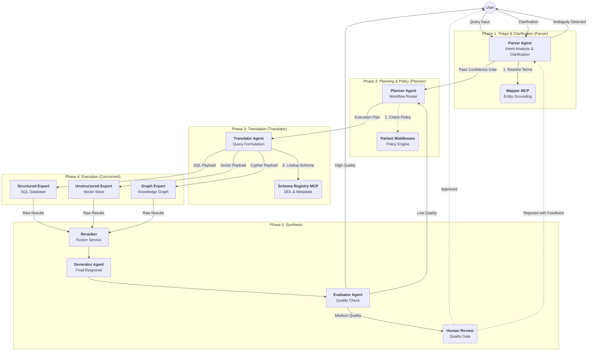

# Design Document: MCP-Based Multi-Agent RAG System

**Version:** 3.0 (Unified & Refined)
**Pattern:** Hybrid Agentic Orchestration with Two-Workflow Design
**Framework:** Microsoft Agent Framework + MCP

## 1. Executive Summary

The MCP-Based Multi-Agent RAG System is an enterprise-grade platform that coordinates multiple specialized agents to handle complex query orchestration, knowledge retrieval, answer generation, quality evaluation, and human-in-the-loop workflows. This design adopts a **Two-Workflow architecture** (One-Pass Fast and Two-Pass Clarification) for deterministic routing and enforced compliance.

**Key Architectural Decisions:**
1. **Bifurcated Workflow:** A fast "One-Pass" route for clear queries and a "Two-Pass" loop for ambiguity resolution
2. **Separation of Concerns:** Parser understands Intent → Planner manages Workflows → Translator generates Queries → Experts fetch Data → Generator synthesizes Answers
3. **RAG-on-Schema:** Translators use MCP Schema Registry to lookup DDL/metadata before generating SQL/Cypher, eliminating hallucinations
4. **Policy-as-Code:** Parlant integrated as middleware (Python decorators/hooks) enforces compliance at every agent transition
5. **Hybrid Communication:** Microsoft Agent Framework provides both SingleThreadedAgentRuntime (single-process) and GrpcWorkerAgentRuntime (distributed)

---

## 2. Architecture

### System Overview

The system uses a layered architecture that separates concerns while enabling seamless coordination between components:

```
┌─────────────────────────────────────────────────────────────────────┐
│                         Frontend Layer                              │
│  ┌──────────────┐  ┌──────────────┐  ┌──────────────┐               │
│  │  Next.js 16  │  │  CopilotKit  │  │   AG-UI      │               │
│  │   React 19   │──│   Runtime    │──│   Client     │               │
│  └──────────────┘  └──────────────┘  └──────────────┘               │
└─────────────────────────────────────────────────────────────────────┘
                              │ HTTP/SSE
                              ▼
┌─────────────────────────────────────────────────────────────────────┐
│                         Backend Layer                               │
│  ┌──────────────────────────────────────────────────────-────────┐  │
│  │                    FastAPI Application                        │  │
│  │  ┌────────────┐  ┌────────────┐  ┌────────────┐               │  │
│  │  │  AG-UI     │  │   CORS     │  │  Endpoint  │               │  │
│  │  │  Endpoint  │  │ Middleware │  │  Routing   │               │  │
│  │  └────────────┘  └────────────┘  └────────────┘               │  │
│  └───────────────────────────────────────────────────────-───────┘  │
└─────────────────────────────────────────────────────────────────────┘
                              │
                              ▼
┌─────────────────────────────────────────────────────────────────────┐
│                      Agent Orchestration Layer                      │
│  ┌─────────────────────────────────────────────────────-─────────┐  │
│  │              Microsoft Agent Framework                        │  │
│  │  ┌────────────┐  ┌────────────┐  ┌────────────┐               │  │
│  │  │Parser Agent│  │Planner Agent│ │Translator  │               │  │
│  │  │ (ReAct)    │──│ (Loop)     │──│ Agent (Seq)│               │  │
│  │  └────────────┘  └────────────┘  └────────────┘               │  │
│  │         │              │                │                     │  │
│  │         ▼              ▼                ▼                     │  │
│  │  ┌────────────┐  ┌────────────┐  ┌────────────┐               │  │
│  │  │  Domain    │  │  Reranker  │  │  Generator │               │  │
│  │  │  Experts   │──│  (Fusion)  │──│  (CoT)     │               │  │
│  │  │(Concurrent)│  │            │  │            │               │  │
│  │  └────────────┘  └────────────┘  └────────────┘               │  │
│  └───────────────────────────────────────────────────────────────┘  │
└─────────────────────────────────────────────────────────────────────┘
                              │
                              ▼
┌─────────────────────────────────────────────────────────────────────┐
│                      Supporting Services Layer                      │
│  ┌────────────┐  ┌────────────┐  ┌────────────┐  ┌────────────┐     │
│  │  Parlant   │  │   Agent    │  │ LlamaIndex │  │  Langfuse  │     │
│  │  Policy    │  │ Lightning  │  │  Indexing  │  │  Tracing   │     │
│  └────────────┘  └────────────┘  └────────────┘  └────────────┘     │
└─────────────────────────────────────────────────────────────────────┘
                              │
                              ▼
┌─────────────────────────────────────────────────────────────────────┐
│                         Model Layer                                 │
│  ┌────────────┐  ┌────────────┐  ┌────────────┐  ┌────────────┐     │
│  │   Azure    │  │  OpenAI    │  │ Embeddings │  │ Azure AI   │     │
│  │  OpenAI    │  │   GPT-4    │  │   Models   │  │  TTS       │     │
│  └────────────┘  └────────────┘  └────────────┘  └────────────┘     │
└─────────────────────────────────────────────────────────────────────┘
                              │
                              ▼
┌─────────────────────────────────────────────────────────────────────┐
│                         Storage Layer                               │
│  ┌────────────┐  ┌────────────┐  ┌────────────┐  ┌────────────┐     │
│  │PostgreSQL  │  │  pgvector  │  │ ClickHouse │  │   Redis    │     │
│  │  Database  │  │  Vectors   │  │ (optional) │  │   Cache    │     │
│  └────────────┘  └────────────┘  └────────────┘  └────────────┘     │
└─────────────────────────────────────────────────────────────────────┘
```

### Orchestration Topology

The system uses a **Directed Cyclic Graph** topology with explicit handoffs:



---

## 3. Agent Specifications

### 3.1. Intent Parser Agent (The Triage)

**Pattern:** `ReAct` (internal) → `Handoff` (external)

**Responsibility:** Semantic triage. Converts natural language into structured, grounded Intent Draft.

**Interface:**
```python
class IntentParserAgent:
    async def parse_intent(self, query: str, context: ConversationContext) -> IntentContext:
        """Parse intent using ReAct pattern for multi-step reasoning"""

def step_back_reasoning(self, query: str) -> AbstractIntent:
        """Abstract query to higher-level concepts before detailed parsing"""

    async def extract_entities(self, query: str) -> EntityExtractionResult:
        """Extract required and optional entities with confidence"""

    async def resolve_entities(self, entities: Dict, context: ConversationContext) -> Dict[str, CanonicalEntity]:
        """Ground entity names using Mapper MCP"""
```

**Advanced Techniques:**
1. **Multi-Step Planning:** Decompose complex queries into sequential sub-intents
2. **Variable Assignment:** Track entities across multi-turn conversations
3. **Step-Back Reasoning:** Abstract query to higher-level concepts
4. **Confidence Scoring:** Multi-dimensional confidence with uncertainty quantification
5. **Fallback Detection:** Graceful degradation with clarification strategies

**Tools (MCP):**
- **Mapper Tool:** `resolve_entity(text: str, domain: str) -> List[CanonicalEntity]`
  - Stateless embedding/fuzzy search to resolve entity names (e.g., "Acme" → `ID: CUST-123`)
  - Backends: ElasticSearch / Vector DB

**Output:** `IntentContext` with fields:
- `trace_id`: UUID for tracking
- `intent_type`: `lookup | aggregation | comparison | sql_generation | data_story`
- `entities`: List of grounded CanonicalEntity objects
- `unresolved_slots`: Required entities not found
- `confidence_score`: Multi-dimensional confidence
- `policy_flags``: PII, topic restrictions detected

**Example:**
```python
# Input: "Show me orders from customer ABC123 in the last week"
# Output:
IntentContext(
    trace_id="uuid-123",
    intent_type="lookup",
    entities=[
        CanonicalEntity(id="CUST-ABC123", type="customer", confidence=0.98),
        CanonicalEntity(id="last_7_days", type="timeframe", confidence=0.95)
    ],
    unresolved_slots=[],
    confidence_score=0.92,
    requires_clarification=False
)
```

### 3.2. Planner Agent (The Router & Loop Manager)

**Pattern:** `State Machine` / `Loop`
**Responsibility:** The specific authority on "Is this query ready?" Manages workflow routing and clarification loops.

**Key Logic:**
```python
class PlannerAgent:
    async def decide(self, intent: IntentContext) -> Union[ExecutionPlan, ClarificationRequest]:
        """Route query to appropriate workflow"""

    async def check_policy(self, intent: IntentContext) -> PolicyCheckResult:
        """Invoke Parlant middleware for compliance check"""

    async def create_one_pass_plan(self, intent: IntentContext) -> ExecutionPlan:
        """Fast path for clear intents"""

    async def create_two_pass_plan(self, intent: IntentContext) -> ClarificationRequest:
        """Ambiguous query requiring user clarification"""
```

**Workflow Routing:**
1. **Policy Check:** Middleware calls Parlant to evaluate for PII, topic restrictions
2. **Completeness Check:** If `unresolved_slots` not empty and `confidence_score < 0.7`
   - **Route:** Two-Pass workflow → generate clarification chips
3. **Clear Intent:** If `unresolved_slots` empty and `confidence_score >= 0.7`
   - **Route:** One-Pass workflow → proceed to Translator

**State Persistence:** Maintains conversation state across HIL interactions

**Output:**
- `ExecutionPlan` for One-Pass (includes routing to Translator)
- `ClarificationRequest` for Two-Pass (includes clarification options)

### 3.3. Translator Agent (The Linguist)

**Pattern:** `Sequential` (RAG-on-Schema)
**Responsibility:** Convert natural language intent into executable DB dialects (SQL, Cypher, GraphQL). **Never executes queries.**

**Interface:**
```python
class TranslatorAgent:
    async def formulate_queries(
        self,
        plan: ExecutionPlan,
        context: IntentContext
    ) -> List[RetrievalPayload]:
        """Generate executable queries using schema-aware approach"""

    async def get_schema_context(self, keywords: List[str]) -> SchemaContext:
        """Query Schema Registry MCP for relevant tables/schemas"""

    async def generate_sql(self, intent: IntentContext, schema: SchemaContext) -> str:
        """Generate SQL with schema validation"""

    async def generate_vector_query(self, intent: IntentContext) -> Dict:
        """Generate vector search filters"""
```

**RAG-on-Schema Process:**
1. **Discovery:** Queries Schema Registry MCP to find relevant tables
   - `find_tables(keywords: list[str])` → returns matching table names
   - `get_ddl(table_names: list[str])` → returns table schemas
2. **Generation:** Writes schema-valid query strings using structured generation
3. **Validation:** Ensures all table/column references exist in schema
4. **Handoff:** Returns `RetrievalPayload` targeting specific Domain Experts

**Benefits:**
- **Deterministic:** Translator never hallucinates tables/columns
- **Secure:** Translator doesn't have DB credentials
- **Auditable:** All queries logged with schema version references

**Tools (MCP):**
- **Schema Registry:** `search_context(keywords)`, `get_schema_details(tables)`, `get_query_examples(intent)`

**Output:** `RetrievalPayload` with fields:
- `task_id`: UUID for tracking
- `target_retriever`: `structured | vector | graph | api`
- `executable_query`: SQL or JSON filter
- `query_dialect`: `postgres`, `cypher`, `graphql`, `semantic_filter`
- `explanation`: Audit log description

### 3.4. Domain Experts (The Retrievers)

**Pattern:** `Concurrent` (Fan-out)
**Responsibility:** Execute queries against data sources. Dumb execution pipes with minimal/no LLM usage.

**Types:**
1. **StructuredExpert:** Executes SQL queries (PostgreSQL, ClickHouse)
2. **UnstructuredExpert:** Executes vector searches (pgvector, Weaviate, Pinecone)
3. **GraphExpert:** Executes graph queries (Neo4j, Neptune)
4. **APIExpert:** Calls REST APIs with authentication

**Security:** These agents hold database credentials. The Translator (LLM) *never* sees credentials, only schema.

**Implementation:**
```python
class StructuredExpert:
    def __init__(self, db_pool: asyncpg.Pool):
        self.db = db_pool

    async def execute(self, payload: RetrievalPayload) -> RetrievalResult:
        """Execute SQL query and return results"""
        results = await self.db.fetch(payload.executable_query)
        return RetrievalResult(
            source_agent="structured_expert",
            data=results,
            meta={"row_count": len(results), "query_time_ms": elapsed}
        )

class UnstructuredExpert:
    def __init__(self, vector_store: VectorStoreAdapter):
        self.vector_store = vector_store

    async def execute(self, payload: RetrievalPayload) -> RetrievalResult:
        """Execute vector search"""
        results = await self.vector_store.search(
            query_embedding=payload.query_embedding,
            filters=payload.filters
        )
        return RetrievalResult(
            source_agent="unstructured_expert",
            data=results,
            meta={"doc_count": len(results), "top_score": results[0].score if results else 0}
        )
```

**Execution Pattern:**
- Agents execute in parallel using `asyncio.TaskGroup`
- Each returns `RetrievalResult` with structured data
- Individual failures don't block other agents
- Timeout handling: 5000ms default per agent

### 3.5. Generator Agent (The Synthesizer)

**Pattern:** `Chain-of-Thought` (CoT)
**Responsibility:** Compose final answer with citations and provenance.

**Interface:**
```python
class GeneratorAgent:
    async def synthesize(
        self,
        query: str,
        results: List[RetrievalResult],
        context: IntentContext
    ) -> Answer:
        """Generate grounded answer with structured reasoning"""

    async def assemble_context(self, results: List[RetrievalResult]) -> Context:
        """Merge results from multiple experts with provenance"""

    def extract_citations(self, reasoning_steps: List[str], results: List[RetrievalResult]) -> List[Citation]:
        """Create inline citations from reasoning"""
```

**CoT Structure:**
1. **Identify Key Information:** Extract relevant facts from each result source
2. **Determine Relevance:** Match information to query requirements
3. **Synthesize Answer:** Combine with clear source attribution
4. **Add Citations:** Format: `[Source: Structured DB, confidence: 0.92]`

**Provenance Fields:**
- `sources`: List of source identifiers
- `confidence`: Overall confidence score
- `reasoning_steps`: Chain-of-thought trace
- `citations`: Inline citations with source IDs
- `generation_time_ms`: Performance metric

### 3.6. Evaluator Agent (Quality Assessment)

**Pattern:** `Chain-of-Thought` (CoT)
**Responsibility:** Assess answer quality using 7 RAG characteristics.

**Interface:**
```python
class EvaluatorAgent:
    async def evaluate(
        self,
        query: str,
        context: List[RetrievalResult],
        answer: Answer
    ) -> EvaluationResult:
        """Comprehensive quality evaluation"""

    def calculate_overall_score(self, scores: Dict[str, float]) -> float:
        """Weighted average of all metrics"""
```

**7 RAG Characteristics:**
1. **Faithfulness:** Grounding in source documents (weight: 25%)
2. **Relevance:** Addresses the query (weight: 20%)
3. **Correctness:** Factual accuracy (weight: 20%)
4. **Coverage:** Completeness of answer (weight: 15%)
5. **Consistency:** Internal coherence (weight: 10%)
6. **Freshness:** Recency of information (weight: 5%)
7. **Traceability:** Source attribution quality (weight: 5%)

**Quality Gates:**
- **High Quality (≥0.8):** Deliver directly to user
- **Medium Quality (0.6-0.8):** Request human approval
- **Low Quality (<0.6):** Route to human review with corrections

---

## 4. Orchestration Implementation

### 4.1. Data Contracts (Pydantic Models)

```python
from pydantic import BaseModel, Field
from typing import Literal, List, Optional, Any, Union
from uuid import UUID, uuid4
from datetime import datetime

class CanonicalEntity(BaseModel):
    """Grounded entity with unique identifier"""
    id: str
    name: str
    type: str
    confidence: float = Field(ge=0.0, le=1.0)
    source: str  # Mapper MCP source

class IntentContext(BaseModel):
    """Output from Parser, Input to Planner"""
    trace_id: UUID = Field(default_factory=uuid4)
    intent_type: Literal["lookup", "aggregation", "comparison", "sql_generation", "data_story"]
    entities: List[CanonicalEntity]
    unresolved_slots: List[str] = Field(default_factory=list)
    raw_query: str
    confidence_score: float = Field(ge=0.0, le=1.0)
    policy_flags: List[str] = Field(default_factory=list)
    requires_clarification: bool = False

class ExecutionPlan(BaseModel):
    """One-Pass workflow plan"""
    plan_id: UUID = Field(default_factory=uuid4)
    workflow_type: Literal["one_pass", "two_pass"] = "one_pass"
    target_translators: List[str]  # Which experts to engage
    query_criteria: Dict[str, Any]
    estimated_complexity: Literal["simple", "moderate", "complex"]

class ClarificationRequest(BaseModel):
    """Two-Pass workflow request"""
    request_id: UUID = Field(default_factory=uuid4)
    missing_slots: List[str]
    clarification_options: Dict[str, List[str]]  # slot -> options
    rationale: str
    suggested_questions: List[str]

class RetrievalPayload(BaseModel):
    """Output from Translator, Input to Experts"""
    task_id: UUID = Field(default_factory=uuid4)
    target_retriever: Literal["structured", "vector", "graph", "api"]
    executable_query: str  # SQL, Cypher, or JSON filter
    query_dialect: str     # postgres, cypher, graphql
    explanation: str
    timeout_ms: int = 5000

class RetrievalResult(BaseModel):
    """Output from Experts"""
    source_agent: str
    data: List[Any]
    meta: Dict[str, Any] = Field(default_factory=dict)
    execution_time_ms: int
    success: bool = True
    error_message: Optional[str] = None

class Answer(BaseModel):
    """Generated answer with provenance"""
    answer_id: UUID = Field(default_factory=uuid4)
    trace_id: UUID
    query: str
    text: str
    sources: List[str] = Field(default_factory=list)
    confidence: float = Field(ge=0.0, le=1.0)
    model_used: str
    generation_time_ms: int
    provenance: Dict[str, Any] = Field(default_factory=dict)
    citations: List[Dict[str, Any]] = Field(default_factory=list)

class EvaluationResult(BaseModel):
    """Quality assessment output"""
    evaluation_id: UUID = Field(default_factory=uuid4)
    trace_id: UUID

    # 7 RAG Characteristics
    faithfulness: float = Field(ge=0.0, le=1.0)
    relevance: float = Field(ge=0.0, le=1.0)
    correctness: float = Field(ge=0.0, le=1.0)
    coverage: float = Field(ge=0.0, le=1.0)
    consistency: float = Field(ge=0.0, le=1.0)
    freshness: float = Field(ge=0.0, le=1.0)
    traceability: float = Field(ge=0.0, le=1.0)

    overall_score: float = Field(ge=0.0, le=1.0)
    needs_review: bool = False
    review_reasons: List[str] = Field(default_factory=list)
```

### 4.2. Concurrent Execution Logic

The Translator uses `asyncio.TaskGroup` for parallel expert execution:

```python
import asyncio
from typing import List

class ConcurrentExecutor:
    def __init__(self, retrievers: Dict[str, BaseRetriever]):
        self.retrievers = retrievers

    async def execute_concurrent(
        self,
        payloads: List[RetrievalPayload]
    ) -> List[RetrievalResult]:
        """
        Execute multiple retrievers in parallel with proper error handling.
        Uses Python 3.11+ TaskGroup for robust concurrency.
        """
        results: List[RetrievalResult] = []

        try:
            async with asyncio.TaskGroup() as tg:
                tasks = []
                for payload in payloads:
                    retriever = self.retrievers.get(payload.target_retriever)
                    if retriever:
                        task = tg.create_task(
                            retriever.execute(payload),
                            name=f"retrieval-{payload.target_retriever}"
                        )
                        tasks.append(task)

            # Collect results after all complete
            results = [task.result() for task in tasks]

        except* asyncio.TimeoutError as te:
            # Handle timeout errors
            print(f"Retrieval timeout: {te}")

        except* Exception as eg:
            # Handle other errors but continue
            print(f"Partial retrieval failures: {eg}")
            # Collect successful results
            results = [t.result() for t in tasks if not t.exception()]

        return results
```

### 4.3. Main Orchestration Workflow

```python
async def run_agentic_rag(
    user_query: str,
    session_id: str,
    context: ConversationContext = None
) -> Union[Answer, ClarificationRequest]:
    """
    Complete RAG pipeline with Parser as sole entry point.
    Follows: Parse → [Clarify Loop] → Plan → Translate → Execute → Synthesize
    """
    # Initialize agents
    parser = IntentParserAgent()
    planner = PlannerAgent()
    translator = TranslatorAgent()
    executor = ConcurrentExecutor(retrievers)
    generator = GeneratorAgent()
    evaluator = EvaluatorAgent()

    # === PHASE 1: PARSER TRIAGE & CLARIFICATION ===
    # Parser handles all user interaction until intent is clear
    intent_ctx = await parser.parse_intent(user_query, context)

    # If ambiguity detected, return clarification request directly
    if intent_ctx.requires_clarification:
        return parser.create_clarification_request(intent_ctx)

    # === PHASE 2: PLANNING & WORKFLOW ROUTING ===
    # Parser hands off to Planner only after confidence gate passed
    decision = await planner.create_execution_plan(intent_ctx)

    # === PHASE 3: TRANSLATION (Schema-Aware) ===
    # Uses MCP Schema Registry internally
    payloads = await translator.formulate_queries(
        decision,
        intent_ctx
    )

    # === PHASE 4: EXECUTION (Parallel) ===
    raw_results = await executor.execute_concurrent(payloads)

    # === PHASE 5: GENERATION ===
    answer = await generator.synthesize(
        query=user_query,
        results=raw_results,
        context=intent_ctx
    )

    # === PHASE 6: EVALUATION & QUALITY GATES ===
    evaluation = await evaluator.evaluate(
        query=user_query,
        context=raw_results,
        answer=answer
    )

    # If quality below threshold, route through Parser for human review
    if evaluation.needs_review:
        return await parser.request_human_review(answer, evaluation)

    # Direct delivery (Parser as exit point)
    return answer
```

---

## 5. Workflows in Detail

### Workflow 1: One-Pass (Fast Path)

*Ideal for:* "Show me Q3 revenue for Acme Corp" (clear intent, high confidence)

**Sequence:**
1. **User** → **Parser**: Submit query
2. **Parser** analyzes query, grounds entities via Mapper MCP, calculates confidence
3. **Parser** has high confidence (>0.7) and no unresolved slots
4. **Parser** → **Planner**: Handoff with ExecutionPlan
5. **Planner** policy check via Parlant passes
6. **Planner** → **Translator**: Route finalized plan
7. **Translator** generates queries using Schema Registry MCP
8. **Experts** execute retrieval in parallel
9. **Generator** synthesizes answer with citations
10. **Evaluator** checks quality (≥0.8 score)
11. **Eval** → **User**: Deliver answer directly

**Timing:** ~2-3 seconds total

**Key Point:** Parser is the sole entry point. No other agent receives direct user input.

### Workflow 2: Two-Pass (Clarification Loop)

*Ideal for:* "How much did we spend on the project?" (ambiguous: which project? which timeframe?)

**First Pass:**
1. **User** → **Parser**: Submit query
2. **Parser** analyzes query, detects low confidence and missing slots
3. **Parser** → **User**: Return ClarificationRequest with options
4. **User** sees UI chips/guidance

**Second Pass:**
5. **User** provides clarification (selects "Project Alpha", "YTD")
6. **User** → **Parser**: Submit updated query
7. **Parser** re-analyzes with updated context
8. **Parser** now has high confidence, creates ExecutionPlan
9. **Parser** → **Planner**: Handoff for execution
10. **Proceed** with remaining One-Pass workflow (steps 5-11 above)

**Timing:** ~5-10 seconds total (including human input)

**Key Point:** Parser manages the entire clarification loop. Planner only sees finalized intents.

### Workflow 3: Human-in-the-Loop Quality Gate

*Triggered by:* Quality score 0.6-0.8 or user preference for oversight

**Flow:**
1. Complete One-Pass workflow through Evaluator
2. **Evaluator** calculates quality score (0.6-0.8)
3. **Evaluator** → **Parser**: Route to Human Approval
4. **Parser** → **User**: Present for review with context
5. **Human Reviewer** sees:
   - Generated answer
   - Source documents
   - Quality metrics (faithfulness, relevance, etc.)
6. **Reviewer** can:
   - Approve → deliver to user
   - Reject → submit feedback to Parser
7. **If Rejected:** Feedback goes to **Parser**, which incorporates it and re-generates
8. **Feedback** stored in LightningStore for optimization

**Key Point:** Parser remains the single entry/exit point for user interactions.

---

## 6. Middleware & Policy (Parlant)

Parlant is integrated as **middleware decorators/hooks** to enforce compliance:

### 6.1. Parlant Guard Implementation

```python
from functools import wraps
from parlant.client import ParlantClient

parlant = ParlantClient(url="http://parlant-service")

def parlant_guard(policy_domain: str, action: str):
    """Middleware to check policy before agent execution"""
    def decorator(func):
        @wraps(func)
        async def wrapper(*args, **kwargs):
            # Extract context
            context_data = kwargs.get('context') or args[0]

            # Call Parlant policy engine
            evaluation = await parlant.evaluate(
                domain=policy_domain,
                action=action,
                context=context_data
            )

            # Enforce policy
            if evaluation.status == "BLOCK":
                raise PolicyViolationError(evaluation.reason)

            if evaluation.status == "FLAG":
                # Inject warning into context
                if hasattr(context_data, 'warnings'):
                    context_data.warnings.append(evaluation.reason)

            if evaluation.status == "CLARIFY":
                # Force clarification workflow
                context_data.requires_clarification = True
                context_data.clarification_prompt = evaluation.suggestion

            # Proceed with execution
            return await func(*args, **kwargs)
        return wrapper
    return decorator

# Usage in Planner
class PlannerAgent:
    @parlant_guard(policy_domain="data_access", action="route_query")
    async def decide(self, intent: IntentContext):
        # Business logic here
        pass
```

### 6.2. Policy Domains

- **data_access:** Controls which data sources can be queried
- **pii_protection:** Detects and masks personally identifiable information
- **topic_restrictions:** Blocks restricted topics (e.g., HR data without permission)
- **query_safety:** Validates SQL queries for safety (no DELETE/UPDATE)
- **response_compliance:** Ensures generated answers follow guidelines

---

## 7. MCP Integration

The **Model Context Protocol (MCP)** standardizes how agents access external knowledge:

### 7.1. Mapper MCP (Parser)

**Endpoint:** `POST /mcp/v1/tools/call`

**Tool:** `resolve_entity`

**Request:**
```json
{
  "tool": "resolve_entity",
  "arguments": {
    "text": "Acme Corp",
    "domain": "crm",
    "entity_type": "customer"
  }
}
```

**Response:**
```json
{
  "id": "CUST-001",
  "name": "Acme International",
  "type": "customer",
  "confidence": 0.98,
  "source": "customer_database"
}
```

### 7.2. Schema Registry MCP (Translator)

**Endpoint:** `POST /mcp/v1/tools/call`

**Tool:** `get_schema_context`

**Request:**
```json
{
  "tool": "get_schema_context",
  "arguments": {
    "intent_keywords": ["revenue", "Q3", "customer"],
    "limit": 3
  }
}
```

**Response:**
```sql
-- Schema for: fact_sales
CREATE TABLE fact_sales (
    sale_id BIGINT PRIMARY KEY,
    cust_id VARCHAR(50) REFERENCES dim_customer(id),
    amt DECIMAL(10,2) NOT NULL,
    sale_date DATE NOT NULL,
    quarter INT,
    year INT
);

-- Context: Contains quarterly revenue data by customer
-- Indexes: btree on cust_id, btree on (year, quarter)
-- Row count: 12,456,789
-- Last updated: 2025-01-15
```

### 7.3. Execution MCP (Experts)

**Tools:**
- `execute_sql(query: str, readonly: bool = true)`
- `search_vectors(embedding: list, filters: dict, top_k: int)`
- `execute_cypher(query: str)`

**Security:**
- All queries run in read-only mode
- Timeout enforced (5000ms)
- Credentials isolated from Translator
- Query logging for audit

---

## 8. System Properties (Correctness Guarantees)

### Property 1: Intent Parsing Completeness
*For any* natural language query, the Parser Agent should return a structured IntentContext with extracted entities, confidence score, and unresolved slots.

**Validates:** Requirements 2.1, 6.1

### Property 2: Workflow Routing Determinism
*For any* IntentContext, the Planner should deterministically route to either One-Pass or Two-Pass workflow based on confidence threshold and slot completeness.

**Validates:** Requirements 1.2, 2.3

### Property 3: Parallel Execution Aggregation
*For any* set of Domain Experts executing in parallel, the system should aggregate all results before proceeding to synthesis phase.

**Validates:** Requirements 1.3, 3.4

### Property 4: Translator Schema Validation
*For any* query generated by Translator, the system should validate table/column references against Schema Registry before execution.

**Validates:** Requirements 3.1, 3.2, 12.2

### Property 5: Parlant Policy Enforcement
*For any* agent action, Parlant middleware should evaluate and enforce policy rules (BLOCK, FLAG, or CLARIFY).

**Validates:** Requirements 4.1, 4.3, 14.1

### Property 6: Quality-Based Review Routing
*For any* generated answer, the Evaluator should route to Human Review if overall quality score < 0.8.

**Validates:** Requirements 6.3, 6.4

### Property 7: Clarification Loop Completion
*For any* Two-Pass workflow, the system should persist conversation state and resume execution after user clarification.

**Validates:** Requirements 2.2, 7.1

### Property 8: Credential Isolation
*For any* query, Translator Agent should never have access to database credentials (held only by Domain Experts).

**Validates:** Requirements 12.3, 14.4

### Property 9: MCP Standard Compliance
*For any* external service call, agents should use standardized MCP protocol for tool invocation.

**Validates:** Requirements 16.1, 16.6

### Property 10: Runtime Configurability
*For any* agent communication, the system should support both SingleThreadedAgentRuntime and GrpcWorkerAgentRuntime via configuration.

**Validates:** Requirements 16.1, 16.2, 16.3

---

## 9. Testing Strategy

### Property-Based Testing

**Framework:** Hypothesis (Python)

**Example Tests:**

```python
from hypothesis import given, strategies as st
import pytest

@given(query=st.text(min_size=5, max_size=200))
@pytest.mark.asyncio
async def test_property_1_intent_parsing_completeness(query):
    """
    Property 1: Intent Parsing Completeness
    For any query, Parser returns structured context with entities/confidence
    """
    parser = IntentParserAgent()
    result = await parser.parse_intent(query)

    assert isinstance(result, IntentContext)
    assert hasattr(result, 'trace_id')
    assert hasattr(result, 'confidence_score')
    assert 0.0 <= result.confidence_score <= 1.0

@given(
    confidence=st.floats(min_value=0.0, max_value=1.0),
    has_unresolved=st.booleans()
)
def test_property_2_workflow_routing(confidence, has_unresolved):
    """
    Property 2: Workflow Routing Determinism
    Routing decision based on confidence and slot completeness
    """
    planner = PlannerAgent()
    intent = IntentContext(
        confidence_score=confidence,
        unresolved_slots=["project"] if has_unresolved else []
    )

    decision = planner.decide(intent)

    if confidence < 0.7 and has_unresolved:
        assert isinstance(decision, ClarificationRequest)
    else:
        assert isinstance(decision, ExecutionPlan)
```

### Integration Testing

**End-to-End Scenario:**
```python
@pytest.mark.integration
@pytest.mark.asyncio
async def test_complete_query_pipeline():
    """Test One-Pass workflow from query to answer"""

    # Setup mocks for MCP services
    with mock_mapper(), mock_schema_registry():
        # Execute complete pipeline
        result = await run_agentic_rag(
            "What was Q3 revenue for customer ABC123?",
            session_id="test-123"
        )

        # Verify answer structure
        assert isinstance(result, Answer)
        assert result.text is not None
        assert len(result.sources) > 0
        assert result.confidence >= 0.0

        # Verify evaluation ran
        assert hasattr(result, 'evaluation_score')
```

---

## 10. Deployment Strategy

### Technology Stack

**Backend:**
- **Microsoft Agent Framework** (`autogen-agentchat`) - Agent orchestration with Swarm
- **MCP Protocol** - Standardized tool communication
- **FastAPI** - HTTP server
- **Python 3.12+** - Runtime
- **Azure OpenAI** / **OpenAI** - LLM providers
- **asyncpg** - PostgreSQL driver

**Data Layer:**
- **PostgreSQL** - Metadata and transactional data
- **pgvector** - Vector similarity search
- **Azure AI Search** - Alternative vector store option
- **Redis** - Caching layer

**Middleware:**
- **Parlant** - Policy and behavioral guidelines
- **LlamaIndex** - Document indexing and chunking
- **Langfuse** - Observability and tracing
- **RAGAS** - Quality evaluation metrics

**Frontend:**
- **Next.js 16** - React framework
- **CopilotKit** - Agent UI framework with HIL
- **TypeScript** - Type safety
- **Tailwind CSS** - Styling

**Development:**
- **Hypothesis** - Property-based testing
- **pytest** - Test framework
- **Docker** - Containerization
- **GitHub Actions** - CI/CD

### Containerization

**Backend Dockerfile:**
```dockerfile
FROM python:3.12-slim

WORKDIR /app

COPY pyproject.toml .
RUN pip install --no-cache-dir -e .

COPY . .

CMD ["uvicorn", "app.main:app", "--host", "0.0.0.0", "--port", "8000"]
```

**Docker Compose:**
```yaml
version: '3.8'

services:
  backend:
    build: ./backend
    ports:
      - "8000:8000"
    environment:
      - DATABASE_URL=postgresql://user:pass@db:5432/rag_system
      - AZURE_OPENAI_ENDPOINT=${AZURE_OPENAI_ENDPOINT}
    depends_on:
      - db
      - redis

  db:
    image: pgvector/pgvector:pg16
    environment:
      POSTGRES_USER: user
      POSTGRES_PASSWORD: pass
      POSTGRES_DB: rag_system
    volumes:
      - postgres_data:/var/lib/postgresql/data

  redis:
    image: redis:7-alpine

volumes:
  postgres_data:
```

### CI/CD Pipeline

**GitHub Actions:**
```yaml
name: CI/CD Pipeline

on:
  push:
    branches: [main, develop]

jobs:
  test:
    runs-on: ubuntu-latest
    steps:
      - uses: actions/checkout@v3
      - uses: actions/setup-python@v4
        with:
          python-version: '3.12'
      - run: pip install -e . && pip install pytest hypothesis
      - run: pytest tests/ -v

  deploy:
    needs: test
    runs-on: ubuntu-latest
    if: github.ref == 'refs/heads/main'
    steps:
      - uses: azure/login@v1
      - run: az containerapp update --name rag-system --image ${{ env.IMAGE_TAG }}
```

---

## 11. Future Enhancements

### Phase 2 (Months 3-4)
- **Multi-Modal RAG:** Support images, videos, audio in retrieval
- **Graph RAG:** Knowledge graph integration for relationship queries
- **Streaming Generation:** Token-by-token streaming for long answers
- **Multi-Language:** Internationalization for queries and answers
- **Advanced Personas:** Custom persona creation and management

### Phase 3 (Months 5-6)
- **Active Learning:** Intelligent sample selection for human review
- **Federated Learning:** Privacy-preserving model updates
- **Edge Deployment:** On-premise deployment for sensitive data
- **Multi-Tenant:** Isolated environments for different organizations
- **Advanced Analytics:** Predictive query routing, cost optimization

---

*Last Updated: 2025-01-24*
*Version: 3.0 (Unified & Refined)*
