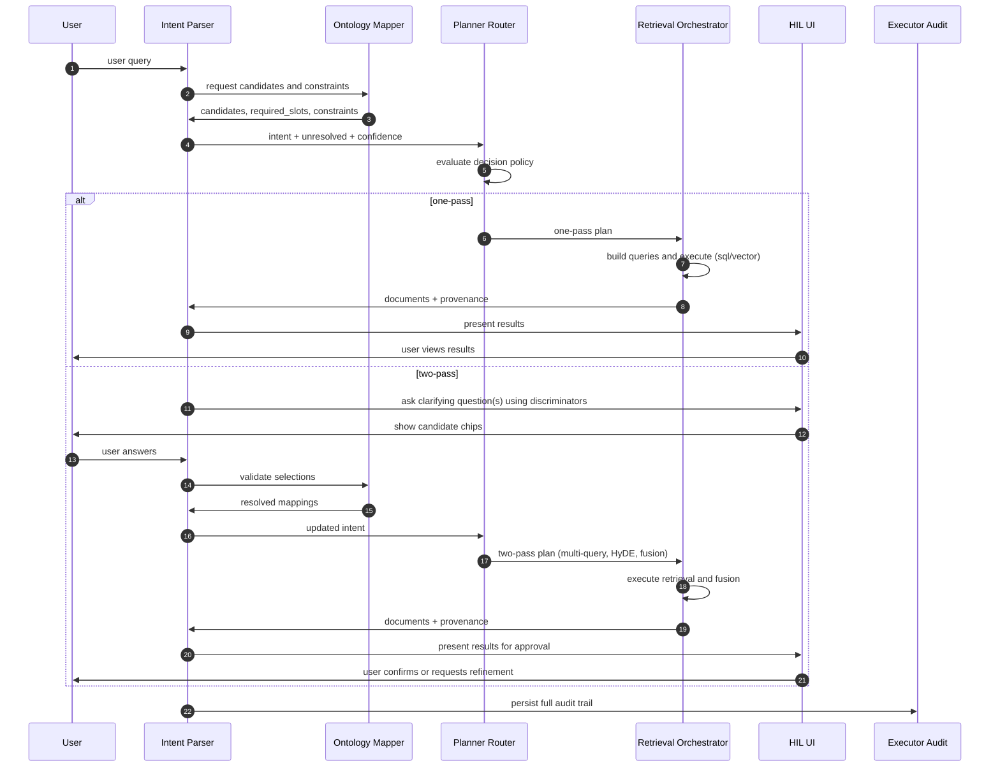

## 🎯 Quality Characteristics of a Good Intent Statement
Borrowing from both conversational AI practice and systems engineering (requirements engineering, ISO/IEC standards), a high-quality intent statement should be:

- **Clear & Unambiguous**  
  - No room for multiple interpretations.  
  - Example: “Book a flight to Tokyo on Dec 12” vs. “Book a trip.”

- **Complete**  
  - Contains all necessary parameters for execution (who, what, when, where, constraints).  
  - Example: “Transfer $500 from checking to savings today” (includes amount, source, destination, time).

- **Consistent**  
  - No internal contradictions.  
  - Example: “Book a flight to Paris departing from Paris” would be flagged.

- **Atomic**  
  - Represents a single actionable unit.  
  - Example: “Check weather in New York” (not “Check weather and book a hotel”).

- **Verifiable**  
  - Can be confirmed against user expectations or system capabilities.  
  - Example: “Find Italian restaurants within 5 miles” → system can verify radius constraint.

- **Traceable**  
  - Linked back to the original user query and clarifications.  
  - Important for debugging and audit trails.

- **Prioritized / Ranked**  
  - If multiple intents are possible, the parser should indicate confidence or preference.

---

## ⚙️ Borrowing from Systems Engineering Principles
Intent statements can be treated like **requirements specifications**. Classic systems engineering principles apply:

- **SMART Requirements** (Specific, Measurable, Achievable, Relevant, Time-bound)  
  → Adapted to intents: Specific (clear action), Measurable (parameters defined), Achievable (system can execute), Relevant (matches user goal), Time-bound (includes temporal constraints if needed).

- **Requirements Validation & Verification**  
  → Multi-turn clarifications act as *validation loops* (does this intent reflect what the user meant?). Execution success acts as *verification*.

- **Hierarchical Decomposition**  
  → Break complex queries into sub-intents (like “plan trip” → flight intent + hotel intent + car rental intent).

- **Interface Definition**  
  → Each intent statement should map cleanly to a system interface (API call, agent function). This ensures modularity.

- **Change Management**  
  → Multi-turn conversations handle evolving requirements (user changes date, destination, or constraints mid-dialogue).

---

## 🧩 Example: Multi-Turn Refinement
User: *“I want to go to Japan.”*  
- Step 1 (clarify): “Do you mean booking a flight, hotel, or both?”  
- Step 2 (clarify): “Which city in Japan?”  
- Step 3 (clarify): “What dates are you planning to travel?”  
- Final Intent Statement:  
  ```json
  {
    "intent": "book_flight",
    "parameters": {
      "destination": "Tokyo",
      "departure_date": "2025-12-12",
      "origin": "Los Angeles"
    }
  }
  ```


---

## 🧠 Reasoning Frameworks for Intent Parsing + Requirement Elicitation

### 1. **Single-Agent Reasoning (Prompt Engineering + Self-Improvement)**
- **Prompt Engineering**:  
  - Role-based prompts (“You are a requirements analyst”).  
  - Task-description prompts (“Clarify user queries into complete intent statements”).  
  - In-context examples (few-shot classification + clarification dialogues).
- **Self-Improvement Loops**:  
  - Reflection: agent summarizes what’s missing in the intent.  
  - Iterative Optimization: agent refines until intent meets quality criteria.  
  - Interactive Learning: agent adapts goals based on user clarifications.

### 2. **Tool-Based Reasoning**
- **Tool Integration**:  
  - CopilotKit APIs for conversation state, memory, and routing.  
  - External tools (e.g., calendar, CRM, analytics) as “slots” to be filled.
- **Tool Selection**:  
  - Rule-based mapping (keywords → tool).  
  - Autonomous selection (LLM decides which CopilotKit module to call).  
  - Learning-based (feedback loop improves routing).
- **Tool Utilization**:  
  - Sequential (clarify → validate → finalize).  
  - Parallel (ask multiple clarifications at once).  
  - Iterative (retry until intent passes validation checklist).

### 3. **Multi-Agent Reasoning**
- **Organizational Architectures**:  
  - Centralized: one “orchestrator” agent manages clarifications.  
  - Hierarchical: analyst agent → domain expert agent → validator agent.  
  - Decentralized: agents debate possible interpretations.
- **Interaction Protocols**:  
  - Cooperation: agents share clarifications.  
  - Competition: agents propose conflicting interpretations, user resolves.  
  - Negotiation: agents converge on consensus intent.

---

## 🔧 Techniques to Implement in MVP

### A. **Closed-Loop Clarification Cycle**
1. **Parse initial query** → draft intent statement.  
2. **Check against quality characteristics** (clarity, completeness, atomicity, etc.).  
3. **Identify gaps** → generate clarifying questions.  
4. **User answers** → update intent.  
5. **Repeat until validated** (HIL confirmation).  

This mirrors **requirements validation loops** in systems engineering.

---

### B. **Human-in-the-Loop (HIL) with CopilotKit**
- **Validation Step**:  
  - Present intent statement to user in structured JSON.  
  - Ask: “Does this capture your request fully?”  
- **Correction Step**:  
  - Allow user edits or overrides.  
  - Feed corrections back into agent memory.  
- **Audit Trail**:  
  - Store conversation + intent evolution for traceability.

---

### C. **Framework Techniques You Can Borrow**
- **Chain of Thought (CoT)**: break down reasoning into explicit steps.  
- **ReAct (Reason + Act)**: alternate between clarifying reasoning and tool calls.  
- **Plan-and-Execute**: agent plans clarification strategy, executes questions.  
- **Debate/Negotiation**: multiple agents propose interpretations, converge.  
- **Context Engineering**: maintain persistent conversation state across turns.

---

## 📌 MVP Architecture Sketch
- **Intent Parser Agent**:  
  - Uses CoT + ReAct prompting.  
  - Applies quality checklist after each clarification.  
- **CopilotKit Integration**:  
  - Conversation state management.  
  - HIL validation UI (structured JSON + “approve/correct” buttons).  
- **Closed Loop**:  
  - Parse → Clarify → Validate → Confirm → Route.  
- **Evaluation**:  
  - Track % of intents meeting quality characteristics.  
  - Measure clarification turns per intent.

---

# Two-agent collaboration for ontology-grounded intent elicitation

This spec defines a modular, closed-loop conversational system where an Intent Parser Agent and an Ontology Mapper Agent collaborate to elicit precise, executable intent statements with human-in-the-loop validation.

---

## Roles and responsibilities

### Intent parser agent

- **Primary mission:** Turn ambiguous user input into a clear, complete, atomic intent statement through multi-turn clarification.
- **Key responsibilities:**
  - **Clarification:** Identify missing parameters and ask targeted questions guided by ontology context.
  - **Normalization:** Produce structured outputs (JSON) with standardized slot names and types.
  - **Quality assurance:** Enforce clarity, completeness, consistency, atomicity, verifiability, and traceability via a checklist.
  - **User validation:** Present candidate intents to the user for approval or correction.
- **Inputs:** Raw user utterances, prior conversation state, ontology context (candidate entities, required attributes, constraints).
- **Outputs:** Intent statements with resolved parameters and confidence, plus an audit trail.

### Ontology mapper agent

- **Primary mission:** Ground normalized slots to canonical enterprise entities, constraints, and required attributes using the enterprise ontology.
- **Key responsibilities:**
  - **Entity resolution:** Map phrases to canonical IDs (tables, dimensions, metrics, services).
  - **Constraint provision:** Provide required fields, valid values, constraints, and compatibility checks.
  - **Ambiguity surfacing:** Return candidate matches with discriminators for the parser to clarify.
  - **Validation signals:** Flag contradictions and schema violations.
- **Inputs:** Draft intent with unresolved or normalized slots, ontology store (data warehouse catalogs, metric registries).
- **Outputs:** Enriched intent context (candidate entities, constraints, required slots, validation flags).

---

## Prompts

### Intent parser agent system prompt

You are the Intent Parser Agent and a requirements analyst. Your job is to elicit a clear, complete, atomic intent statement from the user, using ontology context provided by the Ontology Mapper Agent. Ask targeted clarifying questions only when required slots or constraints are missing or ambiguous. Always enforce the quality checklist: clarity, completeness, consistency, atomicity, verifiability, traceability. Output only JSON according to the schema below. If multiple interpretations exist, propose top 2 with discriminators and ask the user to choose. When the user confirms, finalize a single intent.

Schema:
{
  "intent": "string",
  "parameters": { "key": "value" },
  "unresolved": [{ "slot": "string", "reason": "missing|ambiguous", "candidates": ["..."] }],
  "confidence": 0-1,
  "audit": { "from_query": "string", "clarifications": ["..."] }
}

Rules:
- Ask one concise clarification at a time.
- Use ontology context to propose candidate values and required slots.
- Do not execute actions; only produce intent statements.
- If the user changes scope mid-conversation, re-evaluate atomicity and propose decomposition.

### Ontology mapper agent system prompt

You are the Ontology Mapper Agent. Your job is to ground normalized slots from the parser into canonical enterprise entities and constraints. Return candidate mappings with discriminators when ambiguous. Provide required attributes for the selected domain, valid value sets, and compatibility checks. Output only JSON according to the schema below. Do not ask the user questions; surface ambiguity via candidates and flags.

Schema:
{
  "candidates": {
    "slot_name": [
      { "value": "canonical_id", "label": "human label", "discriminator": "short note", "confidence": 0-1 }
    ]
  },
  "required_slots": [
    { "slot": "string", "reason": "domain_required|policy_required", "valid_values_hint": ["..."] }
  ],
  "constraints": [
    { "type": "compatibility|range|enum", "applies_to": ["slotA","slotB"], "rule": "description" }
  ],
  "violations": [
    { "slot": "string", "issue": "contradiction|unknown", "details": "..." }
  ],
  "audit": { "ontology_version": "string" }
}

Rules:
- Prefer canonical IDs and provide human-readable labels.
- Include discriminators that help the parser form clarifying questions.
- If a slot is already canonical, validate it and report violations if any.

---

## Data contracts and validation

- **Intent statement (final):**
  - **intent:** canonical action name (e.g., “allocate_finops_cost”).
  - **parameters:** fully resolved canonical values (e.g., service_id, account_id, timeframe_id, allocation_method_id).
  - **confidence:** numeric 0–1.
  - **audit:** original query, clarifications, ontology version, timestamps.

- **Quality checklist (parser enforced):**
  - **Clarity:** Single interpretation; no vague nouns.
  - **Completeness:** All required_slots satisfied.
  - **Consistency:** No constraint violations.
  - **Atomicity:** One actionable goal; propose decomposition if multiple.
  - **Verifiability:** Parameters map to executable interfaces.
  - **Traceability:** Link to source utterances and ontology version.

- **Error handling:**
  - **Ambiguity:** Present top candidates with discriminators; ask the user to choose.
  - **Violation:** Explain specific constraint conflict; suggest valid alternatives.
  - **Unknown term:** Ask for description; attempt ontology-free normalization; requery mapper.

---

## Workflow

- **Step 1 — User input:** User provides a request.
- **Step 2 — Parser draft:** Parser normalizes and identifies unresolved slots.
- **Step 3 — Mapper grounding:** Mapper returns candidates, required slots, and constraints.
- **Step 4 — Parser clarification:** Parser asks targeted questions using mapper context.
- **Step 5 — User answers:** User chooses among candidates or provides values.
- **Step 6 — Parser validation:** Parser checks quality checklist; if incomplete/violations, loop back to Step 3.
- **Step 7 — HIL confirmation (CopilotKit):** Present final intent for approval; capture edits.
- **Step 8 — Route/execute:** Once confirmed, route to downstream tool or service with canonical parameters.
- **Step 9 — Audit:** Persist intent evolution, ontology version, and confirmations.

---

## Typical use case: FinOps cost allocation

#### Scenario
User asks to allocate cloud costs to services for a specific period using a basis (tags or usage), constrained to an account and region.

#### Canonical entities
- **Action:** allocate_finops_cost
- **Slots:** account_id, service_id, timeframe_id, region_id, allocation_method_id
- **Methods:** tags_based, usage_based, revenue_based
- **Constraints:** account-region compatibility; timeframe granularity must match allocation method.

#### Mermaid sequence diagram

```mermaid
sequenceDiagram
  autonumber
  participant U as User
  participant P as Intent Parser Agent
  participant O as Ontology Mapper Agent
  participant H as HIL UI (CopilotKit)

  rect rgb(230,245,255)
    U->>P: "Allocate last month's costs to backend services by usage in us-west under account 12345."
    P->>P: Draft intent with unresolved slots
  end

  rect rgb(240,255,240)
    P->>O: Request ontology context for draft slots
    O->>P: Return candidates and constraints
    Note right of O: service → [API, Worker]\ntimeframe → [2025-10, rolling_last_month]\nregion → [us-west-1, us-west-2]
  end

  rect rgb(255,250,230)
    P->>U: "Which backend service do you mean: API or Worker? And is 'us-west-1' or 'us-west-2' correct?"
    U->>P: "API, and us-west-2."
    P->>O: Validate selections and resolve timeframe "last month"
    O->>P: Return resolved mapping
    Note right of O: service=backend_api\nregion=us-west-2\ntimeframe=2025-10\nmethod=usage_based\n(no violations)
  end

  rect rgb(255,240,240)
    P->>H: Present final intent for confirmation (JSON)
    H->>U: "Confirm this allocation intent?"
    U->>H: "Approved."
    H->>P: Approval event
    P->>O: Persist ontology resolution audit
  end



```



---

## Implementation notes

- **State management:** Maintain a conversation state object with current intent, unresolved slots, candidate lists, and constraint flags; persist via CopilotKit.
- **Routing abstraction:** Define a stable interface for the executor service; parser should only produce canonical parameters that match this interface.
- **Ontology access:** Implement the mapper with pluggable backends (DW catalog, metrics registry, embeddings index) and versioned schemas to preserve auditability.
- **HIL UX:** Use compact JSON previews with inline edits; provide quick-select chips for candidates; always show discriminators so users understand choices.
- **Metrics:** Track clarification turns per intent, completion rate, violation rate, and mapper precision/recall; use these to refine prompts and ontology coverage.

If you want, I can turn this into a minimal repo scaffold with agent prompts, JSON schemas, and a CopilotKit HIL view to kickstart your MVP.

---
# Semantic grounding in a two-agent architecture

You’re on the right track: semantic grounding should be separated into building/maintaining the ontology and serving mapping results via fast search. This keeps latency low (MCP-style server), preserves auditability, and lets the ontology evolve independently from conversational logic.

---

## Responsibilities of semantic grounding

- **Domain scoping:** Identify the enterprise domains (FinOps, CRM, Billing) and define their canonical entities, relationships, and constraints.
- **Canonicalization:** Normalize synonyms, abbreviations, and colloquialisms into canonical IDs with human-readable labels and metadata.
- **Constraint surfacing:** Expose compatibility rules (e.g., account-region, timeframe granularity), required slots, valid enums, and value ranges.
- **Disambiguation support:** Provide ranked candidates with discriminators (short hints that help the parser ask precise clarifying questions).
- **Versioning & traceability:** Tag all mappings with ontology versions, timestamps, and lineage to support audit and rollback.

---

## Split the function: construction/maintenance vs. serving/search

### Ontology construction and maintenance (offline)

- **Scope definition:**  
  - **Label:** Domains and boundaries  
  - Define entity types, metrics, dimensions, relations, and constraints; align with your data warehouse and policy catalogs.
- **Schema design:**  
  - **Label:** Canonical models  
  - Choose IDs, labels, aliases, attributes, and relationship schemas (e.g., JSON-LD or a graph model).
- **Curation workflows:**  
  - **Label:** Editorial and automated updates  
  - Combine human curation with automated ingestion from catalogs (dbt docs, metric registries, lineage tools).
- **Indexing pipeline:**  
  - **Label:** Hybrid search prep  
  - Build keyword indices (BM25) and semantic indices (embeddings) with per-entity documents containing aliases, context, constraints, and usage examples.
- **Versioning strategy:**  
  - **Label:** Stable releases  
  - Maintain versioned snapshots (e.g., v2025.11), diffs, and deprecation notices.

### Ontology mapping service (online, MCP-style)

- **Hybrid retrieval:**  
  - **Label:** Keyword + semantic  
  - Use keyword search for precision and embeddings for recall; fuse results via re-ranking.
- **Candidate generation:**  
  - **Label:** Top-N with discriminators  
  - Return the top candidates per slot with short discriminators (e.g., “API vs Worker”) and confidence scores.
- **Constraint checks:**  
  - **Label:** Validation at serve time  
  - Apply compatibility rules to flag contradictions early (e.g., account_id X not available in region Y).
- **Latency discipline:**  
  - **Label:** ms-scale responses  
  - Avoid internal LLM calls; leverage precomputed indices and lightweight re-rankers.
- **Stateless interface:**  
  - **Label:** Simple, cache-friendly  
  - Accept normalized slots, return candidates/constraints, and include ontology_version for audit.

---

## MCP server design: APIs, hybrid search, and disambiguation

- **API endpoints:**
  - **Resolve entities:**  
    - **Label:** POST /resolve  
    - Input: domain, slot_name, query_text, hints (optional). Output: candidates[], constraints[], required_slots[], ontology_version.
  - **Validate selection:**  
    - **Label:** POST /validate  
    - Input: selected canonical IDs. Output: violations[], constraints[], confirmations[], ontology_version.
  - **Describe entity:**  
    - **Label:** GET /entity/:id  
    - Input: canonical_id. Output: label, aliases, attributes, relations, constraints, examples.
- **Hybrid search flow:**
  - **Label:** Retrieval pipeline  
  - BM25 keyword search → embedding similarity → reciprocal rank fusion → domain filter → policy filter → re-rank by type-priority.
- **Disambiguation strategy:**
  - **Label:** Discriminators over prose  
  - Provide short, contrastive discriminators (e.g., “API = HTTP layer; Worker = async jobs”) to guide one-question clarifications.
- **Constraint surfacing:**
  - **Label:** Executable rules  
  - Encode rules as declarative specs (e.g., JSON rules: type=compatibility, applies_to=[account_id, region_id], rule="account must be enabled in region").

---

## Data contracts, versioning, and audit

- **Resolve response schema:**
  - **Label:** Candidates and guidance  
  - candidates: [{value, label, discriminator, confidence}],  
    required_slots: [{slot, reason, valid_values_hint}],  
    constraints: [{type, applies_to, rule}],  
    violations: [{slot, issue, details}],  
    ontology_version: string.
- **Validate response schema:**
  - **Label:** Confirmation or correction  
  - confirmed: boolean,  
    violations: [{slot, issue, details}],  
    constraints: [{…}],  
    ontology_version: string.
- **Audit fields:**
  - **Label:** Traceability  
  - request_id, timestamp, ontology_version, source_index_version, candidate_ids, decision_ids.
- **Version handling:**
  - **Label:** Stability under change  
  - Parser persists ontology_version with the final intent; mapper accepts a requested version for deterministic behavior.

---

## HIL integration and closed loop with the parser

- **Clarification generation:**  
  - **Label:** Ontology-informed questions  
  - Parser converts discriminators into targeted questions; one gap per turn for speed and focus.
- **User resolution:**  
  - **Label:** Low-friction choices  
  - CopilotKit UI renders quick-select chips from candidates; inline edits update selections.
- **Verification step:**  
  - **Label:** Pre-execution checks  
  - Parser calls /validate with chosen canonical IDs; resolves violations before HIL confirmation.
- **Finalization:**  
  - **Label:** Intent ready  
  - Parser enforces the quality checklist; attaches ontology_version and audit trail; routes to executor.

---

## Practical tips to keep latency low and quality high

- **Precompute embeddings:**  
  - **Label:** Offline index builds  
  - Refresh on ontology releases; avoid on-the-fly embedding generation.
- **Cache hot paths:**  
  - **Label:** Domain-aware caching  
  - Cache popular entity lookups (e.g., services, regions, accounts) per domain and per user/org.
- **Feature-rich entity docs:**  
  - **Label:** Better retrieval  
  - Include aliases, constraints, relations, and usage examples in the indexed text to improve both keyword and semantic recall.
- **Minimal payloads:**  
  - **Label:** Faster wire time  
  - Return only top 3–5 candidates with concise discriminators; let the parser request details via /entity when needed.
- **Metrics & feedback:**  
  - **Label:** Continuous improvement  
  - Track match precision, clarification turns, violation rate, and time-to-final-intent; feed misses back into ontology curation.

---
# Coverage of RAG processes with two agents

To get straight to it: your two-agent setup (Intent Parser + Ontology Mapper) strongly covers query construction, but only partially covers query translation. Below is a concise mapping of what’s handled and what needs an additional agent.

---

## Coverage map

| RAG process                          | Parser agent | Ontology mapper agent | Gap / recommendation |
|-------------------------------------|--------------|------------------------|----------------------|
| Text-to-query (SQL/Graph)           | Partial      | Partial                | Add executor/translator adapter |
| Self-query retriever (filters)      | Strong       | Strong                 | Covered collaboratively |
| Schema-aware parsing                | Moderate     | Strong                 | Covered; refine with constraints |
| Constraint lifting                  | Strong       | Strong                 | Covered collaboratively |
| Intent classification               | Strong       | N/A                    | Covered by parser |
| Multi-query                         | None         | N/A                    | Add retrieval orchestrator |
| RAG-Fusion (RRF, etc.)              | None         | N/A                    | Add retrieval orchestrator |
| Decomposition (sub-queries)         | Moderate     | N/A                    | Parser can plan; orchestrator executes |
| Step-back prompting                 | Moderate     | N/A                    | Parser plans; orchestrator retrieves |
| HyDE (hypothetical docs)            | None         | N/A                    | Add retrieval orchestrator |
| Term expansion/condensation         | Moderate     | Moderate               | Shared; boost via retrieval orchestrator |

> In short: the two agents nail “what to ask” (construction). You still need a Retrieval Orchestrator for “how to retrieve” (translation and fusion).

---

## How the two agents cover query construction

### Intent parser agent
- **Intent classification:** Determines lookup vs exploratory vs synthesis to route downstream.
- **Constraint lifting:** Extracts hard constraints (dates, IDs, jurisdictions) and normalizes them.
- **Decomposition planning:** Splits complex asks into atomic sub-intents; prepares sub-query plans.
- **Term expansion/condensation (linguistic):** Normalizes synonyms/acronyms; can propose alternates for recall.

### Ontology mapper agent
- **Schema-aware parsing:** Aligns entities/relations to canonical IDs and known schemas; prevents ambiguous field usage.
- **Self-query retriever (filters):** Returns valid filter facets (dimensions, enums) and compatibility rules for precise retrieval.
- **Constraint validation:** Flags contradictions (e.g., account-region), enforces required slots and policy constraints.
- **Term expansion/condensation (semantic):** Supplies aliases and discriminators from the ontology for grounded normalization.

Together, they produce a complete, grounded query specification (intent + canonical parameters + constraints) ready for retrieval.

---

## Where query translation needs a third agent

### Retrieval orchestrator agent (recommended)
- **Multi-query generation:** Produces diverse reformulations conditioned on canonical entities and constraints.
- **RAG-Fusion:** Executes retrieval across queries and merges results (e.g., RRF, weighted fusion).
- **Executable translation:** Converts the grounded specification into SQL/Graph queries against specific sources.
- **Step-back prompting:** Generates higher-level context queries to pull domain grounding before detailed retrieval.
- **HyDE:** Synthesizes hypothetical passages for embedding-based recall when corpora are sparse.
- **Term expansion/condensation (retrieval-aware):** Applies query-time synonym/jargon adjustments tuned to index statistics.

This agent should consume the parser’s final intent + ontology mapper’s canonical parameters and operate deterministically where possible (templates, schema-aware generators), reserving LLM use for reformulations when needed.

---

## Minimal MVP recommendation

- **Keep two-agent core as-is** for construction:
  - Parser produces intent + constraints + decomposition plan.
  - Ontology mapper resolves entities + required slots + compatibility rules.
- **Add a lightweight retrieval orchestrator**:
  - Template-based SQL/Graph generation (schema-aware).
  - Optional LLM for multi-query and step-back prompts.
  - Deterministic fusion (RRF) and execution adapters (DW/VectorDB/GraphDB).
- **HIL checkpoints**:
  - Confirm final intent before translation.
  - Preview generated queries (read-only) for approval when sensitive.
  - Log fusion decisions and query variants for auditability.

---

## Clean separation of concerns

- **Parser (conversation-first):** What the user wants, clarified and atomic.
- **Ontology mapper (grounding-first):** What that means in enterprise terms, with constraints.
- **Retrieval orchestrator (retrieval-first):** How to turn grounded asks into robust retrieval (variants, fusion, execution).

---
# Summary

Design a hybrid RAG workflow that dynamically selects between a one-pass retrieval path and a two-pass retrieval path (ontology-first clarification then document retrieval). The Intent Parser Agent collaborates with a Planner/Router to decide the path at runtime based on intent complexity, ambiguity, and risk. The goal is low latency for simple requests and high precision and traceability for complex or ambiguous requests.

---

## Decision policy for one-pass versus two-pass

- **One-pass path (fast, low-latency)**  
  - Use when the parser yields a high-confidence, complete, atomic intent with all required canonical slots resolved and no constraint violations.  
  - Heuristics that qualify: confidence ≥ 0.9, zero unresolved slots, no ambiguity flags from the Ontology Mapper, intent classified as lookup or single-action, and no sensitive data or policy constraints present.

- **Two-pass path (clarify then retrieve)**  
  - Use when intent is ambiguous, incomplete, multi-intent, or has constraint violations; or when the query is exploratory/synthesis and requires broader grounding.  
  - Heuristics that trigger: any unresolved slots, multiple high-probability candidate mappings, constraint violations, intent confidence < 0.9, decomposition required, or query classified as exploratory/synthesis.

- **Adaptive thresholds and overrides**  
  - Allow per-tenant or per-domain threshold tuning (e.g., FinOps tighter thresholds).  
  - Provide HIL override: user or operator can force one-pass or two-pass for a particular conversation.

---

## Architecture and components

- **Intent Parser Agent**  
  - Outputs: normalized intent statement, unresolved slot list, intent confidence, decomposition plan.  
  - Enforces QA checklist before routing decision.

- **Ontology Mapper Agent (MCP server)**  
  - Provides candidates, discriminators, required slots, constraints, ontology_version, and latency-optimized responses.

- **Planner / Router Agent**  
  - Receives parser output and mapper signals.  
  - Applies Decision policy to choose one-pass or two-pass.  
  - Produces retrieval plan (single query or clarification loop + retrieval orchestration).

- **Retrieval Orchestrator**  
  - For one-pass: builds schema-aware query (SQL/graph) and vector/text queries; executes fusion and returns documents.  
  - For two-pass: supports multi-query generation, step-back prompting, HyDE, and RAG fusion after clarifications.

- **CopilotKit HIL UI**  
  - Shows clarifying questions, candidate chips, final intent JSON preview, and optional query previews for approval.

- **Executor / Audit Store**  
  - Runs final queries or downstream actions and stores full audit trail: parser drafts, mapper candidates, planner decision, retrieval variants, ontology_version, user confirmations.

---

## Conversation and runtime flow

1. User utters query.  
2. Intent Parser drafts structured intent, extracts constraints, marks unresolved slots, and sets intent confidence.  
3. Parser queries Ontology Mapper for candidates and constraints.  
4. Ontology Mapper returns candidates, discriminators, required_slots, constraints, and ontology_version.  
5. Parser updates unresolved list and recomputes confidence.  
6. Planner/Router evaluates Decision policy:
   - If one-pass qualifies → route to Retrieval Orchestrator one-pass workflow.  
   - If two-pass triggers → Parser generates targeted clarifying question(s) using mapper discriminators; present via HIL.  
7. If two-pass: user answers → Parser updates intent → Mapper validates → Planner re-evaluates; when resolved, route to Retrieval Orchestrator two-pass workflow.  
8. Retrieval Orchestrator executes queries (single or multiple variants), performs fusion (RRF or weighted ranking), and returns top documents + provenance.  
9. Present results to user with provenance and an option to request refinement (loops back via Parser).  
10. Persist audit trail and metrics.

Mermaid sequence diagram



---

## Prompts and planner decision pseudocode

### Intent Parser prompt (concise)
You are a requirements analyst. Produce a JSON intent with canonical slots, unresolved list, and confidence. Use ontology context when present. Ask one concise clarifying question at a time. Enforce quality checklist.

Output schema:
{
  "intent":"string",
  "parameters":{...},
  "unresolved":[{"slot":"s","reason":"missing|ambiguous","candidates":["..."]}],
  "confidence":0-1,
  "audit":{"from_query":"..."}
}

### Planner decision pseudocode

- Input: intent, unresolved, mapper_flags, domain_policy
- If intent.confidence >= domain_policy.high_conf_threshold AND unresolved.length == 0 AND mapper_flags.no_ambiguity AND intent.type in [lookup, single_action] then
    decision = ONE_PASS
  Else
    decision = TWO_PASS
- If user_pref.force_one_pass then decision = ONE_PASS
- Attach decision_reason

Return decision + retrieval_plan

---

## Metrics, tuning, and operational tips

- **Key metrics**  
  - Turn latency (one-pass vs two-pass), clarification turns per intent, final intent accuracy, resolution rate, time-to-final-intent, user approval rate, retrieval precision@k, mapper precision.

- **Tuning recommendations**  
  - Start with conservative thresholds (favor two-pass) for sensitive domains, then relax for performance.  
  - Cache mapper top-N per user/org to reduce repeated two-pass cycles for similar queries.  
  - Log decision reasons and sample conversations to iteratively refine heuristics and discriminators.

- **UX guidelines**  
  - Keep clarifications atomic and show concise discriminators.  
  - Offer an explicit “fast answer” option to users for low-risk one-pass responses.  
  - For long retrievals, show progress and interim top-1 preview if available.

---

