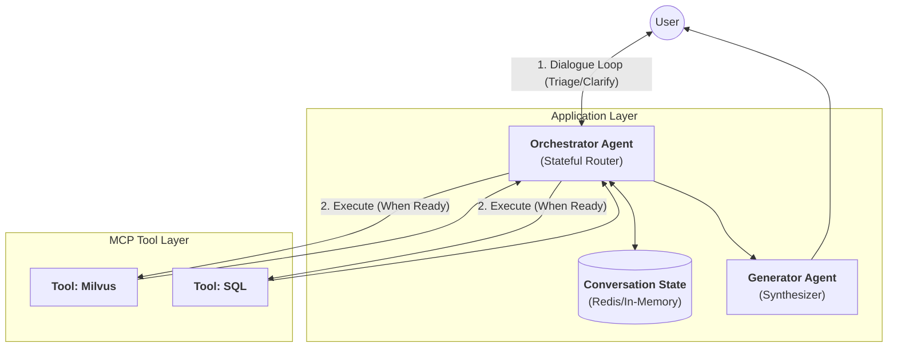
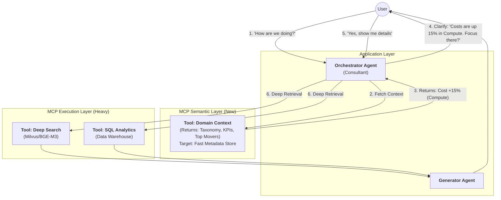

This is a critical self-reflection. In Version 4.1, we successfully demoted the "Experts" to Tools, but we left the **"Agent Management Layer" (Parser -> Planner -> Translator)** too bloated.

If we strictly follow the rule **"Don't use an Agent unless you need adaptive reasoning,"** we can collapse the architecture significantly.

Here is the **Lean Architecture (Version 5.0)**. It removes the "Bureaucracy of Agents" in favor of a single **Orchestrator**.

---

### The Critique: Where v4.1 was Over-Engineered

1.  **The Parser Agent:** **Redundant.**
    *   *Why:* Modern LLMs (GPT-4o, Claude 3.5) don't need a separate step to "understand" entities. They can extract entities *while* deciding which tool to use.
    *   *Fix:* Merge into the Orchestrator's prompt context.
2.  **The Translator Agent:** **Redundant.**
    *   *Why:* This is the classic "Middle Manager." The Planner has already decided *what* to do. Passing it to another agent just to format the JSON for the tool call adds latency and cost.
    *   *Fix:* The Orchestrator (Planner) makes the Tool Call directly.
3.  **The Planner:** **Rename to "Orchestrator".**
    *   *Why:* "Planning" implies a long-term abstract schedule. In RAG, we usually just need **Routing** (Vector vs. SQL) and **Parameterization** (Strategy A vs. B).

---

Yes, absolutely. This is the logical evolution of the **Orchestrator** role.

To support **Triage** and **Step-Back** (clarification) patterns without re-introducing "Agent Bloat," we do **not** add more agents. Instead, we leverage **Conversation History (State)** and **System Prompt Instructions**.

The Orchestrator becomes an **"Active Listener"** rather than just a "Pass-through Router."

Here is the **Design v5.1: The Interactive Orchestrator**.

---

## 1. Conceptual Shift: The "Refinement Loop"

In v5.0, the flow was Linear: `User -> Orchestrator -> Tool`.
In v5.1, the flow is Circular: `User <-> Orchestrator` (until ready) `-> Tool`.

### The Patterns
1.  **Triage:** The Orchestrator immediately assesses the *category* and *completeness* of the request. (e.g., "Is this an IT incident? A Policy question? Is it urgent?").
2.  **Step-Back Questioning:** If the request is ambiguous (e.g., "It's broken"), the Orchestrator pauses execution to ask: *"To help you best, are you referring to the VPN or the ERP system?"*

---

## 2. Architecture (v5.1)

We introduce **Memory (State)** to the Application Layer. The Orchestrator accesses the chat history to maintain context across turns.



---

## 3. Implementation: The Prompt Logic

We don't need a separate code function for Triage; we use the **System Prompt** to enforce a "Guardrail" before tool execution.

### System Prompt for Orchestrator

```text
You are the Enterprise Orchestrator. You have access to Retrieval Tools.
Your goal is to answer the user, but ONLY when you have sufficient intent.

Current Conversation History: {history}

### PROTOCOL:
1. **TRIAGE:** Analyze the user's latest input.
   - Critical/Incident? -> Prioritize speed.
   - Informational? -> Prioritize accuracy.

2. **STEP-BACK CHECK:**
   - Is the query specific enough to run a SQL or Vector search?
   - BAD: "Show me the sales." (Which quarter? Which region?)
   - GOOD: "Show me Q3 North America sales."
   
3. **DECISION:**
   - IF Ambiguous: Do NOT call tools. Return a CLARIFYING QUESTION to the user.
   - IF Clear: Call `search_docs` or `query_sql`.

### Constraints:
- ask a maximum of 2 clarifying questions. If still unsure, execute a Broad Search ('deep' strategy).
```

---

## 4. Execution Flow Examples

### Scenario A: The "Triage & Clarify" (Step-Back)
*User says:* "I can't access the system."

1.  **Orchestrator (Internal Thought):**
    *   *Triage:* Incident/Support.
    *   *Check:* Ambiguous. "System" could mean HR Portal, VPN, or ERP.
    *   *Action:* **Reply to User** (No Tool Call).
2.  **Orchestrator (Output):** "I'd be happy to help with that. To check the right logs, are you having trouble with the **VPN** or the **HR Portal**?"
3.  *User says:* "The HR Portal."
4.  **Orchestrator (Internal Thought):**
    *   *Check:* Specific. Intent is "HR Portal access issues".
    *   *Action:* **Call Tool:** `search_docs(query="HR Portal access troubleshooting", strategy="fast")`.

### Scenario B: The "Implicit Triage" (Fast Path)
*User says:* "What is the Q3 revenue for the North America division?"

1.  **Orchestrator (Internal Thought):**
    *   *Triage:* Analytics/Reporting.
    *   *Check:* Specific. Contains Time (Q3) and Entity (North America).
    *   *Action:* **Call Tool:** `query_sql(query="SELECT revenue FROM sales WHERE quarter='Q3' AND region='NA'")`.

---

## 5. Code Structure (State Handling)

You need a lightweight loop to handle the "No Tool Call" scenario.

```python
# pseudo_code_orchestrator_loop.py

def orchestrator_flow(user_input, conversation_id):
    # 1. Load History
    history = memory.get(conversation_id)
    
    # 2. Call LLM (Orchestrator)
    response = llm.invoke(
        system_prompt=ORCHESTRATOR_PROMPT,
        user_input=user_input,
        history=history
    )
    
    # 3. Determine Next Step
    if response.has_tool_calls():
        # Intent is clear -> Execute Tools
        tool_outputs = execute_tools(response.tool_calls)
        # Pass to Generator for final answer
        final_answer = generator_agent.invoke(context=tool_outputs)
        memory.append(user_input, final_answer)
        return final_answer
        
    else:
        # Intent is vague -> The LLM generated a clarifying question
        # Return this question directly to the user
        clarification_question = response.content
        memory.append(user_input, clarification_question)
        return clarification_question
```

## 6. Summary of Benefits

1.  **No "Garbage In, Garbage Out":** By stepping back, you avoid wasting GPU compute on searching for "the system" (which would return thousands of irrelevant docs).
2.  **User Experience:** Feels like a real consultant ("Triage") rather than a dumb search bar.
3.  **Lean Architecture:** You achieved this **without** adding a "Triage Agent" or a "Clarification Agent." You simply allowed the Orchestrator to *talk* instead of just *act*.
---

This is a sophisticated requirement that moves the Orchestrator from being a **"Process Router"** to a **"Domain-Aware Consultant."**

To achieve this without over-engineering (i.e., adding more agents), we treat **Business Context** and **Ontology** as just another set of **MCP Tools**.

The key shift here is **Tool Usage for Clarification**, not just for Resolution. The Orchestrator is allowed to fetch "Metadata" (Ontology/KPIs) to frame its follow-up questions intelligently.

Here is **Design v5.2: The Context-Aware Orchestrator**.

---

## 1. The Architectural Shift: "Grounded Triage"

We introduce a **Semantic Layer (MCP)**. This is distinct from the heavy Vector/SQL tools. It provides fast access to taxonomies (how data is organized) and snapshots (high-level KPIs).



---

## 2. The Semantic Tools (MCP Implementation)

We need a tool specifically designed to give the Orchestrator the "Lay of the Land" so it sounds smart immediately.

### Tool Definition (Python)

```python
@mcp.tool()
def get_domain_context(domain: str = "finops") -> str:
    """
    Retrieves high-level business context, current status, and ontology.
    Use this when the user query is vague (e.g., "How are things?") to 
    get enough data to ask intelligent clarifying questions.
    
    Returns:
        - Current KPI Snapshot (e.g., Month-to-date Cost, MoM Change)
        - Active Anomalies (e.g., "Spike in EC2")
        - Ontology/Taxonomy (Valid Dimensions: Region, Service, Tag)
    """
    # In a real app, this hits a cached Redis key or a materialized view
    # It must be < 100ms latency.
    return {
        "summary": "Current MTD Cost: $120k. Variance: +15% vs Budget.",
        "top_movers": [
            {"dimension": "Service", "name": "EC2-GPU-Instances", "change": "+$12k"},
            {"dimension": "Region", "name": "us-east-1", "change": "+$3k"}
        ],
        "available_dimensions": ["Cost Center", "Application", "Environment", "Service"],
        "semantic_model": "Costs are aggregated by Service and tagged by Cost Center."
    }
```

---

## 3. The Orchestrator Logic (The FinOps Scenario)

We instruct the Orchestrator to use `get_domain_context` **before** asking the user to clarify.

### System Prompt Update
```text
You are the FinOps Orchestrator.

### STRATEGY:
1. **Initial Assessment:** If the user asks a VAGUE status question (e.g., "How is spend?", "What's happening?"), do NOT ask a generic question like "What do you mean?".
2. **Context Lookup:** Immediately call `get_domain_context()` to see the current reality.
3. **Grounded Clarification:** Use the context to provide a summary AND ask a specific targeting question.
   - BAD: "Which service are you interested in?"
   - GOOD: "Overall spend is up 15%, driven largely by **EC2 GPU instances**. Would you like to dig into the **Compute costs**, or looking at a specific **Cost Center**?"
4. **Deep Dive:** Once the user confirms the intent (e.g., "Dig into Compute"), call `query_sql` or `search_docs` for line-item details.
```

---

## 4. Step-by-Step Execution Trace

Let's trace the "FinOps" example to see how this architecture enables the behavior you want.

**User:** "How are we doing this month?"

1.  **Orchestrator (Internal):**
    *   *Analysis:* "Vague query. User wants a status update. I don't know the status yet."
    *   *Action:* Call `get_domain_context(domain='finops')`.

2.  **Tool (Context):**
    *   *Return Payload:*
        ```json
        {
          "mtd_spend": 50000,
          "trend": "UP 20%",
          "primary_driver": "LLM Training (p4d.24xlarge)",
          "ontology": ["Project", "Owner", "Service"]
        }
        ```

3.  **Orchestrator (Internal):**
    *   *Reasoning:* "Okay, we are over budget because of LLM training. I should present this summary to elicit if this is what they care about."
    *   *Action:* Return text to user (No deep tool call yet).

4.  **Orchestrator (Output to User):**
    "We are currently running **20% over budget** for the month ($50k total).
    The data shows this is primarily driven by **LLM Training instances (p4d.24xlarge)**.
    
    Are you interested in analyzing the **training infrastructure costs**, or were you looking for a breakdown by **Project/Owner**?"

5.  **User:** "Who is owning those training instances?"

6.  **Orchestrator (Internal):**
    *   *Analysis:* "User wants 'Owner' dimension filtered by 'LLM Training'."
    *   *Action:* Call `query_sql("SELECT owner, sum(cost) FROM expenses WHERE service='p4d.24xlarge' GROUP BY owner...")`.

---

## 5. Why this fits "High Performance" & "Lean"

1.  **Latency Management:**
    *   The `get_domain_context` tool hits a "Fast Path" (Metadata Store/Cache). It does *not* scan millions of vector embeddings or join huge SQL tables. This ensures the "Conversation Turn" feels instant.
    *   The "Heavy" tools (BGE-M3/Milvus) are only invoked once the intent is narrowed down.
2.  **Ontology Injection:**
    *   You don't need to fine-tune the LLM with your business ontology (which changes often). You inject the ontology (valid column names, service names) at runtime via the Context Tool.
3.  **Trust:**
    *   The agent demonstrates competence immediately by citing real numbers ("Up 20%") in its first reply, rather than playing "20 Questions" with the user.

This pattern—**"Context First, Search Later"**—is the gold standard for Consultative Agents.