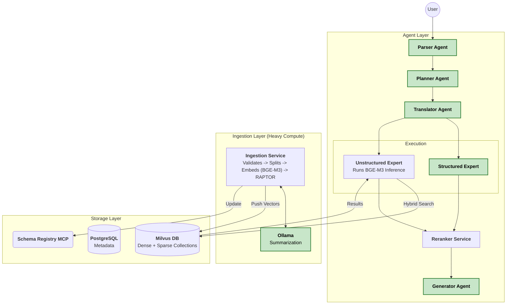

This is a high-performance architectural pivot. Switching to **Milvus** with **BGE-M3** (Dense + Sparse) moves the embedding computation to the application layer ("Client-Side") but provides state-of-the-art retrieval quality.

Here is the updated Design Document (Version 4.0), refactored for **Milvus**, **BGE-M3**, and **Planner-Controlled Retrieval Strategies**.

---

# Design Document: MCP-Based Multi-Agent RAG (Milvus Edition)

**Version:** 4.0
**Core Stack:** Microsoft Agent Framework + MCP + Milvus (BGE-M3)
**Key Pattern:** "Fat Client" Ingestion (Application-side Embedding)

## 1. Executive Summary

This architecture implements an Enterprise RAG system using **Milvus** as the vector engine. It leverages the **BGE-M3 model** to generate both Dense (Semantic) and Sparse (Lexical) embeddings, enabling superior hybrid search without external search engines.

**Key Changes from v3:**
1.  **Vector Engine:** Milvus (Standalone) replaces Weaviate.
2.  **Embedding Strategy:** **BGE-M3** runs in the Application Layer (Ingestion Service / Retriever Agents), pushing multi-vector data to Milvus.
3.  **Planner Logic:** The Planner now dictates the retrieval depth:
    *   **Strategy A (Fast):** Native Milvus Hybrid (Dense + Sparse internal fusion).
    *   **Strategy B (Deep):** Multi-Agent Retrieval + External Reranker (Cross-Encoder).
4.  **Ingestion:** A "Fat" Python Service that handles Embedding (BGE-M3), NER (GLiNER), and Summarization (Ollama) *before* storage.

---

## 2. Architecture & Topology

### 2.1. System Overview

Note the shift: The **Ingestion Service** and **Unstructured Expert** now contain "Model Inference" capabilities (or call a shared Model Service) to generate BGE-M3 vectors.



---

## 3. The Planner: Retrieval Strategies

The Planner determines *how* to retrieve based on query complexity. This is the **Strategy Pattern**.

### Strategy A: "Simple BGE-M3" (Fast)
*   **Trigger:** High confidence, specific lookup (e.g., "Find the Q3 revenue policy").
*   **Logic:**
    1.  Translator targets `UnstructuredExpert`.
    2.  Expert generates BGE-M3 embeddings (Dense + Sparse) for the query.
    3.  Expert sends request to Milvus using **Weighted Ranker (RRFRanker)** internal to Milvus.
    4.  Milvus returns Top-K.
    5.  **Skip** the external Reranker service (or pass-through).
    6.  **Latency:** Low (~50-100ms).

### Strategy B: "Fusion + Reranker" (Deep)
*   **Trigger:** Ambiguity, multi-hop reasoning, or low confidence.
*   **Logic:**
    1.  Translator targets `UnstructuredExpert` AND `StructuredExpert`.
    2.  Unstructured Expert performs a "Broad Search" (Lower threshold, Higher K) in Milvus.
    3.  Results are sent to the **Reranker Service** (Cross-Encoder, e.g., `bge-reranker-v2-m3`).
    4.  Reranker scores all documents against the query.
    5.  **Latency:** Moderate (~500ms+).

---

## 4. Ingestion Pipeline Service (Milvus Edition)

Since Milvus does not have server-side embedding modules, the **Ingestion Service** handles the Model Inference.

### 4.1. Implementation Logic (Python)

```python
from pymilvus import MilvusClient
from FlagEmbedding import BGEM3FlagModel
from gliner import GLiNER

class IngestionService:
    def __init__(self):
        # Heavy Model Loading (GPU recommended)
        self.embedding_model = BGEM3FlagModel('BAAI/bge-m3', use_fp16=True)
        self.ner_model = GLiNER.from_pretrained('urchade/gliner_medium-v2.1')
        self.milvus = MilvusClient(uri="http://milvus:19530")

    async def process_document(self, file_path):
        # 1. Validation & Split (Standard)
        chunks = self.splitter.split(file_path)

        # 2. BGE-M3 Embedding (Dense + Sparse)
        # This runs in the Python process
        embeddings = self.embedding_model.encode(
            [c.text for c in chunks], 
            return_dense=True, 
            return_sparse=True
        )

        # 3. NER Enrichment (GLiNER)
        entities = [self.ner_model.predict_entities(c.text) for c in chunks]

        # 4. Prepare Payload for Milvus
        data = []
        for i, chunk in enumerate(chunks):
            data.append({
                "id": uuid4(),
                "text": chunk.text,
                "dense_vector": embeddings['dense_vecs'][i],
                "sparse_vector": embeddings['lexical_weights'][i], # BGE-M3 Sparse format
                "metadata": {"entities": entities[i]}
            })

        # 5. Insert
        self.milvus.insert(collection_name="enterprise_knowledge", data=data)

        # 6. RAPTOR Loop (Manual Orchestration)
        # Fetch vectors -> Cluster (Sklearn) -> Call Ollama API -> Re-Embed -> Insert
        await self.run_raptor_loop(data)
```

---

## 5. Domain Experts (Updated)

### 5.1. Unstructured Expert (BGE-M3 Aware)
This agent is responsible for executing the strategy defined by the Planner.

**Tools:**
*   `bge_m3_inference`: Generates vectors from query text.
*   `milvus_hybrid_search`: Executes the DB search.

**Code Logic:**
```python
class UnstructuredExpert:
    def execute(self, payload: RetrievalPayload):
        # 1. Generate Query Embeddings
        query_emb = self.model.encode(payload.query, return_dense=True, return_sparse=True)

        if payload.strategy == "SIMPLE_BGE_M3":
            # Strategy A: Milvus Internal Fusion
            req_dense = AnnSearchRequest(data=[query_emb['dense_vecs'][0]], field="dense_vector", limit=10)
            req_sparse = AnnSearchRequest(data=[query_emb['lexical_weights'][0]], field="sparse_vector", limit=10)
            
            # Weighted Ranker (Milvus Native)
            res = self.milvus.hybrid_search(
                reqs=[req_dense, req_sparse],
                ranker=RRFRanker(), # Reciprocal Rank Fusion inside DB
                limit=10
            )
            return res

        elif payload.strategy == "FUSION_RERANK":
            # Strategy B: Broad Retrieval for Downstream Reranking
            # Fetch more candidates (limit=50)
            res = self.milvus.search(...) 
            return res # Sent to Reranker Service next
```

---

## 6. Infrastructure (Docker Compose)

We replace Weaviate sidecars with Milvus and a Model Inference Service (optional, to keep Python agents light, or bundle models in the backend).

*Decision: Bundle models in backend for simplicity, assuming GPU availability.*

```yaml
version: '3.8'

services:
  # 1. Main Application (Agents + Ingestion)
  # Needs GPU for BGE-M3
  backend:
    build: ./backend
    deploy:
      resources:
        reservations:
          devices:
            - driver: nvidia
              count: 1
              capabilities: [gpu]
    environment:
      - MILVUS_URI=http://milvus:19530
      - OLLAMA_URL=http://ollama:11434

  # 2. Milvus Standalone
  milvus:
    image: milvusdb/milvus:v2.3.4
    ports:
      - "19530:19530"
    volumes:
      - milvus_data:/var/lib/milvus

  # 3. Dependencies for Milvus (Etcd, MinIO)
  etcd:
    image: quay.io/coreos/etcd:v3.5.0
  minio:
    image: minio/minio:RELEASE.2023-03-20T20-16-18Z

  # 4. Summarization & Reranking Model Host
  ollama:
    image: ollama/ollama:latest
    volumes:
      - ./ollama_data:/root/.ollama
```

---

## 7. Data Contracts (Schema Registry)

The **Schema Registry MCP** must now describe the Milvus Collection schema so the Translator knows about the hybrid capabilities.

**Registry Entry Example:**
```json
{
  "collection_name": "enterprise_knowledge",
  "description": "General enterprise documents indexed with BGE-M3",
  "fields": [
    {"name": "text", "type": "VarChar"},
    {"name": "dense_vector", "type": "FloatVector", "dim": 1024},
    {"name": "sparse_vector", "type": "SparseFloatVector"},
    {"name": "metadata", "type": "JSON"}
  ],
  "capabilities": ["hybrid_search", "metadata_filter"]
}
```

---

## 8. Summary of Benefits

1.  **State-of-the-Art Retrieval:** **BGE-M3** is widely considered superior to standard OpenAI embeddings or vanilla BM25, as it natively handles multi-linguality and complex semantic matching.
2.  **Planner Control:** The Planner optimizes for **Cost/Latency** (Strategy A) or **Accuracy** (Strategy B) dynamically per query.
3.  **Scalability:** Milvus handles 100M+ vectors more gracefully than sidecar-based DBs.
4.  **Hardware Utilization:** Moving embedding to the Application Layer allows you to scale "Compute Nodes" (Ingestion Workers) independently of "Storage Nodes" (Milvus).