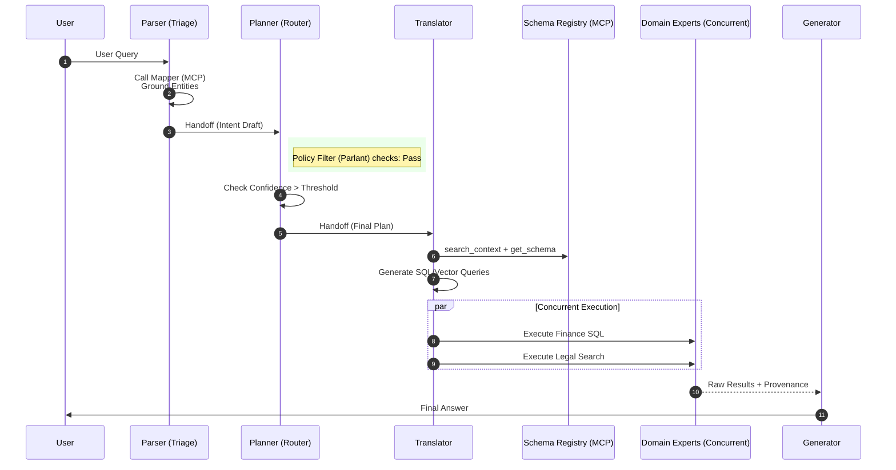
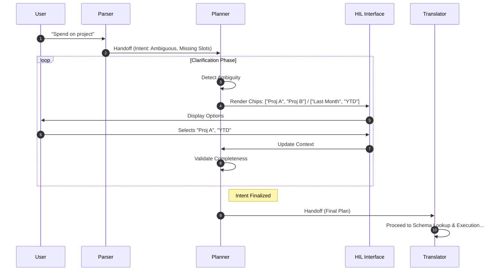

# Architecture Design: Enterprise Agentic RAG
**Version:** 2.0 (Final Revision)
**Pattern:** Hybrid Agentic Orchestration (Triage, Loop, Concurrent)

## 1. Executive Summary
This system provides high-precision Question Answering over enterprise data (SQL, Graph, Vector). It prioritizes **determinism over creativity** by separating intent understanding (Parser) from query formulation (Translator) and execution (Experts). It features two operational modes: a **One-Pass (Fast)** workflow for clear intents and a **Two-Pass (Clarification)** workflow for ambiguous scenarios, governed by a central Policy Engine (Parlant).

---

## 2. Orchestration Patterns & Topology

The system moves away from a flat "Group Chat" topology to a structured **Handoff Chain**.

### A. Triage & Handoff (Sequential)
*   **Role:** Entry analysis and routing.
*   **Pattern:** `User -> Parser -> Planner`.
*   **Behavior:** The Parser analyzes input and explicitly hands off a structured context to the Planner.

### B. Feedback Loop (Cyclic)
*   **Role:** Disambiguation and Policy Compliance.
*   **Pattern:** `Planner <-> User (HIL)`.
*   **Behavior:** The Planner holds the state. It does not hand off to the execution layer until the intent is atomic, unambiguous, and compliant.

### C. Concurrent Execution (Fan-Out/Fan-In)
*   **Role:** Data Retrieval.
*   **Pattern:** `Translator -> [Expert A, Expert B, Expert C] -> Reranker`.
*   **Behavior:** The Translator generates a batch plan. Domain Experts execute tasks in parallel. The Reranker fuses the results.

---

## 3. Agent Roles & Responsibilities

### 3.1. Intent Parser Agent (The Triage)
*   **Goal:** Convert natural language into a structured, grounded Intent Draft.
*   **Type:** ChatCompletion Agent.
*   **Tools:**
    *   **Mapper Tool (MCP Client):** Stateless embedding/fuzzy search to resolve entity names (e.g., "Acme" -> `ID: CUST-123`).
*   **Logic:**
    1.  Receives user query.
    2.  Calls `Mapper` to ground terms.
    3.  Calculates `confidence_score` and checks for `missing_slots`.
    4.  **Handoff:** Passes `IntentContext` to Planner.

### 3.2. Planner Agent (The Router)
*   **Goal:** Enforce policy and manage the clarification loop.
*   **Type:** Logic-Heavy Agent / Router (Code + LLM).
*   **Inputs:** `IntentContext` from Parser.
*   **Logic:**
    *   **Policy Check:** Middleware calls Parlant.
    *   **Route:**
        *   If `ambiguous OR policy_block`: Trigger **Two-Pass**. Generate clarification chips $\rightarrow$ Wait for HIL $\rightarrow$ Update Context $\rightarrow$ Loop.
        *   If `clear AND safe`: Trigger **One-Pass**.
    *   **Handoff:** Passes finalized `ExecutionPlan` to Translator.

### 3.3. Translator Agent (The Linguist)
*   **Goal:** Convert natural language intent into executable DB dialects (SQL, Cypher, GraphQL).
*   **Type:** Specialist Code-Gen Agent.
*   **Tools:**
    *   **Schema Registry (MCP Client):** RAG-over-Schema.
        *   `search_context(keywords)`: Find relevant tables.
        *   `get_schema_details(tables)`: Get DDL/Foreign Keys.
        *   `get_query_examples(intent)`: Get few-shot SQL examples.
*   **Logic:**
    *   **Discovery:** Queries Schema Registry to find *only* relevant tables.
    *   **Generation:** Writes schema-valid query strings.
    *   **Handoff:** Sends `Payload` to specific Domain Experts.

### 3.4. Domain Experts (The Retrievers)
*   **Goal:** Execute queries against data sources.
*   **Type:** Worker Agents (Minimal/No LLM).
*   **Roles:**
    *   `FinanceExpert` (SQL Executor).
    *   `LegalExpert` (Vector Search Executor).
    *   `OrgChartExpert` (Graph API Executor).
*   **Logic:** Receive payload $\rightarrow$ Execute $\rightarrow$ Return raw results (Concurrent orchestration).

### 3.5. Generator Agent (The Synthesizer)
*   **Goal:** Compose the final answer with citations.
*   **Type:** ChatCompletion Agent.
*   **Logic:** Fuse evidence, check policy (Parlant), generate response, append provenance.

---

## 4. Key Services & Middleware

### 4.1. Parlant (Policy Engine)
*   **Integration:** Implemented as **Invocation Filters (Hooks)** in the Agent Framework.
*   **Pre-Hook (Planner):** Evaluates input for PII, topic restrictions, and routing rules. Can force a "Block" or "Clarification".
*   **Post-Hook (Generator):** Scans final output for hallucinations or non-compliant advice.

### 4.2. Ontology Mapper (MCP Server)
*   **Function:** Low-latency entity resolution.
*   **Backends:** ElasticSearch / Vector DB.
*   **API:** `resolve_term(text, domain) -> [candidates]`.

### 4.3. Schema Registry (MCP Server)
*   **Function:** Metadata store for the Translator.
*   **Content:** DDL, Graph Ontology, API Specs, vetted SQL examples.

---

## 5. System Workflows

### Workflow 1: One-Pass (Sequential & Concurrent)
*Ideal for: "Show me the Q3 revenue for Acme Corp."*



### Workflow 2: Two-Pass (Loop / Feedback)
*Ideal for: "How much did we spend on the project?" (Ambiguous: Which project? Which timeframe?)*



---

## 6. Data Contracts (JSON Schemas)

### A. Intent Context (Parser $\rightarrow$ Planner)
```json
{
  "request_id": "uuid",
  "original_query": "string",
  "intent_type": "lookup | aggregation | comparison",
  "confidence": 0.95,
  "entities": [
    { "surface_form": "Acme", "canonical_id": "CUST-001", "type": "customer", "source": "mapper_tool" }
  ],
  "unresolved_slots": [],
  "policy_flags": []
}
```

### B. Translator Payload (Translator $\rightarrow$ Expert)
```json
{
  "task_id": "uuid",
  "target_agent": "FinanceExpert",
  "dialect": "PostgreSQL",
  "executable_code": "SELECT sum(amount) FROM fact_sales WHERE cust_id = 'CUST-001'...",
  "explanation": "Aggregating sales for customer CUST-001",
  "timeout_ms": 5000
}
```

---

## 7. Implementation Roadmap

1.  **Phase 1: Foundation**
    *   Deploy **Parlant** and configure basic filters.
    *   Build **Mapper MCP** (backed by simple vector search).
    *   Implement **Parser** and **Planner** with basic Handoff logic.

2.  **Phase 2: The Linguist**
    *   Build **Schema Registry MCP** (indexing your DB DDL).
    *   Implement **Translator Agent** using the "Discovery" $\rightarrow$ "Generation" prompt flow.

3.  **Phase 3: Execution & Integration**
    *   Implement **Domain Experts** (wrappers around DB drivers).
    *   Wire up **Concurrent Orchestration** logic.
    *   Connect the **HIL UI** (CopilotKit) to the Planner's loop state.

## 8. Summary of Benefits
1.  **Accuracy:** The Translator cannot hallucinate tables because it must look them up in the Schema Registry first.
2.  **Safety:** Agents cannot bypass Parlant; it is baked into the framework middleware.
3.  **Speed:** One-pass requests skip the HIL loop; Domain Experts execute in parallel.
4.  **Clarity:** The "Handoff" pattern makes debugging easy—you know exactly which agent held the ball when an error occurred.