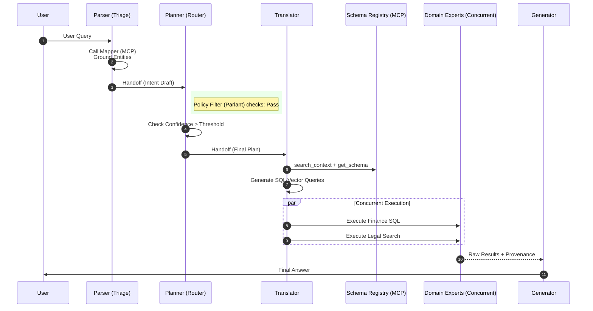
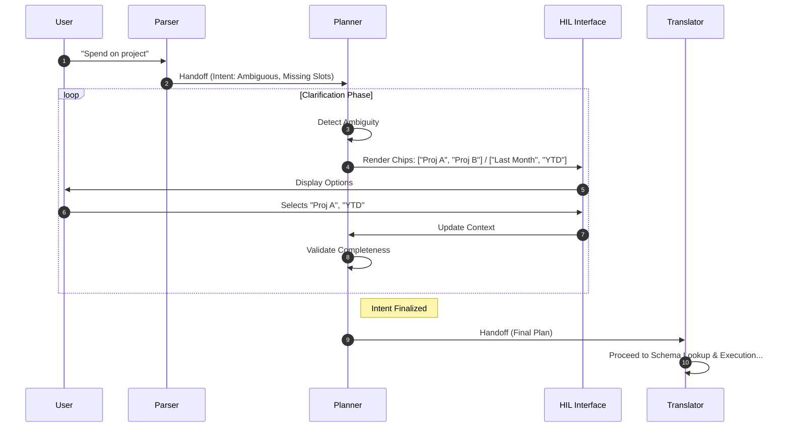
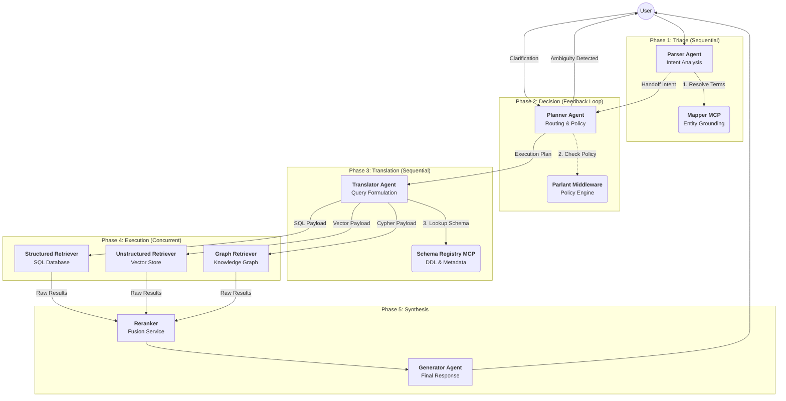

# Architecture Design: Enterprise Agentic RAG
**Version:** 2.0 (Final Revision)
**Pattern:** Hybrid Agentic Orchestration (Triage, Loop, Concurrent)

## 1. Executive Summary
This system provides high-precision Question Answering over enterprise data (SQL, Graph, Vector). It prioritizes **determinism over creativity** by separating intent understanding (Parser) from query formulation (Translator) and execution (Experts). It features two operational modes: a **One-Pass (Fast)** workflow for clear intents and a **Two-Pass (Clarification)** workflow for ambiguous scenarios, governed by a central Policy Engine (Parlant).

---

## 2. Orchestration Patterns & Topology

The system moves away from a flat "Group Chat" topology to a structured **Handoff Chain**.

### A. Triage & Handoff (Sequential)
*   **Role:** Entry analysis and routing.
*   **Pattern:** `User -> Parser -> Planner`.
*   **Behavior:** The Parser analyzes input and explicitly hands off a structured context to the Planner.

### B. Feedback Loop (Cyclic)
*   **Role:** Disambiguation and Policy Compliance.
*   **Pattern:** `Planner <-> User (HIL)`.
*   **Behavior:** The Planner holds the state. It does not hand off to the execution layer until the intent is atomic, unambiguous, and compliant.

### C. Concurrent Execution (Fan-Out/Fan-In)
*   **Role:** Data Retrieval.
*   **Pattern:** `Translator -> [Expert A, Expert B, Expert C] -> Reranker`.
*   **Behavior:** The Translator generates a batch plan. Domain Experts execute tasks in parallel. The Reranker fuses the results.

---

## 3. Agent Roles & Responsibilities

### 3.1. Intent Parser Agent (The Triage)
*   **Goal:** Convert natural language into a structured, grounded Intent Draft.
*   **Type:** ChatCompletion Agent.
*   **Tools:**
    *   **Mapper Tool (MCP Client):** Stateless embedding/fuzzy search to resolve entity names (e.g., "Acme" -> `ID: CUST-123`).
*   **Logic:**
    1.  Receives user query.
    2.  Calls `Mapper` to ground terms.
    3.  Calculates `confidence_score` and checks for `missing_slots`.
    4.  **Handoff:** Passes `IntentContext` to Planner.

### 3.2. Planner Agent (The Router)
*   **Goal:** Enforce policy and manage the clarification loop.
*   **Type:** Logic-Heavy Agent / Router (Code + LLM).
*   **Inputs:** `IntentContext` from Parser.
*   **Logic:**
    *   **Policy Check:** Middleware calls Parlant.
    *   **Route:**
        *   If `ambiguous OR policy_block`: Trigger **Two-Pass**. Generate clarification chips $\rightarrow$ Wait for HIL $\rightarrow$ Update Context $\rightarrow$ Loop.
        *   If `clear AND safe`: Trigger **One-Pass**.
    *   **Handoff:** Passes finalized `ExecutionPlan` to Translator.

### 3.3. Translator Agent (The Linguist)
*   **Goal:** Convert natural language intent into executable DB dialects (SQL, Cypher, GraphQL).
*   **Type:** Specialist Code-Gen Agent.
*   **Tools:**
    *   **Schema Registry (MCP Client):** RAG-over-Schema.
        *   `search_context(keywords)`: Find relevant tables.
        *   `get_schema_details(tables)`: Get DDL/Foreign Keys.
        *   `get_query_examples(intent)`: Get few-shot SQL examples.
*   **Logic:**
    *   **Discovery:** Queries Schema Registry to find *only* relevant tables.
    *   **Generation:** Writes schema-valid query strings.
    *   **Handoff:** Sends `Payload` to specific Domain Experts.

### 3.4. Domain Experts (The Retrievers)
*   **Goal:** Execute queries against data sources.
*   **Type:** Worker Agents (Minimal/No LLM).
*   **Roles:**
    *   `FinanceExpert` (SQL Executor).
    *   `LegalExpert` (Vector Search Executor).
    *   `OrgChartExpert` (Graph API Executor).
*   **Logic:** Receive payload $\rightarrow$ Execute $\rightarrow$ Return raw results (Concurrent orchestration).

### 3.5. Generator Agent (The Synthesizer)
*   **Goal:** Compose the final answer with citations.
*   **Type:** ChatCompletion Agent.
*   **Logic:** Fuse evidence, check policy (Parlant), generate response, append provenance.

---

## 4. Key Services & Middleware

### 4.1. Parlant (Policy Engine)
*   **Integration:** Implemented as **Invocation Filters (Hooks)** in the Agent Framework.
*   **Pre-Hook (Planner):** Evaluates input for PII, topic restrictions, and routing rules. Can force a "Block" or "Clarification".
*   **Post-Hook (Generator):** Scans final output for hallucinations or non-compliant advice.

### 4.2. Ontology Mapper (MCP Server)
*   **Function:** Low-latency entity resolution.
*   **Backends:** ElasticSearch / Vector DB.
*   **API:** `resolve_term(text, domain) -> [candidates]`.

### 4.3. Schema Registry (MCP Server)
*   **Function:** Metadata store for the Translator.
*   **Content:** DDL, Graph Ontology, API Specs, vetted SQL examples.

---

## 5. System Workflows

### Workflow 1: One-Pass (Sequential & Concurrent)
*Ideal for: "Show me the Q3 revenue for Acme Corp."*



### Workflow 2: Two-Pass (Loop / Feedback)
*Ideal for: "How much did we spend on the project?" (Ambiguous: Which project? Which timeframe?)*



---

## 6. Data Contracts (JSON Schemas)

### A. Intent Context (Parser $\rightarrow$ Planner)
```json
{
  "request_id": "uuid",
  "original_query": "string",
  "intent_type": "lookup | aggregation | comparison",
  "confidence": 0.95,
  "entities": [
    { "surface_form": "Acme", "canonical_id": "CUST-001", "type": "customer", "source": "mapper_tool" }
  ],
  "unresolved_slots": [],
  "policy_flags": []
}
```

### B. Translator Payload (Translator $\rightarrow$ Expert)
```json
{
  "task_id": "uuid",
  "target_agent": "FinanceExpert",
  "dialect": "PostgreSQL",
  "executable_code": "SELECT sum(amount) FROM fact_sales WHERE cust_id = 'CUST-001'...",
  "explanation": "Aggregating sales for customer CUST-001",
  "timeout_ms": 5000
}
```

---

---

# Design Document: Enterprise Agentic RAG Architecture

**Version:** 3.0
**Language:** Python 3.14 (Target) / 3.12+ (Compatible)
**Framework:** Microsoft Agent Framework (AutoGen Core) + MCP

## 1. Executive Summary

This architecture defines a high-precision Query Answering system designed for complex enterprise environments. It prioritizes **determinism**, **safety**, and **observability** over unchecked autonomy.

**Key Architectural Decisions:**
1.  **Bifurcated Workflow:** A fast "One-Pass" route for clear queries and a "Two-Pass" loop for ambiguity resolution.
2.  **Separation of Concerns:**
    *   **Parser:** Understands *Intent*.
    *   **Translator:** Understands *Schema* (generates queries).
    *   **Retrievers:** Understand *Execution* (fetches data).
3.  **RAG-on-Schema:** The Translator uses an MCP Schema Registry to lookup DDL/Metadata before generating SQL/Cypher, eliminating schema hallucinations.
4.  **Policy-as-Code:** **Parlant** is integrated as middleware (Python Decorators/Hooks) to enforce compliance at every agent transition.

---

## 2. Orchestration Topology

The system uses a **Directed Cyclic Graph** topology, not a flat group chat.



---

## 3. Agent Specifications (Python Implementation)

### 3.1. Intent Parser Agent (Triage)
**Pattern:** `ReAct` (Internal) $\rightarrow$ `Handoff` (External)
**Responsibility:** Semantic triage. It does not route; it analyzes.

*   **Inputs:** Raw user text.
*   **Tool (MCP):** `MapperClient`.
    *   `resolve_entities(text: str) -> List[CanonicalEntity]`
*   **Output:** `IntentContext` (Pydantic model).
*   **Modern Python Feature:** Uses `Annotated` for rigorous type validation on extraction.

### 3.2. Planner Agent (Router & Loop Manager)
**Pattern:** `State Machine` / `Loop`
**Responsibility:** The specific authority on "Is this query ready?"

*   **Logic:**
    1.  **Policy Check:** Invokes `@parlant_check`.
    2.  **Completeness Check:** If `IntentContext.unresolved_slots` is not empty, yield `ClarificationRequest` to UI.
    3.  **Handoff:** Once valid, map Intent to `RetrievalPlan` and handoff to `Translator`.
*   **State Persistence:** Maintains conversation state across HIL (Human-in-the-Loop) interactions.

### 3.3. Translator Agent (The Linguist)
**Pattern:** `Sequential` (RAG-on-Schema)
**Responsibility:** Text-to-Syntax (SQL/Cypher/DSL). **Never executes queries.**

*   **Tool (MCP):** `SchemaRegistryClient`.
    *   `find_tables(keywords: list[str])`
    *   `get_ddl(table_names: list[str])`
*   **Logic:**
    1.  Receives `RetrievalPlan` (e.g., "Get revenue for CUST-123").
    2.  Calls MCP to get table schema for `sales_fact`.
    3.  Generates SQL: `SELECT sum(amt) FROM sales_fact...`.
    4.  **Handoff:** Returns `TranslatorPayload` targeting specific Retrievers.

### 3.4. Retrievers (The Executors)
**Pattern:** `Concurrent` (Fan-out)
**Responsibility:** Dumb execution pipes.

*   **Components:**
    1.  **StructuredRetriever:** Async SQL wrapper (e.g., `asyncpg`).
    2.  **UnstructuredRetriever:** Async Vector wrapper (e.g., `qdrant-client`).
    3.  **GraphRetriever:** Async Graph wrapper (e.g., `neo4j-driver`).
*   **Security:** These agents hold the database credentials. The `Translator` (LLM) *never* sees credentials, only schema.

### 3.5. Generator Agent
**Pattern:** `Sequential`
**Responsibility:** Synthesis and Citations.

*   **Logic:** Fuses `FusionResult` into natural language. Enforces Parlant "Tone & Safety" rules via post-hooks.

---

## 4. Orchestration Implementation (Modern Python)

We utilize `asyncio.TaskGroup` (Python 3.11+) for the Concurrent phase and strict Pydantic typing for Handoffs.

### 4.1. Data Contracts (Pydantic Models)

```python
from pydantic import BaseModel, Field
from typing import Literal, List, Optional, Any
from uuid import UUID, uuid4

class CanonicalEntity(BaseModel):
    id: str
    type: str
    confidence: float

class IntentContext(BaseModel):
    """Output from Parser, Input to Planner"""
    trace_id: UUID = Field(default_factory=uuid4)
    intent_type: Literal["lookup", "aggregation", "comparison"]
    entities: List[CanonicalEntity]
    unresolved_slots: List[str] = []
    raw_query: str

class RetrievalPayload(BaseModel):
    """Output from Translator, Input to Retrievers"""
    target_retriever: Literal["structured", "vector", "graph"]
    executable_query: str  # The SQL or JSON filter
    query_dialect: str     # e.g., "postgres", "semantic_filter"
    explanation: str       # For audit logs

class RetrievalResult(BaseModel):
    source_agent: str
    data: List[Any]
    meta: dict
```

### 4.2. The Concurrent Orchestration Logic

This is the core logic within the main runtime that manages the "Phase 4" fan-out.

```python
import asyncio
from typing import List

class AgentRuntime:
    def __init__(self):
        self.retrievers = {
            "structured": StructuredRetriever(),
            "vector": UnstructuredRetriever(),
            "graph": GraphRetriever()
        }

    async def execute_concurrent_retrieval(
        self, 
        payloads: List[RetrievalPayload]
    ) -> List[RetrievalResult]:
        """
        Executes multiple retriever agents in parallel using 
        Python's asyncio.TaskGroup (Python 3.11+).
        """
        results: List[RetrievalResult] = []

        try:
            async with asyncio.TaskGroup() as tg:
                tasks = []
                for payload in payloads:
                    agent = self.retrievers.get(payload.target_retriever)
                    if agent:
                        # Schedule the coroutine
                        tasks.append(
                            tg.create_task(
                                agent.execute(payload), 
                                name=f"retrieval-{payload.target_retriever}"
                            )
                        )
                
                # TaskGroup implicitly waits for all tasks to complete here.
                # If any task fails, it cancels the others and raises ExceptionGroup.
                
            # Collect results after the context manager exits successfully
            results = [t.result() for t in tasks]
            
        except ExceptionGroup as eg:
            # Handle partial failures or log specific errors
            print(f"Retrieval errors occurred: {eg}")
            # Fallback logic could go here
            
        return results
```

---

## 5. Middleware & Policy (Parlant)

We avoid tightly coupling policy logic inside agent classes. Instead, we use **Decorators**.

### 5.1. Parlant Hook Implementation

```python
from functools import wraps
from parlant.client import ParlantClient

parlant = ParlantClient(url="http://parlant-service")

def parlant_guard(policy_domain: str, action: str):
    """
    Middleware to check policy before agent execution.
    """
    def decorator(func):
        @wraps(func)
        async def wrapper(*args, **kwargs):
            # 1. Extract context (simplified)
            context_data = kwargs.get('context') or args[0]
            
            # 2. Call Parlant
            evaluation = await parlant.evaluate(
                domain=policy_domain,
                action=action,
                context=context_data
            )
            
            # 3. Enforce
            if evaluation.status == "BLOCK":
                raise PolicyViolationError(evaluation.reason)
            
            if evaluation.status == "FLAG":
                # Inject warning into context
                context_data.warnings.append(evaluation.reason)
            
            # 4. Proceed
            return await func(*args, **kwargs)
        return wrapper
    return decorator

# Usage in Planner
class PlannerAgent:
    @parlant_guard(policy_domain="finance_ops", action="route_query")
    async def generate_plan(self, intent: IntentContext):
        # Business logic...
        pass
```

---

## 6. MCP Integration Details

The **Model Context Protocol (MCP)** is used to standardize how the `Parser` and `Translator` access external knowledge without embedding SDKs.

### 6.1. Mapper MCP (Used by Parser)
*   **Endpoint:** `POST /mcp/v1/tools/call`
*   **Tool Name:** `resolve_entity`
*   **Input:** `{"text": "Acme Corp", "domain": "crm"}`
*   **Output:** `{"id": "CUST-99", "name": "Acme International", "score": 0.98}`

### 6.2. Schema Registry MCP (Used by Translator)
*   **Endpoint:** `POST /mcp/v1/tools/call`
*   **Tool Name:** `get_schema_context`
*   **Input:** `{"intent_keywords": ["revenue", "Q3"], "limit": 3}`
*   **Behavior:** Performs vector search on table descriptions.
*   **Output:**
    ```sql
    CREATE TABLE fact_sales (
        cust_id VARCHAR(50) REFERENCES dim_customer(id),
        amt DECIMAL(10,2),
        sale_date DATE
    );
    -- Context: Contains quarterly revenue data.
    ```

---

## 7. Workflow State Machine

The entire lifecycle is managed by a master orchestrator function that respects the Handoff/Loop logic.

```python
async def run_agentic_rag(user_query: str, session_id: str):
    # 1. TRIAGE
    intent_ctx = await parser_agent.analyze(user_query)
    
    # 2. DECISION LOOP
    while True:
        plan_result = await planner_agent.decide(intent_ctx)
        
        if isinstance(plan_result, ClarificationRequest):
            # Pause execution, return to Frontend/CopilotKit
            return await suspend_for_user_input(plan_result)
        
        if isinstance(plan_result, RetrievalPlan):
            # Break loop, proceed to execution
            break
            
    # 3. TRANSLATION
    # Uses MCP Schema Registry internally
    payloads = await translator_agent.generate_payloads(plan_result)
    
    # 4. EXECUTION (Concurrent)
    # Uses asyncio.TaskGroup
    raw_data = await runtime.execute_concurrent_retrieval(payloads)
    
    # 5. SYNTHESIS
    final_response = await generator_agent.synthesize(raw_data)
    
    return final_response
```

---

## 8. Summary of Improvements

1.  **Translator Role:** Explicitly decoupled from execution. It writes the code (SQL/Cypher) but doesn't have the keys to run it. It relies on the **Schema Registry MCP** to ensure the code it writes is valid.
2.  **Retrievers Role:** Pure execution units. Highly secure, optimized for throughput.
3.  **Modern Python:** Utilization of `asyncio.TaskGroup` ensures robust handling of concurrent retrieval tasks, with proper error propagation (ExceptionGroups) and cancellation semantics.
4.  **Policy Layer:** Decoupled via decorators, making the agents cleaner and the policy easier to audit.
5.  **Data Contracts:** Strict Pydantic models prevent "contract drift" between agents in the handoff chain.