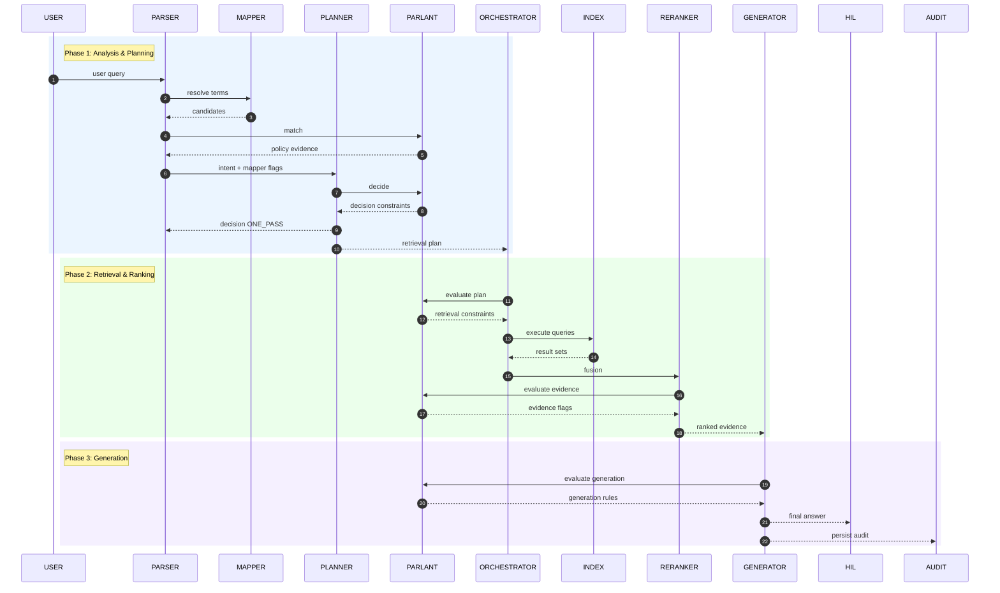
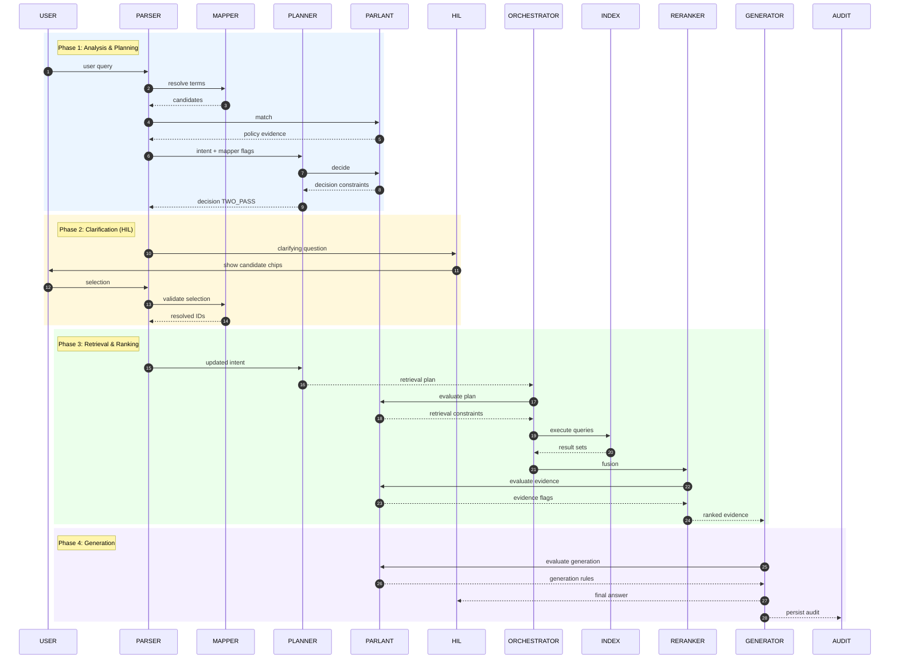

### One-pass and Two-pass RAG workflows — overview

Two operational modes:
- One-pass: low-latency path when the parser produces a high-confidence, complete canonical intent; single retrieval + fusion + generation executes and returns results.
- Two-pass: clarification-first path when intent is ambiguous, incomplete, or complex; a fast ontology grounding pass drives targeted clarifications, then full retrieval and fusion execute after HIL confirmation.

Below are compact workflows and explicit agent responsibilities for each mode, followed by Mermaid sequence diagrams.

---

### Decision policy (router heuristics)
- ONE-PASS if: intent.confidence ≥ threshold (e.g., 0.9), unresolved_slots == 0, mapper_flags.no_ambiguity, intent.type ∈ {lookup, single_action}, no sensitive/policy flags.
- TWO-PASS if: any unresolved slots, multiple high-confidencecandidate mappings, intent.confidence < threshold, decomposition required, exploratory/synthesis intent, or policy/sensitivity triggers.
- Allow per-domain thresholds and user/operator overrides.

---
### Agent roles & responsibility 
#### Intent Parser Agent (Parser)

- Purpose  
  Act as the conversational requirements analyst: turn user utterances into precise, testable intent statements and drive multi‑turn clarification until the quality checklist is met.

- Primary responsibilities  
  - Extract intent, slot parameters, unresolved_slots, constraints, intent_type, and decomposition_plan.  
  - Generate one concise clarifying question per turn using mapper discriminators.  
  - Enforce the intent quality checklist: clarity, completeness, consistency, atomicity, verifiability, traceability.  
  - Produce normalized JSON intent artifacts for downstream components.  
  - Maintain the conversational audit (from_query, clarifications, timestamps).

- Inputs  
  - Raw user utterance and conversation state.  
  - Ontology context / candidates from Mapper.  
  - Planner decision (decision_id, plan) when present.

- Outputs  
  - Intent JSON: {intent, parameters, unresolved, confidence, audit}.  
  - Clarifying questions (one per turn).  
  - Signals/hints to Planner: short decision hints (confidence, unresolved_count, sensitivity_flag).

- API / Integration points  
  - POST /parse → returns intent JSON and clarifying Q (if needed).  
  - Subscribe/accept Planner decisions and Mapper responses (sync RPC or event).

- Quality & validation rules  
  - Never produce an executable action; only structured intent.  
  - Only ask one question at a time; reuse candidate discriminators.  
  - Recompute confidence after each user reply and re-run checklist.

- Performance / SLAs  
  - Response latency budget: low tens to low hundreds ms (LLM inference dependent).  
  - Keep clarifying turns minimal; track turns per intent metric.

- Error handling & fallbacks  
  - If Mapper unavailable, return normalized linguistic slots and set mapper_unavailable flag; escalate to Planner.  
  - If repeated ambiguous mappings, surface HIL suggestion to switch domain or escalate to human analyst.

- Telemetry & audit  
  - Log from_query, every clarification, confidence deltas, mapper_version, decision_id.

---

#### Ontology Mapper Agent (Mapper)

- Purpose  
  Fast MCP‑style semantic grounding: resolve surface terms to canonical enterprise entities, provide constraints and discriminators with minimal latency.

- Primary responsibilities  
  - Return top‑N candidate canonical IDs, human labels, discriminators, and confidence.  
  - Provide required_slots, constraints, compatibility checks, and ontology_version.  
  - Validate user-selected canonical IDs and flag violations.  
  - Serve entity descriptions on demand (GET /entity/:id).

- Inputs  
  - Normalized slot queries from Parser (slot_name, query_text, hints).  
  - Optional requested ontology_version for deterministic behavior.

- Outputs  
  - Resolve response: {candidates[], required_slots[], constraints[], violations[], ontology_version, latency_hint}.

- Implementation details  
  - Hybrid retrieval: BM25 keyword + precomputed embeddings + re-ranker.  
  - Pluggable index backends: DW catalog, metric registry, vector DB.  
  - Precompute embeddings and aliases offline; keep hot caches per-tenant.

- API / Integration points  
  - POST /resolve (domain, slot_name, query_text, hints) → candidates + constraints.  
  - POST /validate (selected_ids) → violations, confirmations.  
  - GET /entity/:id → canonical metadata and examples.

- Performance & SLAs  
  - Strict low-latency target (single-digit to low double-digit ms for cached requests).  
  - Return top 3 candidates by default; provide paging on demand.

- Error handling & fallbacks  
  - If no candidate found, return ontology_free_normalization suggestion with confidence < threshold.  
  - If index stale, return ontology_version warning and fallback to best-effort mapping.

- Telemetry & audit  
  - Log request_id, candidate_ids, index_version, confidence scores, latency. Persist mapper decisions with ontology_version.

---

#### Planner / Router Agent (Planner)

- Purpose  
  Authoritative policy engine: evaluate routing heuristics (ONE_PASS vs TWO_PASS), apply domain policies, and emit deterministic retrieval plans and clarification guidance.

- Primary responsibilities  
  - Evaluate decision policy using intent JSON, mapper_flags, domain policy, and user/operator overrides.  
  - Produce decision {ONE_PASS | TWO_PASS}, decision_reason, decision_id, and a retrieval_plan (indices, templates, decomposition plan, HyDE flag, rerank policy).  
  - Emit required_clarifications when TWO_PASS and cache decisions for identical signatures.  
  - Enforce compliance/legal routing and accept overrides (auditable).

- Inputs  
  - Intent JSON from Parser, mapper_flags from Mapper, per-domain Policy Store entries, user_pref/override flags.

- Outputs  
  - Decision response: {decision, decision_id, reason, plan, policy_version}.  
  - Retrieval directives for Orchestrator (one-pass vs two-pass plan).

- API / Integration points  
  - POST /decide (intent, mapper_flags, user_pref, session) → decision payload.  
  - GET /policy/:domain → policy metadata for explainability.

- Decision logic & configurability  
  - Per-domain thresholds: confidence_threshold, ambiguity_margin, allowed_one_pass_types.  
  - Mandatory routing hooks for Legal/Policy microservice.  
  - Deterministic policy evaluation; reason codes must be human-readable.

- Performance & SLAs  
  - Synchronous decision latency target: low ms to low hundreds ms (cache-first).  
  - Cache decisions per-session for same intent+mapper signature to avoid repeat compute.

- Error handling & fallbacks  
  - If Policy Store unreachable, use safe conservative defaults (favor TWO_PASS).  
  - If Mapper missing flags, degrade to TWO_PASS and log.

- Telemetry & audit  
  - Persist decision_id, input signature, policy_version, decision_reason, who-overrode (if any), timestamp.

---

#### Retrieval Orchestrator (Orchestrator)

- Purpose  
  Translate canonical intents into executable retrievals (SQL/Graph + vector/sparse), perform multi-query generation, decomposition, HyDE, and orchestrate retrievals across indices.

- Primary responsibilities  
  - Implement query construction: text‑to‑query, schema‑aware parsing, constraint lifting, and self‑query retriever for filters.  
  - Generate multi‑query variants, manage HyDE flows, and decompose complex intents into sub‑queries.  
  - Select indices and issue retrievals per Planner directives; collect and return raw result sets with provenance.  
  - Coordinate with Index, Reranker, and Generator for downstream fusion and generation.

- Inputs  
  - Retrieval_plan from Planner (templates, indices, decomposition instructions) and resolved canonical parameters from Parser/Mapper.

- Outputs  
  - Raw result sets per query variant; retrieval metadata (query_texts, templates_used, execution_stats).

- API / Integration points  
  - POST /execute_plan (decision_id, plan, canonical_params) → returns multi-query result manifests.  
  - Interface to Index backends for SQL/graph execution and vector search.

- Implementation details  
  - Use schema-aware SQL/Graph templates for deterministic mapping; LLM-only reformulation reserved for multi-query/HYDE generation steps.  
  - Keep execution deterministic when possible; log all generated SQL/graph queries.

- Performance & SLAs  
  - Throughput and parallelism tuning per-index; report per-query latency and success/failure.

- Error handling & fallbacks  
  - If an index fails, retry with fallback index (e.g., from dense to sparse) and flag degraded mode in response.  
  - If HyDE produced content shows low confidence, annotate and surface to Reranker/Generator.

- Telemetry & audit  
  - Persist query templates, final executed queries, index_versions, and raw result checksums.

---

#### Index & Storage Service (Index)

- Purpose  
  Provide the persistent retrieval infrastructure: dense vectors, sparse indices, metadata, parent document mapping, embeddings, and specialized encoders.

- Primary responsibilities  
  - Host and serve vector DB indices, BM25/sparse indices, and parent-document mappings.  
  - Maintain index versioning, metadata enrichment, and embedding refresh pipelines.  
  - Provide query endpoints (vector search, boolean filters, SQL/Graph execution).

- Inputs / Upstream feeds  
  - Indexing pipeline outputs: chunks, embeddings, metadata, parent pointers, domain encoders.

- Outputs  
  - Search hits, scores, document fragments, parent documents, and index metadata (index_version).

- Implementation details  
  - Support specialized encoders per domain; store parent doc pointers for provenance retrieval.  
  - Expose metadata filters and sparse signals to support schema‑aware retrieval.

- Performance & SLAs  
  - Operational SLA tuned per index type; hot caches for frequently accessed entities.  
  - Index versioning with deterministic access to prior versions for audits.

- Error handling & fallbacks  
  - Graceful fallback to alternative indices or cached results if a partition fails.

- Telemetry & audit  
  - Log index_version, request_id, returned doc_ids, shard latencies, and hit rates.

---

#### Reranker / Fusion Service (Reranker)

- Purpose  
  Re-rank and fuse multi-query result sets to produce stable, instruction-aware ranked evidence lists with contamination checks and provenance.

- Primary responsibilities  
  - Apply RRF or weighted fusion across result lists; optionally use LLM-based reranking (RankGPT style) when instructed.  
  - Perform contamination / contradiction detection across candidate evidence and surface coverage signals.  
  - Attach provenance links and confidence metadata for Generator consumption.

- Inputs  
  - Raw result sets (multi-query), provenance info, fusion_policy from Planner.

- Outputs  
  - Ranked evidence list with provenance, fusion scores, contamination flags.

- API / Integration points  
  - POST /rerank (result_sets, fusion_policy, decision_id) → ranked_evidence.

- Operational rules  
  - Preserve parent document references; never merge or throw away provenance.  
  - If LLM rerank used, produce a transparent rerank rationale summary stored in audit.

- Performance & SLAs  
  - Rerank latency target: balanced vs quality; support async rerank for expensive LLM scoring with interim results.

- Error handling & fallbacks  
  - If LLM rerank fails, fallback to deterministic fusion (RRF) and mark that LLM rerank was skipped.

- Telemetry & audit  
  - Log fusion weights, individual result contributions, rerank model_version, contamination warnings.

---

#### Generator (Generator)

- Purpose  
  Produce the final synthesized answer using structured reasoning patterns (Chain-of-Thought / ReAct), include provenance, and trigger active retrieval mid‑generation if evidence gaps or contradictions appear.

- Primary responsibilities  
  - Consume ranked evidence and compose answers with explicit source citations, confidence, and coverage statements.  
  - Interleave active retrieval during generation if uncertainty detected (call Orchestrator for extra evidence).  
  - Perform contamination checks and, if high conflict, present top contradictory sources and ask for user selection or clarification.

- Inputs  
  - Ranked evidence with provenance from Reranker, decision_id, and generation policy.

- Outputs  
  - Final response payload: {answer_text, citations[], confidence, coverage_gaps[], decision_id, generation_audit}.

- API / Integration points  
  - POST /generate (ranked_evidence, generation_policy) → final_response.  
  - May call Orchestrator for active retrieval.

- Quality & safety rules  
  - Never assert facts without citing sources; flag low-coverage claims.  
  - If policy/sensitivity indicates, require HIL approval before presenting or executing actions.

- Performance & SLAs  
  - Generation latency tuned by tier: short summaries (~fast), deep syntheses (longer). Provide progress indicators in UI.

- Telemetry & audit  
  - Persist generation tokens, prompts, rerank traces, and citations in audit store.

---

#### HIL UI (CopilotKit UI)

- Purpose  
  Provide the human-in-the-loop interface: present clarifying chips, allow inline edits, show intent JSON previews, enable approvals/overrides, and surface provenance.

- Primary responsibilities  
  - Render candidate chips with discriminators and quick-select actions.  
  - Present single clarifying questions and capture user replies inline.  
  - Show final intent JSON preview and allow in-place edits (edits are recorded and revalidated).  
  - Present answers with provenance and “request refinement” affordances.  
  - Record operator/user overrides with explainable reason entry.

- Inputs  
  - Clarifying Qs and candidate chips from Parser & Mapper.  
  - Final drafts from Generator and Planner decisions.

- Outputs  
  - User selections/edits, approvals/refinements, override flags (who, why).

- UX rules  
  - Limit cognitive load: one slot per clarification turn; show short discriminators; expose fast-answer toggle.  
  - Show decision_id and policy_version when an override is available.

- Security & compliance  
  - Authenticate users; surface org-specific policies in the UI.  
  - Capture consent when sensitive data presented.

- Telemetry & audit  
  - Log user interactions, selections, edit diffs, and override provenance to Audit Store.

---

#### Executor / Audit Store (Audit)

- Purpose  
  Execute downstream actions when approved and persist the full auditable trail of the conversation, decisions, mappings, retrievals, and generations.

- Primary responsibilities  
  - Execute approved actions or route canonical parameters to downstream systems (billing, report generation, DB jobs) per execution policy.  
  - Persist full audit records: parser drafts, mapper candidates, planner decisions (decision_id + policy_version), retrieval manifests, rerank traces, generation prompts/responses, user approvals/overrides, ontology_version.  
  - Provide queryable audit APIs for compliance, debugging, and model tuning.

- Inputs  
  - Final approved intent, decision_id, generation payloads, user approvals.

- Outputs  
  - Execution results (if any), audit indexes, metrics feed for monitoring.

- Implementation details  
  - Immutable append-only store for critical logs; support time‑travel to reproduce flow by ontology_version + decision_id.  
  - Expose audit querying endpoints and daily snapshots for compliance teams.

- Security & governance  
  - Encrypt sensitive audit fields per policy; role-based access control for audit retrieval.  
  - Retention configurable per-org; support redaction requests and deprecation markers for ontology changes.

- Telemetry & metrics  
  - Emit metrics: decision distributions, clarification turn counts, one-pass hit rate, revert rate, and per-domain accuracy signals.  
  - Support export to monitoring and policy‑tuning pipelines.

---

### One-pass workflow — responsibilities and flow

Key idea: Parser + Mapper determine the intent quickly; Planner decides one-pass; Orchestrator builds queries and executes retrieval/fusion; Generator composes answer. Minimal HIL involvement (optional “fast answer” confirm).

Responsibilities in this workflow:
- Parser: produce final intent JSON, ensure unresolved_slots == 0, attach ontology_version and confidence.
- Mapper: validate canonical mappings, return no-ambiguity flags and constraints.
- Planner: decide one-pass, select indices (dense/sparse/hybrid) and rerank policy.
- Orchestrator: translate intent → schema-aware SQL/Graph + vector queries; apply term expansion/HyDE only as needed; return result sets.
- Reranker: run weighted fusion (RRF) and/or LLM rerank, flag contamination/low-coverage.
- Generator: synthesize final answer, attach provenance and confidence; if uncertainty detected, optionally trigger active retrieval.
- HIL UI: optionally show results and allow “request clarification”.
- Audit: persist full transaction.

Mermaid sequence diagram (one-pass)

---

### Two-pass workflow — responsibilities and flow

Key idea: quick ontology-grounding first pass returns candidates/discriminators to drive targeted clarifications. After HIL confirmation (or parser-driven disambiguation), full retrieval and fusion run with high-quality canonical inputs.

Responsibilities in this workflow:
- Parser: identify unresolved slots and ambiguous mappings, ask targeted clarifying Qs (one gap per turn), re-evaluate atomicity and decomposition.
- Mapper: return top-N candidates with discriminators and constraint checks quickly (MCP service); validate subsequent selections.
- Planner: decide TWO_PASS, produce a clarification loop plan, choose retrieval templates for later (including HyDE or multi-query).
- Orchestrator: after confirmation, perform multi-query generation, decomposition, HyDE if needed, and hybrid retrieval across selected indices.
- Reranker: fuse multi-query outputs (RRF), apply LLM rerank/contamination checks, produce provenance and coverage signals.
- Generator: run active retrieval during generation if evidence gaps detected; assemble final response with citations and confidence; request follow-up if conflicting sources.
- HIL UI: surface candidate chips, in-line edit for canonical IDs, show query previews and require approval before execution when policy-sensitive.
- Audit: persist parser drafts, mapper candidate lists, user selections, planner decisions, retrieval variants, fusion weights, and generator provenance.

Mermaid sequence diagram (two-pass)

---

### Additional notes and best practices
- Keep Mapper stateless and extremely low-latency (precomputed embeddings, cached hot mappings, top-3 candidate payload).
- Restrict clarifications to one slot per turn to reduce cognitive load and round-trip latency.
- Planner should prefer deterministic templates for SQL/Graph generation; use LLM reformulation only for multi-query and HyDE where necessary.
- Reranker must attach provenance and contamination warnings; if generator detects high conflict, surface top‑K contradictory sources instead of asserting.
- Metrics to drive tuning: one-pass hit rate, average latency, clarification turns, mapper precision, retrieval precision@k, user approval rate, audit completeness.

---
### Adopt Parlant as the authoritative policy/guideline plugin

Every agent must consult and enforce Parlant rules at relevant decision points (pre‑decision, pre‑execute, post‑generate) and attach Parlant evidence (rule_ids, policy_version, enforcement_level) to the audit trail. Planner remains the canonical enforcer but delegates policy matching and rule semantics to Parlant. This keeps policy logic centralized, versioned, and observable while keeping agents lightweight.

---

### Integration principles

- Parlant = policy decision service. Expose a small API (e.g., POST /match, POST /evaluate) that returns matched rule ids, enforcement_level (block/warn/transform/augment), required_actions, and rationale.
- Agents must not hardcode policy rules. They call Parlant and act according to the returned enforcement_level.
- All Parlant interactions are synchronous for decision points that affect routing or security; asynchronous advisory calls are allowed for telemetry-only checks.
- Every call to Parlant yields a policy_evidence object that must be logged in the Audit Store with decision_id and policy_version.
- Parlant can also return adaptive guidance (e.g., constrained prompt templates, redaction rules, required clarifications, index restrictions).

---

### Agent role updates (with Parlant responsibilities)

#### Intent Parser Agent (Parser)
- Before producing a final intent JSON, call Parlant /match with context {intent_draft, user_role, domain, session} to get:
  - rules that affect clarification phrasing, sensitivity flags, and "must_mask" fields.
- Modify clarifying question language or withhold certain clarifications if Parlant enforces privacy or regulatory restrictions (enforcement_level=block/transform).
- Attach Parlant evidence to each emitted intent JSON: {policy_rule_ids, policy_version, enforcement}.
- If Parlant returns transform (e.g., mask account numbers), apply transformations locally and continue; if block, escalate to HIL or Planner.
- Log Parlant outcomes in the conversational audit.

#### Ontology Mapper Agent (Mapper)
- On each POST /resolve and /validate call, call Parlant /evaluate with {slot_name, candidates, domain, user_role} to get:
  - allowed candidate subsets, candidate transformations (redact/normalize), and required constraints (e.g., legal jurisdiction filters).
- Remove or deprioritize candidates Parlant marks disallowed; include Parlant rationale in the response (for HIL transparency).
- If Parlant requires additional provenance (e.g., only allow mappings with certain index_version), include those constraints in resolve responses.
- Emit policy_evidence in resolve responses and persist to Audit.

#### Planner / Router Agent (Planner)
- Central policy orchestrator: always call Parlant /decide (or /match) with full context {intent, mapper_flags, user_pref, domain, session, risk_signals}. Parlant returns:
  - routing constraints (force TWO_PASS, route to Legal retriever), allowed indices, allowed tools, required clarifications, enforcement_level, and suggested retrieval templates.
- Planner enforces Parlant’s routing directives unconditionally for hard blocks; for warnings it documents and may proceed with user-visible caveats.
- Planner includes Parlant's policy_evidence in the decision response and decision_id metadata.
- Cache decisions keyed on (intent_signature, mapper_version, policy_version) but revalidate on policy_version change.

#### Retrieval Orchestrator (Orchestrator)
- Before executing any query plan, call Parlant /evaluate for retrieval context {retrieval_plan, indices, generated_queries, user_role}. Parlant may:
  - restrict index selection (e.g., exclude external web indexes for regulated queries),
  - require query-level transformations (redact terms, add jurisdiction filters),
  - mandate that HyDE or synthetic passages be suppressed for certain domains.
- Orchestrator must apply transformations and only execute allowed queries. If Parlant blocks, escalate to Planner/HIL.
- Record Parlant evidence with executed queries and attach to retrieval manifest.

#### Index & Storage Service (Index)
- Index operations accept Parlant constraints (e.g., index_whitelist, mask_fields, version) and honor them (server-side enforcement).
- Index must refuse or scrub queries that violate Parlant constraints and return explicit error codes that Orchestrator/Planner interpret.
- Index logs policy_evidence (index-side check) for later audits.

#### Reranker / Fusion Service (Reranker)
- Before and after reranking, call Parlant /evaluate with {candidate_docs, fusion_policy, domain}. Parlant may:
  - demote or ban content sources (legal/paid data),
  - require provenance fields to be included in final evidence,
  - label or flag documents as low‑trust (to be shown as caveats).
- Reranker annotates ranked evidence with policy flags from Parlant.

#### Generator (Generator)
- Call Parlant /evaluate during prompt/template construction to receive:
  - allowed generation templates, forbidden claims, required caveats, and required citation formats.
- If Parlant returns enforcement_level=block for synthesis, Generator must either:
  - present HIL-safe partial results with provenance only, or
  - escalate for human approval before presenting or executing.
- For active retrieval mid-generation, repeat Parlant checks for the new retrieval context and obey returned constraints.

#### HIL UI (CopilotKit UI)
- Request Parlant guidance for UI affordances {user_role, session, intent_state}. Parlant may require:
  - hiding certain candidate chips,
  - adding consent prompts,
  - disabling free-text edits for regulated fields.
- Show Parlant rationale when policy affects UX (e.g., “This option is restricted due to financial regulation — see policy 123”).
- When user overrides, record override metadata and send to Planner and Parlant for audit.

#### Executor / Audit Store (Audit)
- Persist all Parlant interactions: request payload, matched rules, enforcement_level, policy_version, and who-overrode (if any).
- Expose queryable logs: decision_id → list of Parlant evidence across the workflow.
- Provide replay capability: re-run a workflow with the same policy_version for reproducibility.

---

### Enforcement modes and examples

- Hard block: Parlant marks enforcement_level=block (e.g., “do not use external web index for PII queries”). Planner refuses and returns a user-facing block message.
- Transform: Parlant returns transform rules (e.g., mask SSN) that Parser/Mapper/Orchestrator apply before proceeding.
- Augment: Parlant prescribes extra clarifications or redaction before retrieval; Parser generates those clarifications.
- Soft warning: Parlant returns warning; agents include caveat text in UI/Gens and continue if Planner allows.
- Routing: Parlant forces routing to specialized index/tool (Legal retriever) or requires human approval.

---

### Practical deployment notes

- Parlant should be co‑located (low latency) or use a local cache layer for hot policy rules to meet synchronous SLAs.
- Version policies and enforce immutability for released policy_versions used in production runs.
- Provide a safe fallback: if Parlant unreachable, Planner must apply conservative defaults (favor TWO_PASS, block risky operations).
- Record policy hits as metrics (which rules trigger most, override rates) to refine policies and UX.
- Add an integration test suite that runs workflows against fixed policy_versions to validate behavior before policy rollouts.

---

### Summary

- Use Parlant as the single source of policy truth. Each agent must consult Parlant at its decision points and act in accordance with the returned enforcement level; Planner orchestrates these calls and enforces final routing.  
- Ensure every Parlant response is carried forward in audit records to guarantee reproducibility and explainability.  
- This approach centralizes policy control while keeping agent logic simple and auditable.
