# MCP-Based Multi-Agent RAG System Design Specification

## Overview
This document outlines the architecture for a Minimum Viable Product (MVP) that coordinates multiple agents using the MCP (Model Context Protocol) for complex task orchestration with RAG (Retrieval-Augmented Generation) capabilities.

### Key Requirements
1. **Integratability**: The system must support seamless integration capabilities including:
   - Agent-to-Agent (A2A) integration using A2A protocol via both in-memory and HTTP communication channels
   - Agent-to-Human integration via ag-ui protocol
   - Factory/Adapter design patterns for pluggable integration design
2. **Deterministic routing**: Clear routing mechanisms for query handling
3. **Enforced compliance**: Policy enforcement and guardrails
4. **Full observability**: Complete visibility into agent operations and decisions

## Architecture Overview
### Core values:
Deterministic routing, enforced compliance, and full observability — the foundation of an enterprise‑grade solution.

### Core Components

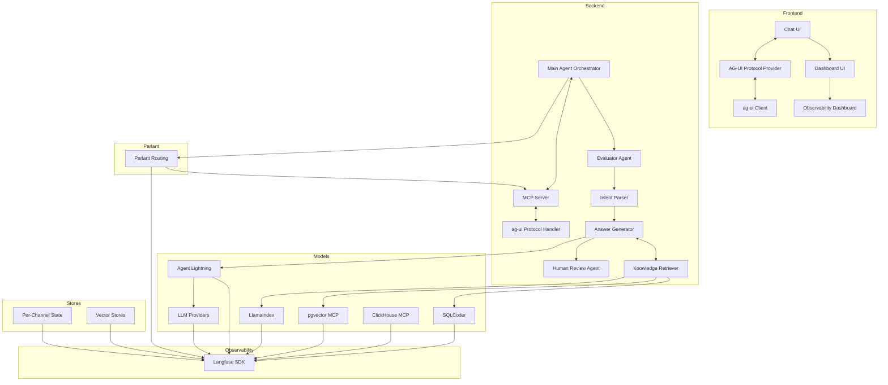

### Integratability Requirements

The system must support seamless integration capabilities with clearly defined protocols and design patterns:

#### A2A (Agent-to-Agent) Integration
- **Protocol**: Implement A2A protocol for agent communication
- **Communication Channels**: Both in-memory and HTTP communication channels
  - **In-Memory**: High-performance communication for agents within the same process
  - **HTTP**: Inter-process and distributed agent communication
- **Message Format**: Standardized message format supporting structured data exchange
- **Discovery**: Agent registry for dynamic discovery of available agents
- **Routing**: Intelligent routing mechanisms for directing messages between agents

#### Agent-to-Human Integration
- **Protocol**: Implement ag-ui protocol for agent-to-human interaction
- **Interface Components**:
  - Real-time notifications and feedback mechanisms
  - Human review workflows with approval/rejection capabilities
  - Interactive decision points for human-in-the-loop scenarios
  - Context-rich interfaces with relevant information display

#### Pluggable Integration Design
- **Factory Pattern**: Implement factory design pattern for creating different types of integration adapters
- **Adapter Pattern**: Implement adapter design pattern to enable seamless integration with diverse systems
- **Plug-and-Play**: Support dynamic loading of integration modules without system restart
- **Configuration-Driven**: Allow integration modules to be configured via external configuration files
- **Extensibility**: Provide clear extension points for adding new integration capabilities

## Agent Orchestration Architecture

### Design Philosophy: Double Diamond + Six Thinking Hats

**⚠️ ARCHITECTURAL VISION - NOT YET IMPLEMENTED**

This section outlines a future architecture that combines design thinking frameworks with LLM compiler patterns to create a robust, multi-perspective agent orchestration system. The current implementation uses a single Pydantic AI agent (see Backend section), but this architecture provides a roadmap for evolution.

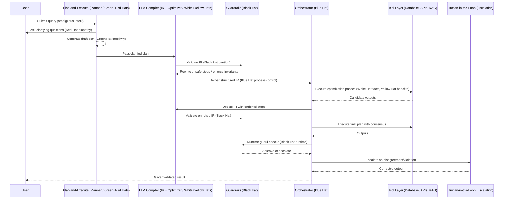

### Framework Integration

#### 1. Double Diamond Design Process

The Double Diamond provides the macro-level divergence/convergence cycles:

- **Discover (Diverge)**: Plan-and-Execute phase for requirement elicitation
  - Green Hat: Creative exploration of possible decompositions
  - Red Hat: Empathetic clarification of user intent
  - Pattern: `Plan-and-Execute` for adaptive clarification

- **Define (Converge)**: LLM Compiler phase for intent formalization
  - White Hat: Fact retrieval to ground requirements
  - Black Hat: Policy validation and risk checks
  - Pattern: `LLM Compiler` for structured IR construction

- **Develop (Diverge)**: Optimization passes for solution exploration
  - Green Hat: Alternative strategy generation
  - Yellow Hat: Efficiency and benefit highlighting
  - Pattern: `Compiler optimization passes` + adaptive re-planning

- **Deliver (Converge)**: Execution with consensus and validation
  - Blue Hat: Process control and orchestration
  - Black Hat: Runtime policy enforcement
  - Pattern: `Compiler execution` with validation

#### 2. Six Thinking Hats Integration

Each hat represents a micro-perspective embedded as agents or policy checks:

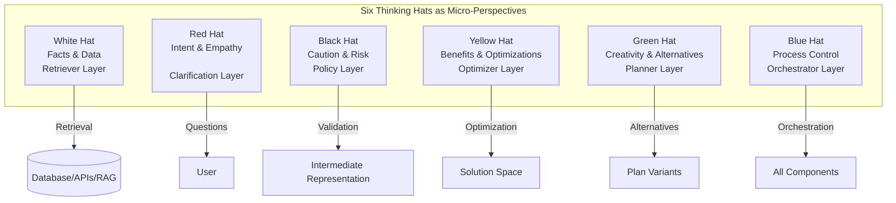

**Hat Mappings (Vision for Future Architecture):**

- **White Hat (Facts)**: Data layer - database queries, API calls, RAG retrieval
- **Red Hat (Feelings)**: Clarification system - user intent analysis, question generation
- **Black Hat (Caution)**: Policy/guardrails - input validation, output filtering, safety checks
- **Yellow Hat (Benefits)**: Optimization layer - cost optimization, caching, performance tuning
- **Green Hat (Creativity)**: Planning layer - alternative generation, divergent thinking, re-planning
- **Blue Hat (Process)**: Orchestration layer - workflow management, scheduling, error handling

### Phase-by-Phase Breakdown

#### Phase 1: Discover (Diverge) - Plan-and-Execute Pattern

**Goal**: Elicit hidden requirements and clarify ambiguous intent

**Hats Active**: Green (creativity), Red (empathy), White (facts via retrievers)

**Guardrails**: Input-level policy checks (deny unsafe queries, sanitize input)

**Orchestration**: Coordinates clarification attempts

**Vision Implementation:**
```python
# Future: Planner component generates questions for clarification
# Current: Simple heuristic intent detection (see intent_detection.py)

# Red Hat: Ask clarifying questions (future enhancement)
async def clarify_intent(user_query: str):
    planner_agent = Agent(
        model,
        system_prompt="You are a requirements elicitation specialist...",
    )
    questions = await planner_agent.run(
        f"Identify ambiguous aspects of: {user_query}"
    )
    return questions

# Green Hat: Generate draft plan variants (future enhancement)
async def generate_plan_variants(clarified_query: str):
    variants = await planner_agent.run(
        f"Generate 3 alternative interpretations: {clarified_query}"
    )
    return variants
```

**Current State**: Simple heuristic-based intent detection (see `/home/chris/repo/copilot-chat-with-your-data/backend/intent_detection.py`)

**Output**: Clarified requirements + draft plan

#### Phase 2: Define (Converge) - LLM Compiler Pattern

**Goal**: Formalize intent into structured Intermediate Representation (IR)

**Hats Active**: Black (caution, policy enforcement), Blue (process control)

**Guardrails**: IR-level validation (tool eligibility, schema completeness)

**Orchestration**: Registers IR as executable workflow

**Vision Implementation:**
```python
# Future: Compile into structured IR with validation
# Current: Direct LLM calls without formal IR

class WorkflowIR:
    steps: List[WorkflowStep]
    dependencies: Dict[str, List[str]]
    validation_rules: List[ValidationRule]

# Black Hat: Validate against policies (future enhancement)
def validate_workflow(ir: WorkflowIR):
    validator = PolicyValidator()
    violations = validator.check(ir)
    if violations:
        raise ValidationError(violations)
    return ir

# Blue Hat: Register for execution (future enhancement)
async def register_workflow(ir: WorkflowIR):
    workflow_id = await orchestrator.store(ir)
    return workflow_id
```

**Current State**: Direct Pydantic AI agent calls without formal IR layer

**Output**: Validated IR ready for optimization

#### Phase 3: Develop (Diverge) - Optimization with Adaptive Re-planning

**Goal**: Generate multiple enriched solution paths

**Hats Active**: Green (alternative strategies), Yellow (benefits), White (facts)

**Guardrails**: Policy enforcement for sensitive operations

**Orchestration**: Coordinates optimization attempts

**Vision Implementation:**
```python
# Future: Parallel optimization passes
# Current: Sequential processing in single agent

optimization_passes = [
    RetrievalEnrichment(),      # White Hat - add facts
    EfficiencyOptimization(),   # Yellow Hat - optimize costs
    AlternativeStrategies(),    # Green Hat - explore alternatives
]

# Execute passes in parallel (future enhancement)
enriched_results = await asyncio.gather(*[
    pass.execute(input_data) for pass in optimization_passes
])

# Blue Hat: Select best variants (future enhancement)
selected = await orchestrator.select_best(
    enriched_results,
    criteria=[cost, accuracy, speed]
)
```

**Current State**: Single analysis agent handles all processing

**Output**: Enriched solution paths

#### Phase 4: Deliver (Converge) - Execution with Validation

**Goal**: Execute with runtime validation and deliver final result

**Hats Active**: Blue (orchestration), Black (runtime guardrails)

**Guardrails**: Runtime policy enforcement (PII detection, evidence requirements)

**Orchestration**: Coordinates execution, handles errors, manages fallback

**Vision Implementation:**
```python
# Future: Structured execution with runtime checks
# Current: Direct execution with basic error handling

# Blue Hat: Orchestrate execution (future enhancement)
async def execute_with_validation(plan: ExecutionPlan):
    results = []
    for step in plan.steps:
        result = await execute_step(step)

        # Black Hat: Runtime validation
        violation = await policy_validator.check_runtime(result)
        if violation:
            # Human-in-the-loop escalation
            corrected = await escalate_to_human(step, violation)
            result = corrected

        results.append(result)

    return consolidate_results(results)
```

**Current State**: Direct execution in single Pydantic AI agent

**Output**: Validated, final result

### Implementation Roadmap

**Current Implementation (FastAPI + Pydantic AI)**:
- Single `analysis_agent` in `/home/chris/repo/copilot-chat-with-your-data/backend/main.py`
- Direct HTTP endpoints (`/ag-ui/run`, `/ag-ui/action/*`)
- Store classes for data management (no micro-agents)
- Basic heuristic intent detection
- No formal IR layer

**Future Evolution Path**:
1. **Phase A**: Add clarification questions for ambiguous queries (Red Hat)
2. **Phase B**: Implement structured workflow representation (IR layer)
3. **Phase C**: Add policy/guardrail validation (Black Hat)
4. **Phase D**: Separate data retrieval from processing (White Hat)
5. **Phase E**: Add optimization passes and planning (Yellow/Green Hats)
6. **Phase F**: Implement formal orchestration layer (Blue Hat)

**Benefits of This Architecture**:
- Design-informed agent workflows
- Multi-perspective validation
- Clear separation of concerns
- Adaptive and resilient
- Human-in-the-loop friendly
- Scalable from single agent to multi-agent system

## Routing Method Specification

This section details three routing strategies with complete Langfuse tracing integration for observability across all routing decisions.

### 1. Hard-Coded Routing + Langfuse

```python
from maf import Orchestrator, Retriever, LLM
from langfuse import Langfuse

# Initialize Langfuse
langfuse = Langfuse(
    public_key="your_public_key",
    secret_key="your_secret_key"
)

embedding_retriever = Retriever("embedding")
metadata_retriever = Retriever("metadata")
guided_grep_retriever = Retriever("guided_grep")

def route_query(query: str):
    """Hard-coded routing based on keyword matching"""
    if "datasheet" in query or "spec" in query:
        return metadata_retriever
    elif "explain" in query or "overview" in query:
        return embedding_retriever
    else:
        return guided_grep_retriever

# Example usage with Langfuse tracing
query = "Find datasheet for 3.3V regulator, RoHS compliant"
trace = langfuse.trace(name="hardcoded_routing", input=query)

retriever = route_query(query)
trace.span(
    name="routing",
    output=f"Selected retriever: {retriever.name}\nDecision: keyword-based"
)

docs = retriever.retrieve(query)
trace.span(name="retrieval", output=f"Retrieved {len(docs)} docs")

answer = LLM().generate(docs, query)
trace.span(name="generation", output=answer)

trace.end()
langfuse.flush()

print(answer)
```

**Key Characteristics:**
- Simple if/else logic based on keyword matching
- Fast execution (no LLM calls for routing)
- Deterministic and predictable
- Limited flexibility for ambiguous queries


### 2. Parlant-Guided Routing + Langfuse

```python
from maf import Orchestrator, Retriever, LLM
from parlant import Router, Guideline
from langfuse import Langfuse

# Initialize Langfuse
langfuse = Langfuse(
    public_key="your_public_key",
    secret_key="your_secret_key"
)

embedding_retriever = Retriever("embedding")
metadata_retriever = Retriever("metadata")
guided_grep_retriever = Retriever("guided_grep")

# Define Parlant guidelines
# Each guideline: (condition, action)
guidelines = [
    Guideline(
        condition=lambda q: "datasheet" in q.lower() or "spec" in q.lower() or "rohs" in q.lower(),
        action=metadata_retriever,
        name="electronics_datasheet"
    ),
    Guideline(
        condition=lambda q: "explain" in q.lower() or "overview" in q.lower() or "what is" in q.lower(),
        action=embedding_retriever,
        name="general_explanation"
    ),
    Guideline(
        condition=lambda q: True,  # Always matches - fallback
        action=guided_grep_retriever,
        name="fallback_heuristic"
    )
]

router = Router(guidelines)

def parlant_route(query: str):
    """Deterministic routing using Parlant guidelines"""
    matching_guideline, retriever = router.route(query)
    return retriever, matching_guideline

# Example usage with Langfuse tracing
query = "Find datasheet for 3.3V regulator, RoHS compliant"
trace = langfuse.trace(name="parlant_routing", input=query)

retriever, guideline = parlant_route(query)
trace.span(
    name="routing",
    output=f"Selected retriever: {retriever.name}\nGuideline matched: {guideline.name}"
)

docs = retriever.retrieve(query)
trace.span(name="retrieval", output=f"Retrieved {len(docs)} docs")

answer = LLM().generate(docs, query)
trace.span(name="generation", output=answer)

trace.end()
langfuse.flush()

print(answer)
```

**Key Characteristics:**
- Deterministic rules with clear decision boundaries
- Explainable routing (can trace which guideline matched)
- Flexible condition expressions
- Versionable and testable guidelines
- Combines benefits of hard-coded (deterministic) and semantic (flexible)
- Fallback guidelines ensure every query is routed


### When to Use Each Method

**Hard-coded routing:**
- Simple query patterns (e.g., keywords always mean same thing)
- High-performance requirements (no LLM calls)
- Limited query types

**Parlant-guided routing:**
- Complex business logic
- Need explainability and audit trails
- Version control and testing important
- Combining multiple routing strategies

### Langfuse Observability Across All Methods

All three routing methods integrate with Langfuse to provide:

1. **Routing Decision Tracking:** Which retriever was selected and why
2. **Performance Metrics:** Latency of routing decisions
3. **Decision Quality:** Correlate routing choices with answer quality
4. **A/B Testing:** Compare routing methods on same queries
5. **Error Analysis:** Identify queries that all methods route incorrectly
6. **Cost Comparison:** Semantic routing (embedding cost) vs Parlant (rule evaluation)
7. **Human Feedback Loop:** Learn from routing mistakes via AG-UI card feedback

**Example Langfuse Dashboard View:**

```json
{
  "trace_id": "rag-pipeline-123",
  "routing_method": "parlant-guided",
  "routing_latency_ms": 12,
  "matched_guideline": "electronics_datasheet",
  "retriever_name": "metadata_retriever",
  "retrieval_latency_ms": 145,
  "generation_latency_ms": 892,
  "answer_quality": {
    "faithfulness": 0.92,
    "relevance": 0.88
  }
}
```

## Detailed Tech Stack Specification

### System Components and Function Mapping

The system implements 6 core RAG stages, each with specific technology mappings:

#### 1. Query Construction
- **Function:** Convert user input into structured queries (SQL, semantic, graph-based)
- **Tech Stack:**
  - `Text-to-SQL`: SQLCoder (production), HuggingFace Text2SQL (experimental)
  - `Self-query retriever`: MAF skill
  - `Routing`: Parlant guidelines expose MCP endpoints to MAF selectors/plans
  - `Schema Awareness`: ClickHouse MCP (list_tables, get_schema) to prevent hallucinations
- **Evaluation:** Spider, UNITE, BIRD datasets; Execution Accuracy; UNITE toolkit

**Langfuse SDK Integration for End-to-End Tracing:**

All evaluation runs are wrapped with Langfuse SDK for comprehensive observability, creating a complete feedback loop:

```python
import pandas as pd
import json

# Initialize node
lf = {}

# UNITE Toolkit Evaluation with Langfuse Wrapping
def evaluate_with_langfuse(dataset_path: str):
    """Run UNITE evaluation with Langfuse tracing for each query"""

    # Load UNITE dataset
    unite_data = pd.read_csv(dataset_path)

    for query, gold_sql in unite_dataset:
        # Langfuse trace for each evaluation
        trace = lf.trace("unite-eval")
        span = trace.span("query_eval")

        # Generate SQL using SQLCoder
        generated_sql = sqlcoder.generate(query, schema)
        result = execute_sql(generated_sql)
        accuracy = compare_results(result, gold_sql)

        # Log to Langfuse
        span.log({
            "query": query,
            "generated_sql": generated_sql,
            "accuracy": accuracy
        })
        span.end()

        # Aggregate metrics
        lf.score("sqlcoder-performance", accuracy)

# Run evaluation
if __name__ == "__main__":
    evaluate_with_langfuse("data/unite.csv")
```

## Overall RAG Pipeline Design

This section shows how all components work together in the complete RAG pipeline, from user query to answer generation, with Parlant routing and metadata filtering integrated throughout.

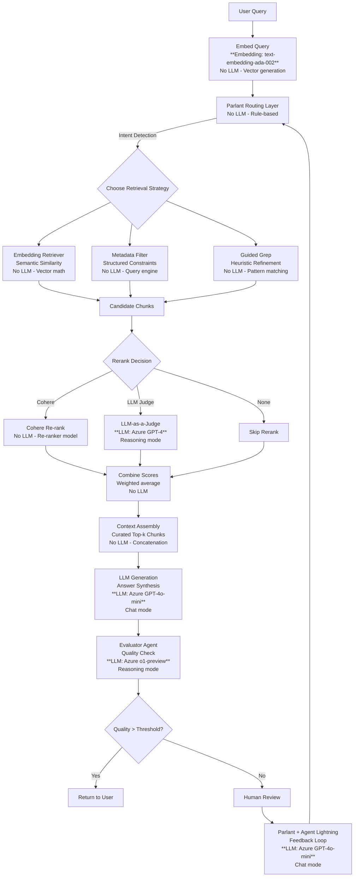

### Pipeline Flow Explanation

**Stage 1: Query Entry & Intent Detection**
- User query enters the pipeline through the Chat UI
- Parlant Routing Layer analyzes intent and applies domain-specific guidelines
- Based on query type, chooses appropriate retrieval strategy (embedding, metadata, or heuristic)

**Stage 2: Multi-Strategy Retrieval**
- **Embedding Retriever:** Uses pgvector/LlamaIndex for semantic similarity search across vector stores
- **Metadata Filter:** Applies structured constraints (ClickHouse schema, compliance tags, timestamps)
- **Guided Grep:** Heuristic refinement for exact matches and pattern-based retrieval
- All strategies execute in parallel via Microsoft Agent Framework

**Stage 3: Candidate Merging & Reranking**
- Candidate chunks from all retrieval strategies are merged
- Optional reranking combines semantic scores with metadata weighting
- Parlant guidelines influence ranking based on domain rules

**Stage 4: Context Assembly**
- Top-k chunks are selected based on combined scores
- Context is assembled with provenance metadata (source, timestamp, confidence)
- Passed to LLM for answer generation with optimized prompts from Agent Lightning

**Stage 5: Quality Evaluation & Human Feedback Loop**
- Evaluator Agent checks answer against 7 RAG quality characteristics
- If quality threshold not met, routes to Human Review
- Human feedback feeds back into Parlant (policy updates) and Agent Lightning (prompt optimization)
- Creates continuous improvement cycle

### Integration with Core Architecture

This pipeline design integrates seamlessly with the static architecture:

- **Frontend:** User query enters via Chat UI → AG-UI Protocol → Backend
- **Backend:** Main Agent Orchestrator coordinates the pipeline stages
- **Models:** Each retrieval strategy uses appropriate models (pgvector, ClickHouse, LlamaIndex)
- **Observability:** Langfuse traces every stage: query routing, retrieval, generation, evaluation
- **Parlant:** Routes queries and applies metadata filtering rules
- **Agent Lightning:** Optimizes prompts based on human feedback
- **Human Review:** Provides training signal for continuous improvement

### Key Benefits of This Pipeline Design

1. **Multi-Strategy Retrieval:** Combines semantic, structured, and heuristic methods for maximum recall
2. **Metadata-Aware:** Leverages ClickHouse schema and compliance tags for accurate filtering
3. **Deterministic Routing:** Parlant ensures predictable query handling based on domain rules
4. **Quality Assurance:** Multi-layer evaluation prevents low-quality responses
5. **Continuous Learning:** Human feedback loop improves both retrieval and generation over time
6. **Full Observability:** Langfuse traces provide complete pipeline visibility
7. **Scalable:** Microsoft Agent Framework enables horizontal scaling of retrieval strategies

### Langfuse Integration for Full Pipeline Observability

```python
from langfuse import Langfuse

# Initialize Langfuse client
lf = Langfuse()

def trace_rag_pipeline(query: str, user_id: str):
    """Complete RAG pipeline tracing from query to answer"""

    # Create parent trace for the entire conversation
    trace = lf.trace(
        name="rag-pipeline",
        user_id=user_id,
        metadata={"pipeline_version": "1.0"}
    )

    # Stage 1: Parlant Routing
    with trace.span("parlant-routing") as routing_span:
        intent = detect_intent(query)
        routing_decision = select_retrieval_strategy(intent)

        routing_span.log({
            "query": query,
            "detected_intent": intent,
            "routing_decision": routing_decision
        })

    # Stage 2: Multi-Strategy Retrieval (parallel spans)
    retrieval_results = {}

    with trace.span("embedding-retrieval") as embed_span:
        semantic_chunks = semantic_search(query)
        retrieval_results['semantic'] = semantic_chunks
        embed_span.log({"chunks_found": len(semantic_chunks)})

    with trace.span("metadata-filter") as meta_span:
        filtered_chunks = apply_metadata_constraints(query)
        retrieval_results['filtered'] = filtered_chunks
        meta_span.log({"chunks_after_filter": len(filtered_chunks)})

    with trace.span("guided-grep") as grep_span:
        heuristic_chunks = pattern_matching(query)
        retrieval_results['heuristic'] = heuristic_chunks
        grep_span.log({"pattern_matches": len(heuristic_chunks)})

    # Stage 3: Rerank and Merge
    with trace.span("reranking") as rerank_span:
        merged_chunks = merge_results(retrieval_results)
        ranked_chunks = rerank(merged_chunks)

        rerank_span.log({
            "total_candidates": len(merged_chunks),
            "final_top_k": len(ranked_chunks)
        })

    # Stage 4: Context Assembly
    with trace.span("context-assembly") as context_span:
        context = assemble_context(ranked_chunks)
        context_span.log({
            "context_tokens": len(context.split()),
            "sources_used": len(set(chunk.source for chunk in ranked_chunks))
        })

    # Stage 5: LLM Generation
    with trace.span("llm-generation") as gen_span:
        answer = generate_answer(query, context)

        gen_span.log({
            "answer_length": len(answer),
            "model_used": "azure-gpt-4",
            "generation_time_ms": gen_span.duration
        })

    # Stage 6: Quality Evaluation
    with trace.span("quality-evaluation") as eval_span:
        quality_scores = evaluate_answer(query, context, answer)

        eval_span.log(quality_scores)
        eval_span.score("faithfulness", quality_scores['faithfulness'])
        eval_span.score("relevance", quality_scores['relevance'])
        eval_span.score("correctness", quality_scores['correctness'])

    # Final trace metadata
    trace.log({
        "query": query,
        "answer": answer,
        "quality_scores": quality_scores,
        "pipeline_completed": True
    })

    trace.end()
    lf.flush()

    return answer
```

**Langfuse Integration Benefits for RAG Pipeline:**

1. **Query-Level Traceability:** Each user query becomes a trace with nested spans for every pipeline stage
2. **Performance Insights:** Identify bottlenecks in routing, retrieval, or generation phases
3. **Retrieval Quality Metrics:** Track semantic scores, metadata filtering effectiveness, reranker performance
4. **Multi-Strategy Comparison:** Compare embedding vs metadata vs heuristic retrieval effectiveness
5. **Context Assembly Analytics:** Monitor context token usage and source diversity
6. **Answer Quality Scoring:** Evaluate faithfulness, relevance, and correctness with RAGAS
7. **Cost Tracking:** Monitor LLM token usage and vector store query costs
8. **A/B Testing:** Compare different retrieval strategies and routing policies
9. **Human Feedback Integration:** Correlate human ratings with specific pipeline stages
10. **Continuous Optimization:** Agent Lightning uses traces to improve prompts and routing over time


**Example Flow: SQLCoder + ClickHouse MCP**

**User Query (Natural Language):**
```
"Show me the top 10 customers by revenue this quarter."
```

**Step 1: Schema Awareness via ClickHouse MCP**
```json
{
  "tables": ["sales", "customers"],
  "sales": {
    "columns": ["customer_id", "revenue", "quarter"],
    "types": ["INT", "DECIMAL", "STRING"]
  },
  "customers": {
    "columns": ["customer_id", "name"],
    "types": ["INT", "STRING"]
  },
  "primary_keys": {
    "sales": ["customer_id"],
    "customers": ["customer_id"]
  }
}
```

**Step 2: SQLCoder Generation with Schema Context**
SQLCoder consumes schema context via MCP, generates validated SQL:

```sql
SELECT c.name, SUM(s.revenue) AS total_revenue
FROM sales s
JOIN customers c ON s.customer_id = c.customer_id
WHERE s.quarter = 'Q4'
GROUP BY c.name
ORDER BY total_revenue DESC
LIMIT 10;
```

**Step 3: ClickHouse MCP Execution**
- MCP safely executes SQL in read-only mode
- Returns structured results to MAF
- Logs execution metadata for observability (schema access, query performance, results)

**Step 4: Parlant + MAF Integration**
```typescript
// Parlant Guideline Routes NL Queries
const sqlGuideline = create_guideline(
  `IF user_query_asks_for_data_analysis
   THEN route_to_sql_coder_with_clickhouse_mcp
   WITH confidence_threshold: 0.85`
);

// MAF Orchestrates Execution
const orchestrationPlan = {
  step1: 'parlant_route_decision',
  step2: 'sqlcoder_with_mcp_schema',
  step3: 'clickhouse_execute',
  step4: 'return_results_to_user'
};
```

**🔨 Benefits of SQLCoder + ClickHouse MCP**

| Benefit | Description |
|---------|-------------|
| **Accuracy** | SQLCoder avoids hallucinations by grounding in real schema |
| **Compliance** | MCP enforces safe, read‑only queries |
| **Observability** | MCP logs schema access + query execution for Langfuse |
| **Performance** | ClickHouse executes analytical queries at scale with low latency (sub-second) |
| **Determinism** | Parlant guidelines ensure only valid NL→SQL queries hit SQLCoder + MCP |
| **Safety** | Schema validation prevents injection and runtime errors |
| **Cost Efficiency** | Fewer failed/invalid queries = lower LLM API costs |

**Schema Caching Strategy:**
- ClickHouse MCP maintains in-memory schema cache (refreshed every 60s)
- Reduces latency for schema lookups
- Version tracking detects schema changes
- Parlant policies can trigger re-validation on schema updates

#### 2. Query Translation
- **Function:** Rewrite, decompose, fuse, or augment queries for better retrieval
- **Tech Stack:**
  - `RAG-Fusion`: MAF orchestrating multiple retrievers
  - `HyDE`: LlamaIndex query engines or Parlant-guided tool calls
  - `Decomposition`: Parlant guideline chaining
  - `Multi-query`: MAF plan-based orchestration
- **Evaluation:** BEIR benchmark; Recall@k, MRR, nDCG; DeepEval reranking

#### 3. Routing
- **Function:** Decide which retriever/tool/agent to use based on query type/context
- **Tech Stack:**
  - Parlant guidelines (`create_guideline()`) with domain-specific triggers
  - MCP endpoints exposed to MAF selectors/plans
  - Parlant `@tool` orchestration → MAF skills
  - **Hybrid routing:**
    - Parlant combines static rules with dynamic (LLM-assisted) routing
    - Static rules handle predictable cases (SQL, GraphQL, API calls)
    - LLM routing handles ambiguous or open-ended queries
- **Evaluation:** Custom routing accuracy tests; Rule compliance %, Misrouting rate; Parlant logs + Langfuse traces

#### 4. Retrieval
- **Function:** Fetch relevant documents from DBs or APIs
- **Tech Stack:**
  - `Vector DBs`: Azure AI Search, Weaviate, Pinecone, Qdrant, FAISS
  - `Rerankers`: Cohere Rerank, DeepEval reranking
  - `Active retrieval`: CMG (Contextual Memory Graph), MAF skill-based retrievers
  - `Indexing/Retrieval Agent`: **LlamaIndex** (SQL, Graph, RAG-Fusion, HyDE engines)
  - `Tool use`: Parlant `@tool` decorators invoking MAF actions
- **Evaluation:** BEIR, MS MARCO, TREC datasets; Precision@k, Recall@k, nDCG; DeepEval + Langfuse retrieval traces

#### 5. Indexing 🔎 *Explicitly LlamaIndex*
- **Function:** Chunking, embedding, organizing documents for optimal retrieval
- **Tech Stack:**
  - **LlamaIndex:**
    - `RecursiveCharacterTextSplitter` → recursive chunking by semantic units
    - `SemanticSplitter` → NLP-driven semantic chunking
    - `Hierarchical Indexing` → parent/child document structures
    - `RAPTOR` → tree-based indexing for multi-level retrieval
  - `Embeddings`: Azure OpenAI, HuggingFace, Cohere
  - `Fine-tuning`: BEIR, CoA (Contrastive Optimization of Alignment)
- **Evaluation:** BEIR benchmark; Embedding similarity scores, Recall@k, nDCG, latency; LlamaIndex eval suite + Langfuse traces

#### 6. Generation
- **Function:** Generate grounded responses from retrieved docs
- **Tech Stack:**
  - `Prompt Optimization`: **Agent Lightning** (RL, supervised fine-tuning, automatic prompt tuning)
  - `LLMs`: Azure OpenAI GPT-4, Mistral, Claude via MAF
  - `Guardrails`: Parlant enforcement, Azure Content Safety
  - `Observability`: Langfuse dashboards
- **Evaluation:** TruthfulQA, MT-Bench, Eval Harness; Metrics: Faithfulness, factual accuracy, hallucination rate; Agent Lightning RL feedback loops


## Static Architecture

### 1. Frontend - React/Next.js Application

**Component Architecture:**

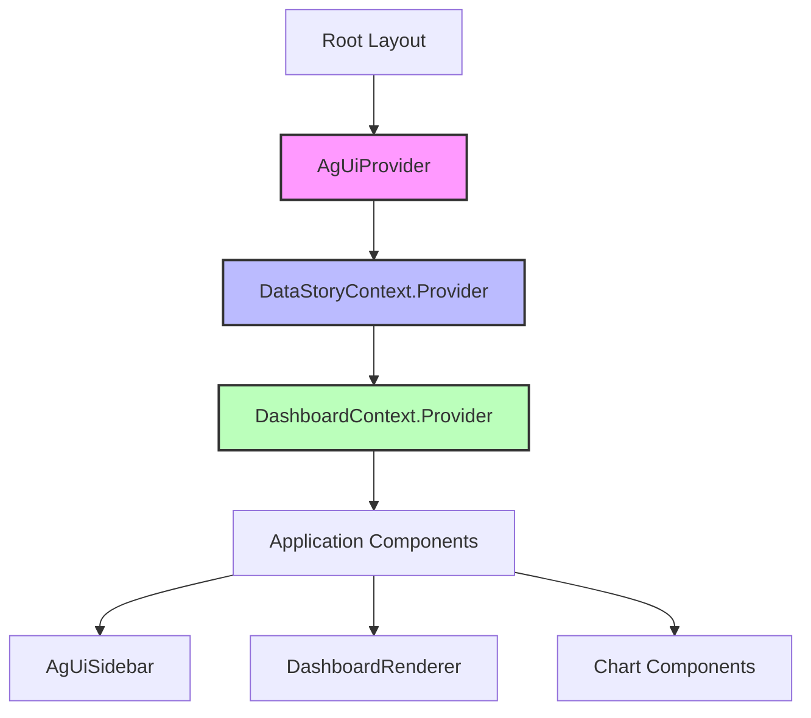

**Core Context Providers:**

#### AgUiProvider - Primary AG-UI Protocol Integration
- **Location**: `/home/chris/repo/copilot-chat-with-your-data/frontend/components/ag-ui/AgUiProvider.tsx`
- **Pattern**: React Context Provider wrapping entire app
- **HTTP Agent**: Single `HttpAgent` instance for all AG-UI communication
- **Message Routing**: Sophisticated message type discrimination

#### Message Type System (4 Message Types)

```typescript
// Message Type Discrimination
export type AgUIMessage =
  | AiMessage           // LLM-powered operations → /ag-ui/run
  | DirectUIUpdateMessage      // Immediate UI navigation → NO LLM
  | DirectDatabaseCrudMessage  // Direct DB operations → /ag-ui/database
  | AiDatabaseCrudMessage      // AI-assisted DB ops → /ag-ui/run
```

**Message Routing Logic:**
```typescript
const processMessage = useCallback((message: AgUIMessage) => {
  switch (message.type) {
    case 'direct_ui_update':
      handleDirectUIUpdate(message);    // Immediate execution, 0ms delay
      return;
    case 'direct_database_crud':
      handleDirectDatabaseCrud(message); // Direct DB operations
      return;
    case 'ai_database_crud':
    case 'ai':
      runAiMessage(message);             // Requires LLM processing
      return;
  }
}, [handleDirectUIUpdate, handleDirectDatabaseCrud, runAiMessage]);
```

**Critical Performance Principle**: Separate UI navigation (DirectUIUpdate) from AI processing to avoid unnecessary LLM invocations and ensure immediate UI responsiveness.

#### AG-UI Protocol Endpoints

**HTTP Endpoints** (via Pydantic AI HttpAgent):
```typescript
"/ag-ui/run" - POST           // AI message processing, event streaming
"/ag-ui/database" - POST      // Database CRUD operations
"/ag-ui/dashboard-data" - GET // SSE stream for dashboard data
"/ag-ui/action/*" - POST     // Specialized actions:
  - searchInternet
  - generateDataStory
  - generateStrategicCommentary
  - testTTSVoice
  - generateDataStoryAudio
  - lidaEnhancedAnalysis  // LIDA integration endpoint
```

#### Chart Highlighting Engine

**Location**: `/home/chris/repo/copilot-chat-with-your-data/frontend/lib/chart-highlighting.ts`

**Core Functions:**
```typescript
// Chart focus targeting system
export type ChartFocusTarget = {
  chartId: string;
  seriesIndex?: number;
  dataIndex?: number;
  xAxisIndex?: number;
  yAxisIndex?: number;
};

// Highlight orchestration
export function highlightTargets(
  targets: ChartFocusTarget,
  options?: { persistent?: boolean; highlightClass?: string }
): void;

// ECharts API integration for precise focus
function getEChartInstance(chartId: string): echarts.ECharts | null;
function focusEChartDataPoint(...): void;
```

**Highlight Flow:**
1. AG-UI event contains `chartIds` in metadata
2. `highlightCharts` helper queries DOM for chart cards
3. Applies CSS animations (pulse, highlight)
4. Uses ECharts API for precise data point/series focus
5. Supports persistent and temporary highlighting modes

#### Data Story Integration

**Required Flag**: `isDynamicDashboard` must be set to enable data story functionality

```typescript
// In dashboard pages (e.g., /home/chris/repo/copilot-chat-with-your-data/frontend/app/page.tsx)
export default function HomePage() {
  const { setIsDynamicDashboard } = useDashboardContext();

  useEffect(() => {
    setIsDynamicDashboard(true);  // CRITICAL: Enable data stories
    return () => {
      setIsDynamicDashboard(false);
    };
  }, [setIsDynamicDashboard]);
}
```

**Data Story State Machine** (`/home/chris/repo/copilot-chat-with-your-data/frontend/hooks/useDataStory.ts`):
```typescript
export type DataStoryState = {
  status: "idle" | "suggested" | "loading" | "awaiting-audio" | "playing" | "completed" | "error";
  suggestion?: DataStorySuggestion;
  steps: DataStoryStep[];
  activeStepId?: string;
  talkingPointIndex?: number;
  audioUrl?: string;
  audioSegments?: DataStoryAudioSegment[];
  audioProgress?: number;
  currentTalkingPointStartTime?: number;
};
```

**Flow:**
1. Backend detects story intent → emits `dataStory.suggestion` event
2. Provider captures event → sets `status = "suggested"`
3. User clicks "Generate" → Provider calls `/ag-ui/action/generateDataStory`
4. Backend returns steps with `chartIds` and `talkingPoints`
5. Provider aggregates `highlightCharts` actions
6. Audio generation with progressive loading
7. Step-by-step playback with chart highlighting coordination
8. Browser TTS fallback when backend audio fails

#### Dashboard Editor Integration

**UI Navigation Pattern** (DirectUIUpdate messages):
```typescript
// Dashboard item clicks in edit mode
onClick={() => sendDirectUIUpdate(`Show item properties for "${item.title}" (${item.id}) in Data Assistant panel`)}

// Dashboard title clicks
onClick={() => sendDirectUIUpdate("Show dashboard title editor in Data Assistant")}

// Dashboard preview clicks
onClick={() => sendDirectUIUpdate("Show dashboard preview and settings in Data Assistant")}
```

**Implementation Flow:**
1. User clicks dashboard element in edit mode
2. Frontend sends `DirectUIUpdate` message (NO LLM invocation)
3. `handleDirectUIUpdate` updates `DashboardContext` directly
4. `AgUiSidebar` re-renders with appropriate cards
5. Chat form is hidden in dashboard edit mode

#### Context Provider Hierarchy

```typescript
// Correct nesting order
<AgUiProvider>
  <DataStoryContext.Provider>
    <DashboardContext.Provider>
      <TTSConfigContext.Provider>
        {children}
      </TTSConfigContext.Provider>
    </DashboardContext.Provider>
  </DataStoryContext.Provider>
</AgUiProvider>
```

**Why This Order Matters:**
- `AgUiProvider` provides base AG-UI protocol and message routing
- `DataStoryContext` depends on AG-UI events (`dataStory.suggestion`)
- `DashboardContext` receives updates from both AG-UI and data story systems
- `TTSConfigContext` configures audio settings used by data stories

#### Type Safety Requirements

**CRITICAL**: All frontend classes that interact with backend APIs MUST implement respective types defined in `/home/chris/repo/copilot-chat-with-your-data/frontend/types/backend_api.ts`.

```typescript
// Example: Frontend Agent class
class FrontendAgent implements AgentType {
  // Must match backend Agent interface exactly
  id: string;
  name: string;
  // ...
}
```

**AG-UI Card Component for Human Feedback:**

The AG-UI card component provides built-in mechanisms for collecting human feedback at the interaction level, creating a seamless feedback loop:

```typescript
// AG-UI Card Feedback Interface
type FeedbackCardProps = {
  messageId: string;
  content: string;
  agentMetadata: {
    routingDecision: string;
    confidence: number;
    promptsUsed: string[];
    sources: string[];
  };
  onFeedbackSubmit: (feedback: UserFeedback) => void;
}

type UserFeedback = {
  messageId: string;
  rating: 'good' | 'bad';
  feedbackText?: string;
  timestamp: string;
  category?: 'routing' | 'answer_quality' | 'relevance';
  suggestedImprovement?: string;
}
```

**Feedback Collection Interface:**
- **Good/Bad Rating Buttons**: Quick 1-click rating (thumbs up/down) on each response
- **Optional Feedback Text**: Expandable text area for detailed explanations
- **Metadata Context**: Card displays routing decision, confidence score, sources used
- **Smart Categories**: Optional tagging for feedback type (routing issue, answer quality, relevance)
- **Suggestion Field**: Users can suggest specific corrections or improvements

**Feedback Flow to Parlant + Agent Lightning:**

1. **User rates response** → Frontend captures rating + optional text
2. **AG-UI protocol sends** → Feedback message sent via HTTP to backend
3. **Feedback enrichment** → Backend enriches feedback with full trace (prompts, routing, sources)
4. **LightningStore ingestion** → Feedback stored with traceability (which prompt, which routing, which sources produced this)
5. **Parlant pattern analysis** → Parlant processes feedback to identify policy gaps:
   - "Bad" ratings on routing → Identifies ambiguous guideline triggers
   - "Bad" ratings on answer quality → Identifies prompt template issues
   - "Bad" ratings on relevance → Identifies retrieval gaps
6. **Agent Lightning optimization** → Trainer uses feedback for targeted optimization:
   - Routing feedback → Updates policy weights, generates new guidelines
   - Answer quality feedback → Refines prompt templates, adjusts LLM parameters
   - Relevance feedback → Improves retrieval query formulation
7. **Iterative enhancement** → Updated policies/prompts deployed to production
8. **A/B testing** → New optimized cards shown to users, feedback cycle continues

**Card Component States:**
- **Default**: Thumbs up/down buttons visible, feedback area collapsed
- **Rating Selected**: Expanded feedback form with text area, categories, suggestion field
- **Submitted**: Confirmation with "thank you" + option to edit feedback within 5 minutes
- **Analytics**: Backend tracks feedback submission rates, response patterns, quality trends

**Data Captured with Each Feedback:**
- Message ID and timestamp
- User rating (good/bad)
- Optional text feedback
- Original query + generated response
- Routing decision + confidence
- Prompt templates used
- Retrieved sources/LOBs
- Agent execution trace
- LLM parameters

This creates a **frictionless feedback loop** where every user interaction can potentially improve the system, with human feedback directly feeding into Agent Lightning's optimization algorithms.

### 2. Backend - FastAPI + Pydantic AI

**Architecture Overview:**

```mermaid
graph TD
    A[FastAPI App] --> B[/ag-ui/run Endpoint]
    A --> C[/ag-ui/database Endpoint]
    A --> D[/ag-ui/action/* Endpoints]
    B --> E[Pydantic AI Agent]
    E --> F[Azure OpenAI GPT-4o-mini]
    E --> G[Custom Event Handlers]
    G --> H[dataStory.suggestion Event]
    G --> I[chart.highlight Event]
    D --> J[Data Story Generator]
    D --> K[Chart Actions]
    D --> L[TTS Service]

    style E fill:#f9f,stroke:#333,stroke-width:2px
    style G fill:#bbf,stroke:#333,stroke-width:2px
```

**Core Components:**

#### FastAPI HTTP Server
- **Primary Framework**: FastAPI (not Microsoft Agent Framework)
- **Async-First**: Full async/await implementation for high concurrency
- **Type Safety**: Pydantic v2 models for request/response validation
- **Endpoints**: All AG-UI protocol endpoints use HTTP (not WebSockets)

#### Pydantic AI Agent
- **Location**: `/home/chris/repo/copilot-chat-with-your-data/backend/main.py`
- **Implementation**: Single `analysis_agent` using `pydantic_ai.Agent`
- **Model**: Azure OpenAI GPT-4o-mini (via `AZURE_OPENAI_DEPLOYMENT`)
- **System Prompt**: Loaded from `/prompts/analysis_agent_system_prompt.md`
- **Capabilities**: Natural language analysis, chart highlighting, strategic commentary

**Agent Pattern:**
```python
# Pydantic AI agent definition
analysis_agent = Agent(
    model,
    system_prompt=load_prompt("analysis_agent_system_prompt.md"),
    deps_type=AnalysisDependencies,
    result_type=AgUIMessage
)
```

**Event Streaming:**
```python
@app.post("/ag-ui/run")
async def ag_ui_run(request: Request) -> StreamingResponse:
    """Main AG-UI agent runtime with SSE event stream"""
    return StreamingResponse(
        event_iterator(),
        media_type="text/event-stream"
    )

async def event_iterator():
    # Stream events: RunStartedEvent, TextMessageContentEvent, CustomEvent, etc.
    yield encoder.encode(RunStartedEvent(...))
    # ... stream LLM tokens and custom events
    yield encoder.encode(RunFinishedEvent(...))
```

#### Event System - Server-Sent Events (SSE)

**Protocol**: `text/event-stream` over HTTP (not WebSockets)

**Custom Event Types:**

1. **`dataStory.suggestion`** - Triggered by intent detection
   ```python
   # Triggered when query matches data story patterns
   yield encoder.encode(CustomEvent(
       "dataStory.suggestion",
       result={
           "intentId": intent.intentId,
           "summary": intent.summary,
           "confidence": intent.confidence
       }
   ))
   ```

2. **`chart.highlight`** - Chart highlighting recommendations
   ```python
   # Generated when agent identifies relevant charts
   metadata = {"chartIds": ["chart-1", "chart-2"]}
   yield encoder.encode(TextMessageContentEvent(..., metadata=metadata))
   ```

3. **Data Story Audio Events**:
   - `dataStory.audio.lifecycle` - Audio generation started
   - `dataStory.audio.progress` - Segment completion (30% → 60% → 100%)
   - `dataStory.audio.complete` - Audio generation finished
   - `dataStory.audio.error` - Error handling with browser TTS fallback

#### AG-UI Protocol Endpoints

**HTTP REST API** (not WebSockets or MCP channels):

| Endpoint | Method | Purpose | Streaming |
|----------|---------|---------|-----------|
| `/ag-ui/run` | POST | Main AG-UI agent runtime | ✅ SSE |
| `/ag-ui/database` | POST | Database CRUD for visualizations | ❌ No |
| `/ag-ui/dashboard-data` | GET | Stream dashboard dataset | ✅ SSE |
| `/ag-ui/action/generateDataStory` | POST | Generate strategic data story | ❌ No |
| `/ag-ui/action/generateDataStoryAudio` | POST | Generate audio narration | ✅ Streaming |
| `/ag-ui/action/searchInternet` | POST | Tavily web search | ❌ No |
| `/ag-ui/action/testTTSVoice` | POST | Test TTS voice | ❌ No |
| `/ag-ui/action/lidaEnhancedAnalysis` | POST | LIDA chart analysis | ❌ No |

#### Store Classes (Data Layer)

**No Multi-Agent System** - Uses store classes for data management:

1. **DashboardTemplateStore** (`/home/chris/repo/copilot-chat-with-your-data/backend/dashboard_template_store.py`)
   - CRUD operations for dashboard templates
   - PostgreSQL with asyncpg (falls back to memory if not configured)
   - Methods: `list_templates()`, `get_template()`, `create_template()`, etc.

2. **LidaVisualizationStore** (`/home/chris/repo/copilot-chat-with-your-data/backend/lida_visualization_store.py`)
   - Persists LIDA-generated visualizations
   - Schema: id, title, chart_type, chart_config, code, insights, etc.
   - PostgreSQL or in-memory storage

3. **LidaDbtModelStore** (`/home/chris/repo/copilot-chat-with-your-data/backend/lida_dbt_model_store.py`)
   - Manages dbt model metadata
   - Schema: id, name, description, path, sql, aliases

**Store Pattern:**
```python
class LidaVisualizationStore:
    def __init__(self):
        self.storage = {}  # In-memory fallback

    async def list_visualizations(self, ...) -> List[LidaVisualization]:
        # Returns list of visualizations
        ...

    async def create_visualization(self, visualization: LidaVisualization) -> None:
        # Persists visualization
        ...
```

#### Data Story Generation

**Intent Detection** (`/home/chris/repo/copilot-chat-with-your-data/backend/intent_detection.py`):
- **Heuristic-based**: Matches phrases like "how are we doing", "how's business", "overall performance"
- **Fuzzy matching**: 78% similarity threshold fallback
- **Returns**: `DataStorySuggestion` with intentId, summary, confidence, focusAreas

**Generation Flow:**
```python
@app.post("/ag-ui/action/generateDataStory")
async def generate_data_story(request: Request):
    # 1. Call analysis agent for strategic commentary
    # 2. Load dashboard context with charts
    # 3. Generate steps with chartIds and talkingPoints
    # 4. Return DataStorySteps for frontend playback
```

**Audio Generation**:
- **Azure OpenAI TTS** (or local TTS via MaaS)
- **Segment-by-segment streaming** with progress updates
- **Browser TTS fallback** when backend audio fails
- **Caching**: xxHash-based caching for strategic commentary

#### LIDA-Enhanced Integration

**LidaEnhancedManager** (`/home/chris/repo/copilot-chat-with-your-data/backend/lida_enhanced_manager.py`):
- **Enhanced version** of Microsoft LIDA adapted for async operation
- **Pydantic models**: `EnhancedDataSummary`, `EnhancedGoal`, `VisualizationRecommendations`
- **AG-UI compatibility**: Streams visualization generation with events
- **Persona support**: Analyst, Executive, Manager, Stakeholder personas
- **Chart highlighting**: Maps goals to existing dashboard chart IDs

**Endpoints:**
- `/lida/visualizations` - CRUD operations
- `/lida/visualize` - Generate chart suggestions (multi-chart)
- `/lida/select-chart` - Record user preferences
- `/lida/dbt-models` - dbt model catalog
- `/lida/semantic-models/{dataset_name}` - Semantic operations

**Persona-Aware Visualization Selection:**
```python
# Persona definitions align visualization types with audience needs
personas = {
    "analyst": {"visualizations": ["scatter", "heatmap", "detailed_table"]},
    "executive": {"visualizations": ["kpi_card", "line", "bar"]}
}
```

#### MCP (Model Context Protocol) Servers

**Not a Coordination Layer** - Tool-Specific MCP Servers:

1. **ClickHouse MCP** (`/home/chris/repo/copilot-chat-with-your-data/backend/focus_lida_integration.py`)
   - Provides access to FinOps datasets
   - Read-only queries to ClickHouse database
   - FOCUS v1.2 compliant data

2. **ECharts MCP** (`/home/chris/repo/copilot-chat-with-your-data/backend/echarts_mcp_server.py`)
   - Generates ECharts visualizations from natural language
   - User preference learning
   - Persona-aware recommendations

**MCP Pattern** (not channel-based routing):
```python
# Individual MCP servers for specific tools
@mcp.tool()
def query_finops_data(sql: str) -> dict:
    """Execute SQL query on FinOps data"""
    # Executes against ClickHouse
    ...

@mcp.tool()
def generate_echarts(config: dict) -> str:
    """Generate ECharts configuration"""
    # Returns ECharts options
    ...
```

#### Text-to-Speech (TTS) Service

**Multi-Provider Support** (`/home/chris/repo/copilot-chat-with-your-data/backend/tts_service.py`):

1. **Azure OpenAI TTS** (primary)
   - High-quality neural voices
   - Segment-by-segment generation

2. **Model-as-a-Service (MaaS) TTS** (local alternative)
   - Open-source TTS models
   - On-premise deployment option

**Configuration:**
- Environment: `DATA_STORY_AUDIO_ENABLED` (default: true)
- Environment: `TTS_PROVIDER` (azure_openai or maas)

**Streaming Pattern:**
```python
# Progressive audio generation with progress updates
for i, segment in enumerate(segments):
    audio_segment = await generate_audio(segment.text)
    progress = ((i + 1) / len(segments)) * 100
    yield encoder.encode(CustomEvent(
        "dataStory.audio.progress",
        result={"progress": progress}
    ))
```

### 3. Storage Layer

**Relational Database (PostgreSQL):**

**PostgreSQL with asyncpg** - No vector database or embedding storage

**Tables:**

1. **dashboards.dashboards** (via `DashboardTemplateStore`)
   ```sql
   id (UUID, PK)
   name (TEXT)
   description (TEXT)
   layout_config (JSONB)
   default_data (JSONB)
   is_template (BOOLEAN)
   category (TEXT)
   is_featured (BOOLEAN)
   created_by (TEXT)
   created_at (TIMESTAMP)
   updated_at (TIMESTAMP)
   ```

2. **lida_visualizations** (via `LidaVisualizationStore`)
   ```sql
   id (UUID, PK)
   title (TEXT)
   description (TEXT)
   chart_type (TEXT)
   chart_config (JSONB)
   code (TEXT)           # Python code for chart generation
   echarts_code (TEXT)   # ECharts configuration JSON
   insights (JSONB)      # List of insight objects
   dataset_name (TEXT)
   dbt_metadata (JSONB)  # dbt model references
   semantic_model_id (UUID)
   created_at (TIMESTAMP)
   updated_at (TIMESTAMP)
   ```

3. **dbt_models** (via `LidaDbtModelStore`)
   ```sql
   id (UUID, PK)
   name (TEXT)
   description (TEXT)
   path (TEXT)
   sql (TEXT)
   aliases (JSONB)       # List of column aliases
   created_at (TIMESTAMP)
   updated_at (TIMESTAMP)
   ```

**Store Pattern (No Vector Database):**

```python
class DashboardTemplateStore:
    def __init__(self, conn):
        self.conn = conn  # PostgreSQL/asyncpg connection

    async def list_templates(self) -> List[DashboardTemplate]:
        """List all dashboard templates"""
        rows = await self.conn.fetch("SELECT * FROM dashboards.dashboards")
        return [DashboardTemplate(**row) for row in rows]

    async def get_template(self, template_id: str) -> DashboardTemplate:
        """Get template by ID"""
        row = await self.conn.fetchrow(...)
        return DashboardTemplate(**row)

    async def create_template(self, template: DashboardTemplate) -> None:
        """Create new template"""
        await self.conn.execute("INSERT INTO dashboards.dashboards ...")
```

**Fallback Mechanism:**
- All stores use in-memory Python dictionaries if PostgreSQL not configured
- No database migration required for development/testing
- **No embedding storage** - visualizations stored as structured data, not vectors

**Database Initialization** (`/home/chris/repo/copilot-chat-with-your-data/backend/scripts/import_db.py`):
- Imports dashboard templates and LIDA visualizations
- CSV-based data import with configurable mode (skip, replace, merge)
- Supports template customization via command-line arguments

### 4. Observability & Tracing

**Current State: Basic Logging Only**

**No Comprehensive Observability System Implemented**

**What's Missing:**
- ❌ No Langfuse integration
- ❌ No OpenTelemetry traces
- ❌ No SigNoz dashboard
- ❌ No DeepEval metrics
- ❌ No quality evaluation framework
- ❌ No cost tracking
- ❌ No performance metrics collection

**Current Implementation:**

```python
# Basic logging only
import logging

logger = logging.getLogger(__name__)

@app.post("/ag-ui/run")
async def ag_ui_run(request: Request):
    logger.info(f"AG-UI run request received")
    # ... no tracing, no metrics, no cost tracking
```

**Dependencies Mentioned But Not Used:**
- `opik` in `pyproject.toml` (observability tool, not integrated)

**Future Recommendations:**

1. **Opik Integration** - Already in dependencies, integrate for:
   - LLM call tracing
   - Token usage tracking
   - Cost analysis
   - A/B testing for prompts

2. **OpenTelemetry** - Add for:
   - Distributed tracing across endpoints
   - Performance metrics (latency, throughput)
   - Error tracking and alerting

3. **Custom Metrics** - Implement for:
   - Data story generation success rate
   - Chart highlighting accuracy
   - User engagement with suggestions
   - Audio generation performance

**Example Opik Integration:**
```python
from opik import track

@track
async def generate_data_story(...) -> DataStoryResult:
    # Automatically tracks:
    # - Function execution time
    # - Input/output sizes
    # - Token usage (if using decorated LLM calls)
    # - Allows A/B testing comparison
    ...
```

**Priority**: Low-Medium - System functions without observability, but lacks production monitoring capabilities

### 5. MCP (Model Context Protocol) Servers

**Tool-Specific MCP Servers (Not Coordination Layer)**

**Implementation Pattern**: Individual MCP servers for specific tools, not a unified coordination layer

#### ClickHouse MCP Server
- **Location**: `/home/chris/repo/copilot-chat-with-your-data/backend/focus_lida_integration.py`
- **Purpose**: Query FinOps datasets for analysis
- **Features**:
  - Read-only queries to ClickHouse database
  - FOCUS v1.2 compliant financial operations data
  - Async query execution
  - Schema introspection capabilities

**Tool Definition:**
```python
@mcp.tool()
async def query_finops_data(sql: str) -> dict:
    """Execute SQL query on FinOps data in ClickHouse"""
    # Validates SQL (read-only)
    # Executes against ClickHouse
    # Returns structured results with metadata
    ...
```

**Usage in Agent:**
```python
@analysis_agent.tool
async def query_finops(sql: str, ctx: RunContext[AnalysisDependencies]) -> dict:
    """Tool for querying FinOps data"""
    return await query_finops_data(sql)
```

#### ECharts MCP Server
- **Location**: `/home/chris/repo/copilot-chat-with-your-data/backend/echarts_mcp_server.py`
- **Purpose**: Generate ECharts visualizations from natural language
- **Features**:
  - Natural language to ECharts configuration
  - User preference learning
  - Persona-aware recommendations
  - Chart type suggestions based on data and audience

**Tool Definition:**
```python
@mcp.tool()
def generate_echarts_visualization(
    user_request: str,
    persona: str = "analyst"
) -> dict:
    """Generate ECharts configuration from natural language request"""
    # Analyzes user intent
    # Considers persona (analyst, executive, etc.)
    # Returns ECharts options JSON
    # Learns from user feedback
    ...
```

**Persona-Aware Selection:**
```python
personas = {
    "analyst": {
        "visualizations": ["scatter", "heatmap", "detailed_table"],
        "preference": "detailed", "technical": True
    },
    "executive": {
        "visualizations": ["kpi_card", "line", "bar"],
        "preference": "summary", "technical": False
    },
    "manager": {
        "visualizations": ["bar", "line", "pie"],
        "preference": "balanced", "technical": False
    },
    "stakeholder": {
        "visualizations": ["kpi_card", "line", "donut"],
        "preference": "summary", "technical": False
    }
}
```

#### No Channel-Based Routing

**Important**: Unlike design spec's description of MCP channels, this implementation:
- ❌ Does NOT use MCP for message routing between agents
- ❌ Does NOT have LOB-specific channels (Inventory, Order, Support)
- ❌ Does NOT route queries through MCP coordination layer
- ✅ Uses MCP as **tool interface** for specific capabilities (ClickHouse, ECharts)
- ✅ Has **direct function calls** between backend components
- ✅ Routes via **HTTP endpoints** and **FastAPI path operations**

**Comparison:**

| Aspect | Design Spec Description | Actual Implementation |
|--------|------------------------|---------------------|
| MCP Role | Coordination layer, message routing | Tool interface for specific services |
| Communication | Channel-based (MCP) | HTTP endpoints + direct calls |
| State Sync | Through MCP channels | Direct database/storage access |
| Routing | MCP channel routing | FastAPI path operations |

**Architecture Implications:**
- Simpler architecture without complex MCP coordination
- Easier to debug (direct calls vs. message routing)
- Less flexible for true multi-agent systems
- Better performance (no message serialization overhead)
- Tightly coupled components (pros and cons)

### 6. Prompt Management (parlant + Agent Lightning)

**Prompt Engineering:**
- Versioned prompt templates
- A/B testing capabilities
- Context optimization
- Persona-based prompt customization
- **Function:** Decide which retriever/tool to use
- **Tech Stack:**
  - `Semantic routing`: Parlant guidelines with domain-specific triggers (independent of tools)
  - `Prompt-based routing`: Parlant guidelines + MAF selectors
  - **`Agent Lightning Integration:`** RL-based prompt optimization, automatic prompt tuning, supervised fine-tuning
- **Evaluation:**
  - Custom routing accuracy tests
  - Metrics: Rule compliance %, Misrouting rate
  - Tools: Parlant explainability logs, Langfuse routing traces

**Parlant + Agent Lightning Integration Loop:**
Parlant and Agent Lightning complete a full optimization loop:
1. **Parlant defines policies:** Guidelines, routing logic, guardrails with domain-specific triggers
2. **Parlant provides rationale:** Each decision includes explainability logs
3. **Agent Lightning optimizes:** Applies RL, automatic prompt tuning using Parlant's decision traces
4. **Agent Lightning updates prompts:** Improves prompt templates, refines policy enforcement
5. **Parlant receives updated templates:** Applies optimized prompts to new queries
6. **Continuous improvement:** LightningStore centralizes traces, resources, and evaluation metrics for iterative enhancement

**Hybrid Routing in Prompt Management:**
Parlant's routing combines with Agent Lightning optimization for maximum effectiveness:
- Static rules handle predictable cases (SQL, GraphQL, API calls) with deterministic routing
- LLM-assisted routing handles ambiguous queries, with Agent Lightning continuously improving the LLM decisions
- Agent Lightning RL feedback loop uses routing traceability data from Parlant to optimize both static and dynamic routing strategies

**Human-in-the-Loop (HIL) Integration in Prompt Management:**
Human feedback provides critical signal for prompt optimization, creating a complete feedback loop that combines automated optimization with human expertise:

- **Human reviewers validate critical decisions:** When evaluator agents route responses for human review, reviewers provide approval/rejection signals
- **Human corrections serve as high-quality training data:** Corrected responses and routing decisions are fed into the LightningStore
- **Agent Lightning learns from human patterns:** RL algorithms identify patterns in human corrections to understand when policies need adjustment
- **Dynamic policy refinement:** Agent Lightning adjusts prompt templates and routing guidelines based on human expert decisions
- **Continuous improvement cycle:** Human-validated traces improve both Parlant routing policies and MAF skill execution quality

**Integration Pattern:**
Parlant operates **independently** from MCP skill routing, but integrates tightly with Agent Lightning and Human-in-the-Loop:
- Parlant guidelines define logic paths and decision boundaries
- Agent Lightning monitors Parlant's decision patterns from both automated and human-validated traces
- Human reviewers provide expert validation on ambiguous cases, which Agent Lightning uses as premium training signal
- MCP channels execute the actual retrievals and tool calls
- Agent Lightning Trainer streams optimization data (from automated + human traces) to improve both Parlant prompts and MAF skill execution
- LightningStore aggregates automated, human-validated, and human-corrected traces for comprehensive optimization
- This creates a complete loop: Parlant → Agent Lightning → Improved Parlant → Better MAF execution → Human validation → Enhanced Agent Lightning

### End-to-End HIL Prompt Tuning Sequence

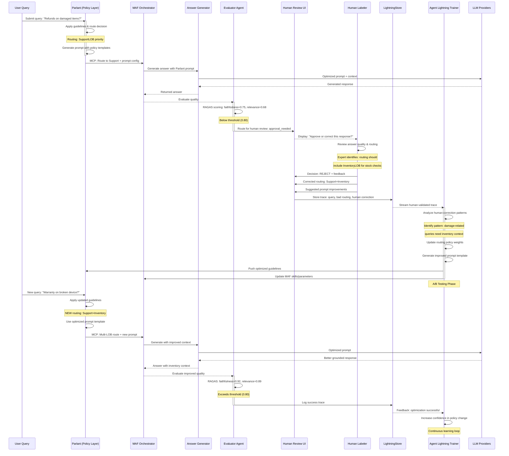

**HIL Prompt Tuning Flow Explained:**

1. **Initial Query** - User asks about refunds, Parlant routes to SupportLOB
2. **Answer Generation** - System generates response, but quality scores are low (0.68-0.75)
3. **Human Review Triggered** - Evaluator routes to human review due to low scores
4. **Expert Correction** - Human reviewer identifies routing should also include InventoryLOB for better context
5. **Feedback Captured** - Human provides corrected routing and prompt suggestions, stored in LightningStore
6. **Agent Lightning Optimization** - Trainer analyzes human correction, identifies patterns (damage → inventory checks), updates policy weights
7. **Prompt Optimization** - Agent Lightning generates improved prompt templates and pushes to Parlant
8. **New Query** - Similar query arrives, Parlant applies updated guidelines
9. **Improved Routing** - System now routes to Support+Inventory, uses optimized prompt
10. **Quality Improvement** - Answer quality scores improve significantly (0.89-0.92)
11. **Success Logging** - Positive result logged, reinforcing the policy change
12. **Continuous Learning** - Loop continues, with Agent Lightning increasing confidence in the optimized policy

This creates a **virtuous cycle** where human expertise directly improves automated decision-making, and Agent Lightning scales those improvements across the entire system.

## Dynamic Interactions

### Use Case: Customer Inquiry → Answer Generation → Human Review

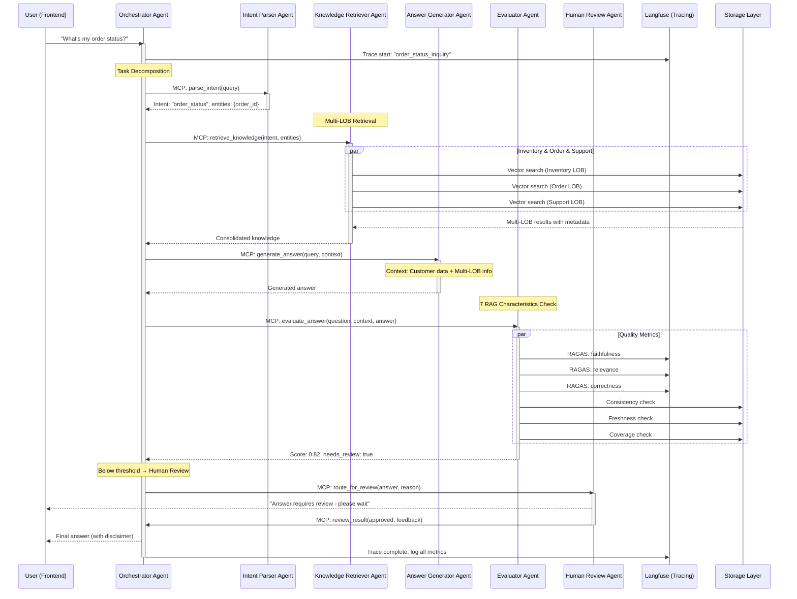

### Use Case: Knowledge Ingestion Workflow

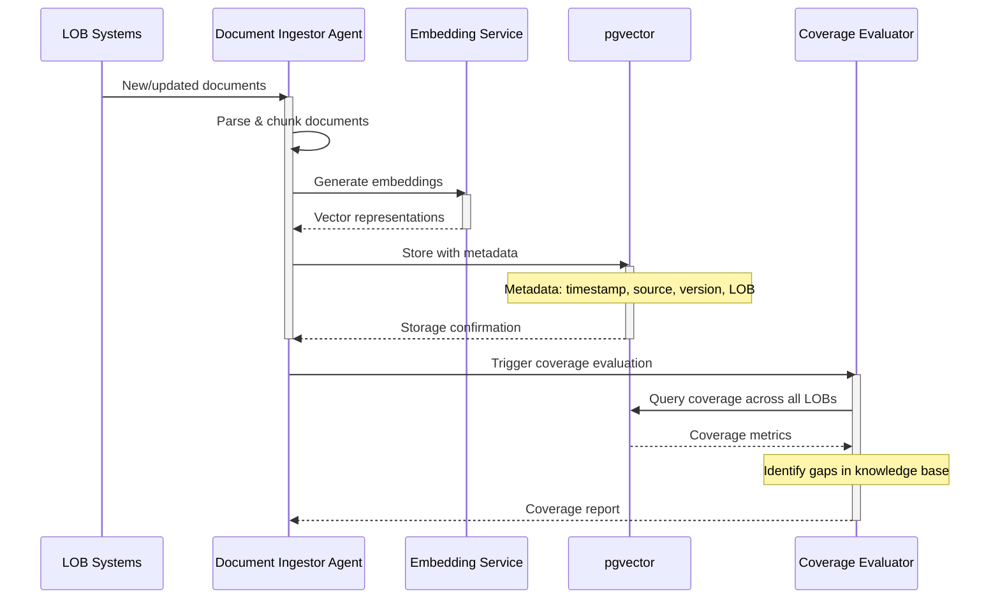

### Use Case: Quality Monitoring & Alerting

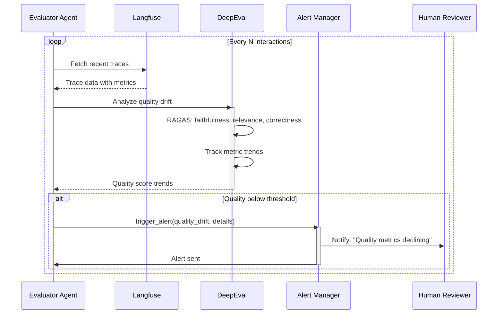

## Data Flow Architecture

### MCP Channel Structure

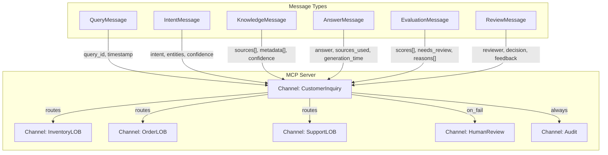

### Observability Data Flow

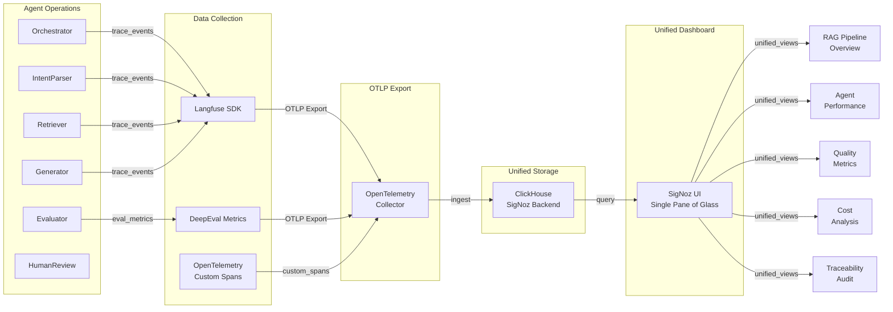

## Implementation Phases

### Phase 1: MVP Core Infrastructure (Week 1-2)
- [ ] Set up Python backend with Microsoft Agent Framework
- [ ] Implement basic MCP server with channel management
- [ ] Create 3 core agents: Orchestrator, Intent Parser, Answer Generator
- [ ] Integrate pgvector for basic RAG
- [ ] Setup Langfuse for tracing

### Phase 2: Multi-LOB Integration (Week 3-4)
- [ ] Implement Knowledge Retriever Agent with multi-LOB connectors
- [ ] Integrate Inventory, Order, and Support system APIs
- [ ] Add document ingestion pipelines
- [ ] Implement RAG quality metrics (Coverage, Consistency)

### Phase 3: Quality Gates & Evaluation (Week 5-6)
- [ ] Build Evaluator Agent with all 7 RAG characteristics
- [ ] Integrate DeepEval for automated assessment
- [ ] Implement faithfulness, relevance, correctness scoring
- [ ] Add traceability and freshness checks

### Phase 4: Human-in-the-Loop (Week 7-8)
- [ ] Implement Human Review Agent and workflow
- [ ] Create React UI for human review interface
- [ ] Add feedback loop for continuous improvement
- [ ] Integrate parant for prompt engineering

### Phase 5: Production Hardening (Week 9-10)
- [ ] Add comprehensive audit logging
- [ ] Implement alerting and monitoring
- [ ] Performance optimization
- [ ] Security and compliance features

## Technology Stack

**Backend:**
- **Microsoft Agent Framework (MAF)** - Primary orchestration framework
- **Parlant** - Prompt engineering and routing guidelines (independent operation)
- **LlamaIndex** - Document indexing, chunking, and retrieval engines
- **Agent Lightning** - Prompt optimization, RL, automatic prompt tuning
- **Python 3.11+**, **FastAPI** - HTTP/WebSocket endpoints
- **ag-ui protocol handlers** - Frontend communication
- **pgvector**, **psycopg2** - Vector database
- **Langfuse SDK** - Tracing and observability
- **DeepEval** - Quality evaluation and benchmarking
- **Cohere Rerank** - Document reranking
- **Azure OpenAI**, **Mistral**, **Claude** - LLM providers via MAF

**Frontend:**
- Next.js 14 (App Router) with React 18 and TypeScript
- ag-ui protocol client for backend communication
- WebSocket client for real-time streaming
- Tailwind CSS / shadcn-ui for styling

**Vector Database Options:**
- **Primary:** Azure AI Search with semantic ranker
- **Alternatives:** Weaviate, Pinecone, Qdrant, FAISS

**Infrastructure:**
- **PostgreSQL with pgvector extension** - Document storage
- **Cosmos DB** (optional) - State management
- **Azure** - Cloud platform for MAF
- **Docker & Docker Compose** - Containerization

**Observability:**
- **Langfuse** - Distributed tracing, metrics, cost tracking
- **DeepEval** - Automated quality evaluation
- **Custom dashboards** - Real-time agent monitoring

**Benchmarks & Evaluation:**
- **BEIR** - Retrieval quality
- **Spider, UNITE, BIRD** - SQL generation
- **TruthfulQA, MT-Bench, Eval Harness** - Generation quality
- **RAGAS metrics** - Faithfulness, relevance, correctness

## Integration Architecture

**Design Patterns:**
- **Factory Pattern** - For creating different types of integration adapters based on configuration
- **Adapter Pattern** - For enabling seamless integration with diverse external systems and protocols
- **Strategy Pattern** - For selecting appropriate communication strategies (in-memory vs HTTP)
- **Registry Pattern** - For agent discovery and management

**Communication Protocols:**
- **A2A Protocol** - Standardized agent-to-agent communication protocol
- **ag-ui Protocol** - Agent-to-human interaction protocol
- **HTTP/REST** - Inter-service communication
- **In-Memory Communication** - High-performance intra-process communication

**Integration Modules:**
- **Dynamic Loading** - Support for plugin-style integration modules
- **Configuration Management** - External configuration for integration modules
- **Message Serialization** - Standardized message formats for inter-agent communication
- **Service Discovery** - Mechanisms for agents to discover and communicate with each other

## RAG Characteristics Implementation

### 1. Coverage
- **Mechanism**: Workflow Graph with Evaluator Agent
- **Metrics**: RAGAS context precision, recall
- **Tools**: LangChain ingestion, pgvector metadata
- **Implementation**: Evaluator Agent runs coverage analysis on retrieval results, identifies gaps in knowledge base

### 2. Consistency
- **Mechanism**: Retriever Agent with cosine similarity checks
- **Tools**: pgvector similarity search
- **Implementation**: Deterministic orchestration prevents duplicate paths, similarity thresholds ensure consistent retrieval

### 3. Freshness
- **Mechanism**: Ingestion Workflow with metadata timestamps
- **Policy**: Deny chunks older than N days, scheduled refresh
- **Implementation**: Middleware attaches timestamps, policy engine enforces freshness rules on channels

### 4. Traceability
- **Mechanism**: Audit Agent + Observability Layer
- **Tools**: pgvector metadata, Cosmos DB state persistence
- **Implementation**: Every message logged with provenance, schema version, agent version; full audit trail maintained

### 5. Faithfulness
- **Mechanism**: Evaluator Agent with RAGAS metric
- **Threshold**: Minimum faithfulness score required
- **Implementation**: Quality gate before answer release, retry or escalate if below threshold

### 6. Relevance
- **Mechanism**: Intent Parser + Evaluator Agent
- **Implementation**: Intent parsing nodes route queries, evaluators score relevance, misaligned intents trigger retries

### 7. Correctness
- **Mechanism**: Evaluator Agent + Human Review Node
- **Implementation**: Correctness scoring in evaluator nodes, human review workflow for low scores, feedback loop to synthesizer

## Key Benefits

1. **Modular Architecture**: Each agent can be developed, tested, and deployed independently
2. **Observability**: Complete visibility into agent decisions and performance
3. **Quality Assurance**: Multi-layer evaluation ensures high-quality responses
4. **Scalability**: MCP enables horizontal scaling of agent instances
5. **Flexibility**: Easy to add new LOBs or agent types
6. **Human-in-the-Loop**: Critical decisions can be validated by humans
7. **Continuous Improvement**: Feedback loops enable learning from interactions

## Security & Compliance

- All agent communications encrypted via MCP
- Audit logs for compliance (SOC2, GDPR)
- Role-based access control for human reviewers
- Data retention policies enforced
- PII detection and handling
