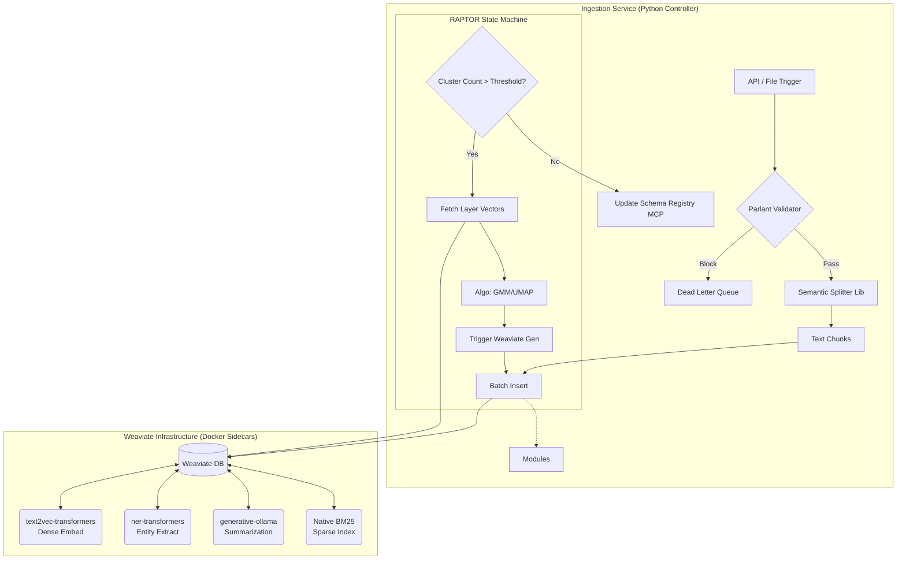

# Module Design: Ingestion Pipeline Service (ETL)

**Type:** Asynchronous Python Service (FastAPI / Worker)
**Architecture:** Controller (Python) + Compute Sidecars (Weaviate Modules)
**Responsibility:** Deterministic transformation of raw data into indexed, compliant, and hierarchically organized knowledge.

## 1. Design Philosophy
Since the ETL process is a fixed sequence of steps (Validation $\rightarrow$ Splitting $\rightarrow$ Embedding $\rightarrow$ Clustering $\rightarrow$ Registration), we replace the "Ingestion Agent" with a **Service Class**. This removes LLM reasoning latency and ensures robust error handling.

**Core Principles:**
1.  **No Logic in DB:** The DB stores data; it doesn't decide *what* to store.
2.  **No AI in Controller:** The Python service orchestrates; it offloads Embedding/NER/Summarization to Weaviate Modules.
3.  **Policy First:** Data is validated by **Parlant** before it touches the Splitter or DB.
4.  **Schema Awareness:** The pipeline explicitly notifies the **Schema Registry** upon completion, enabling the **Translator Agent** to query the new data.

---

## 2. Orchestration Topology



---

## 3. Component Breakdown

### A. The Controller (Python Service)
A standard Python class running in the backend container.
*   **Libraries:** `weaviate-client`, `unstructured` (Splitting), `scikit-learn` (Clustering), `parlant-client`.
*   **Role:** Manages the pipeline state, retries, and batching.

### B. The Compute Stack (Weaviate Modules)
These run as Docker containers alongside the database, minimizing cost and latency.

| Task | Module / Feature | Logic Replaced |
| :--- | :--- | :--- |
| **Dense Vectors** | `text2vec-transformers` | Runs a local BERT/MiniLM model. Auto-vectors on insert. |
| **Sparse Vectors** | **Native BM25** | Core DB feature. No external computation needed. |
| **NER Enrichment** | `ner-transformers` | Auto-extracts People/Orgs on insert. Adds metadata filters. |
| **Summarization** | `generative-ollama` | Local LLM (Llama3/Mistral) summarizes cluster groups for RAPTOR. |

---

## 4. Workflow Specification

### Phase 1: Preparation & Policy
1.  **Trigger:** File upload or S3 event.
2.  **Policy Check:** Service sends document text to **Parlant**.
    *   *Check:* "Does this contain PII?" "Is this document classified Top Secret?"
    *   *Action:* Redact PII or throw `PolicyViolationException`.
3.  **Semantic Splitting:** Service uses `unstructured` or `langchain` to split text by discourse boundaries (headers, paragraph shifts) into `Chunk` objects.

### Phase 2: Ingestion (Dual-Path + Enrichment)
4.  **Batch Insert (Leaves):** Service pushes Chunks to Weaviate.
    *   **Sidecar Action:** Weaviate automatically:
        *   Calculates Dense Vector (`text2vec`).
        *   Calculates Sparse BM25 indices.
        *   Extracts Entities (`ner-transformers`) and adds them as properties.

### Phase 3: RAPTOR Recursion (The Loop)
5.  **Check Depth:** Service checks if the number of chunks > threshold (e.g., 5).
6.  **Fetch Vectors:** Service retrieves vectors of the current layer.
7.  **Clustering:** Service runs **UMAP/GMM** locally in Python to group vectors.
    *   *Output:* List of `[ClusterID, [DocIDs]]`.
8.  **Summarize:** Service triggers `generative-ollama` via Weaviate API.
    *   *Prompt:* "Summarize these documents into a coherent concept."
9.  **Re-Insert:** Service inserts the Summaries as new objects (Level N+1).
    *   *Note:* These summaries are automatically embedded and enriched by Weaviate logic from Phase 2.
10. **Recurse:** Repeat until root node is reached.

### Phase 4: Finalization
11. **Registration:** Service calls **Schema Registry MCP**.
    *   *Payload:* "Registered Source 'Q3_Financials' with fields [revenue, author, orgs]."
    *   *Result:* The **Translator Agent** can now query this data.

---

## 5. Infrastructure Configuration (Docker Compose)

This infrastructure supports the design without external API costs.

```yaml
services:
  # The Application Controller
  ingestion-service:
    build: ./backend
    environment:
      WEAVIATE_URL: "http://weaviate:8080"
      PARLANT_URL: "http://parlant:8000"

  # The Database
  weaviate:
    image: semitechnologies/weaviate:1.24.1
    environment:
      # Enable the Sidecars
      ENABLE_MODULES: 'text2vec-transformers,ner-transformers,generative-ollama'
      DEFAULT_VECTORIZER_MODULE: 'text2vec-transformers'
      # Link to Sidecars
      TRANSFORMERS_INFERENCE_API: 'http://t2v-transformers:8080'
      NER_INFERENCE_API: 'http://ner-transformers:8080'
      GENERATIVE_OLLAMA_API: 'http://ollama:11434'

  # Sidecar 1: Embeddings (Dense)
  t2v-transformers:
    image: semitechnologies/transformers-inference:sentence-transformers-all-MiniLM-L6-v2
    environment:
      ENABLE_CUDA: '1' # Set to 0 if CPU only

  # Sidecar 2: NER (Enrichment)
  ner-transformers:
    image: semitechnologies/ner-transformers:dbmdz-bert-large-cased-finetuned-conll03-english

  # Sidecar 3: Summarization (RAPTOR)
  ollama:
    image: ollama/ollama:latest
    volumes:
      - ./ollama_data:/root/.ollama
```

---

## 6. Implementation Reference (Python Service)

```python
class IngestionService:
    def __init__(self, client: weaviate.Client):
        self.client = client
        self.parlant = ParlantClient()
        self.registry = SchemaRegistryClient()

    async def run_pipeline(self, file_path: str, source_id: str):
        # 1. Validation & Redaction
        text = load_file(file_path)
        policy = await self.parlant.validate(text, domain="ingestion")
        if policy.status == "BLOCK": raise Exception(policy.reason)
        
        # 2. Split
        chunks = semantic_split(policy.redacted_text)
        
        # 3. Insert Leaves (Level 0)
        # Weaviate handles Embedding & NER automatically here
        leaf_ids = self._batch_insert(chunks, level=0)
        
        # 4. RAPTOR Loop
        await self._raptor_recursion(leaf_ids, current_level=0)
        
        # 5. Register
        await self.registry.register(source_id=source_id)

    async def _raptor_recursion(self, doc_ids, current_level):
        if len(doc_ids) <= 5: return # Root Reached

        # A. Clustering (Local Python Logic)
        vectors = self._get_vectors(doc_ids)
        clusters = perform_clustering_gmm(vectors)

        # B. Summarization (Weaviate Logic)
        summaries = []
        for cluster in clusters:
            # Trigger 'generative-ollama' module
            res = self.client.query.get("Document", ["content"])\
                .with_generate(single_prompt="Summarize this: {content}")\
                .with_where(filter_by_ids(cluster.doc_ids))\
                .do()
            
            summary_text = res['data']['Get']['Document'][0]['_additional']['generate']['singleResult']
            summaries.append(summary_text)

        # C. Re-Insert (Level N+1)
        # Weaviate automatically embeds these new summaries
        new_ids = self._batch_insert(summaries, level=current_level + 1)
        
        # Recurse
        await self._raptor_recursion(new_ids, current_level + 1)
```