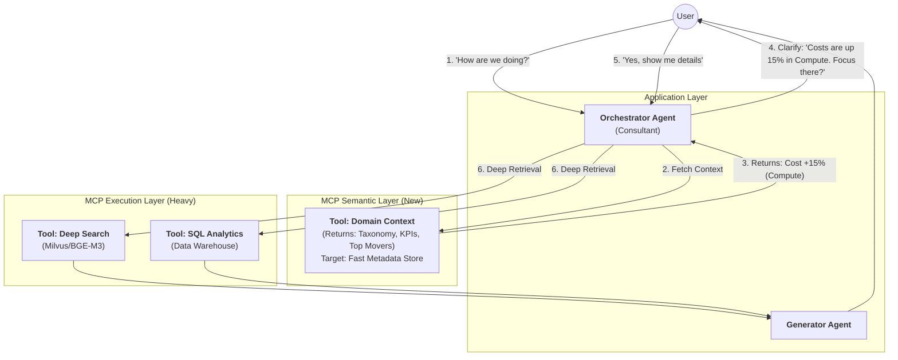

## 1. The Architectural Shift: "Grounded Triage"

We introduce a **Semantic Layer (MCP)**. This is distinct from the heavy Vector/SQL tools. It provides fast access to taxonomies (how data is organized) and snapshots (high-level KPIs).



---

## 2. The Semantic Tools (MCP Implementation)

We need a tool specifically designed to give the Orchestrator the "Lay of the Land" so it sounds smart immediately.

### Tool Definition (Python)

```python
@mcp.tool()
def get_domain_context(domain: str = "finops") -> str:
    """
    Retrieves high-level business context, current status, and ontology.
    Use this when the user query is vague (e.g., "How are things?") to 
    get enough data to ask intelligent clarifying questions.
    
    Returns:
        - Current KPI Snapshot (e.g., Month-to-date Cost, MoM Change)
        - Active Anomalies (e.g., "Spike in EC2")
        - Ontology/Taxonomy (Valid Dimensions: Region, Service, Tag)
    """
    # In a real app, this hits a cached Redis key or a materialized view
    # It must be < 100ms latency.
    return {
        "summary": "Current MTD Cost: $120k. Variance: +15% vs Budget.",
        "top_movers": [
            {"dimension": "Service", "name": "EC2-GPU-Instances", "change": "+$12k"},
            {"dimension": "Region", "name": "us-east-1", "change": "+$3k"}
        ],
        "available_dimensions": ["Cost Center", "Application", "Environment", "Service"],
        "semantic_model": "Costs are aggregated by Service and tagged by Cost Center."
    }
```

---

## 3. The Orchestrator Logic (The FinOps Scenario)

We instruct the Orchestrator to use `get_domain_context` **before** asking the user to clarify.

### System Prompt Update
```text
You are the FinOps Orchestrator.

### STRATEGY:
1. **Initial Assessment:** If the user asks a VAGUE status question (e.g., "How is spend?", "What's happening?"), do NOT ask a generic question like "What do you mean?".
2. **Context Lookup:** Immediately call `get_domain_context()` to see the current reality.
3. **Grounded Clarification:** Use the context to provide a summary AND ask a specific targeting question.
   - BAD: "Which service are you interested in?"
   - GOOD: "Overall spend is up 15%, driven largely by **EC2 GPU instances**. Would you like to dig into the **Compute costs**, or looking at a specific **Cost Center**?"
4. **Deep Dive:** Once the user confirms the intent (e.g., "Dig into Compute"), call `query_sql` or `search_docs` for line-item details.
```

---

## 4. Step-by-Step Execution Trace

Let's trace the "FinOps" example to see how this architecture enables the behavior you want.

**User:** "How are we doing this month?"

1.  **Orchestrator (Internal):**
    *   *Analysis:* "Vague query. User wants a status update. I don't know the status yet."
    *   *Action:* Call `get_domain_context(domain='finops')`.

2.  **Tool (Context):**
    *   *Return Payload:*
        ```json
        {
          "mtd_spend": 50000,
          "trend": "UP 20%",
          "primary_driver": "LLM Training (p4d.24xlarge)",
          "ontology": ["Project", "Owner", "Service"]
        }
        ```

3.  **Orchestrator (Internal):**
    *   *Reasoning:* "Okay, we are over budget because of LLM training. I should present this summary to elicit if this is what they care about."
    *   *Action:* Return text to user (No deep tool call yet).

4.  **Orchestrator (Output to User):**
    "We are currently running **20% over budget** for the month ($50k total).
    The data shows this is primarily driven by **LLM Training instances (p4d.24xlarge)**.
    
    Are you interested in analyzing the **training infrastructure costs**, or were you looking for a breakdown by **Project/Owner**?"

5.  **User:** "Who is owning those training instances?"

6.  **Orchestrator (Internal):**
    *   *Analysis:* "User wants 'Owner' dimension filtered by 'LLM Training'."
    *   *Action:* Call `query_sql("SELECT owner, sum(cost) FROM expenses WHERE service='p4d.24xlarge' GROUP BY owner...")`.

---

## 5. Why this fits "High Performance" & "Lean"

1.  **Latency Management:**
    *   The `get_domain_context` tool hits a "Fast Path" (Metadata Store/Cache). It does *not* scan millions of vector embeddings or join huge SQL tables. This ensures the "Conversation Turn" feels instant.
    *   The "Heavy" tools (BGE-M3/Milvus) are only invoked once the intent is narrowed down.
2.  **Ontology Injection:**
    *   You don't need to fine-tune the LLM with your business ontology (which changes often). You inject the ontology (valid column names, service names) at runtime via the Context Tool.
3.  **Trust:**
    *   The agent demonstrates competence immediately by citing real numbers ("Up 20%") in its first reply, rather than playing "20 Questions" with the user.

This pattern—**"Context First, Search Later"**—is the gold standard for Consultative Agents.